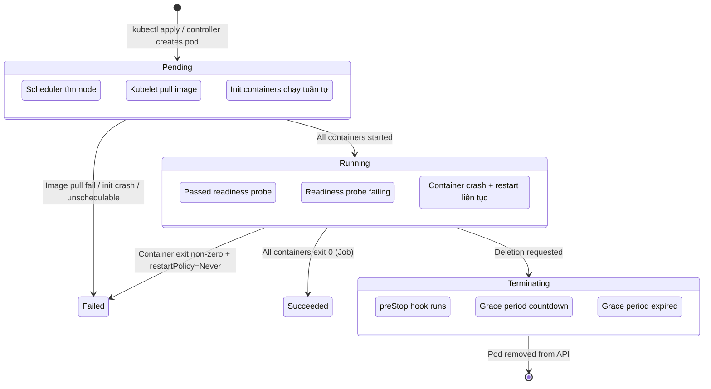
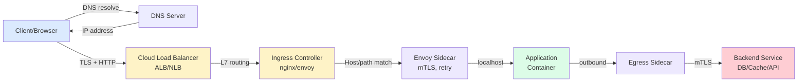

# Chapter S — Kiến trúc Hệ thống Hiện đại cho Kỹ sư AIOps (Phiên bản 2026)

> **AI chỉ xử lý Data — Metrics, Logs, Traces. Nhưng Data đó phản ánh hành vi vật lý của CPU, Memory, Network, Disk, GPU. Nếu kỹ sư AIOps không hiểu BẢN CHẤT VẬT LÝ đằng sau mỗi con số, mọi mô hình Anomaly Detection sẽ thành hộp đen vô dụng, mọi Root Cause Analysis sẽ chỉ ra triệu chứng thay vì nguyên nhân, và mọi Auto-healing sẽ chữa sai bệnh. Chương này xây dựng nền tảng hệ thống cần thiết trước khi đọc bất kỳ chapter nào về intelligence.**

---

## Prerequisites

- Kinh nghiệm cơ bản với Linux và command line
- Hiểu biết sơ lược về container và Kubernetes
- Khuyến nghị: [00 — Introduction to AIOps](../00-introduction.vi.md)

## Related Documents

- [01 — Observability](../01-observability/README.vi.md) — thiết kế evidence pack từ system signals
- [02 — OpenTelemetry](../02-opentelemetry/README.vi.md) — thu thập telemetry từ các lớp hệ thống
- [03 — Prometheus](../03-prometheus/README.vi.md) — lưu trữ và truy vấn system metrics
- [06 — Data Plane](../06-data-plane/README.vi.md) — normalize và enrich telemetry data
- [09 — Anomaly Detection](../09-anomaly-detection/README.vi.md) — phát hiện bất thường trên system signals

## Next Reading

Sau chương này, hãy chuyển sang [01 — Observability](../01-observability/README.vi.md) để hiểu cách thiết kế evidence pack cho các system signals đã học.

---

## Table of Contents

**Section 1: Compute & Runtime Mechanics**

1. [Linux Process Model](#1-linux-process-model)
2. [Memory Management](#2-memory-management)
3. [Linux Control Groups v2](#3-linux-control-groups-v2)
4. [Container Runtime Internals](#4-container-runtime-internals)
5. [Kubernetes Pod Lifecycle Deep Dive](#5-kubernetes-pod-lifecycle-deep-dive)
6. [Resource Requests/Limits & QoS Classes](#6-resource-requestslimits--qos-classes)
7. [CPU Throttling Mechanics](#7-cpu-throttling-mechanics)
8. [OOMKilled & Memory Pressure](#8-oomkilled--memory-pressure)
9. [Node Pressure & Eviction](#9-node-pressure--eviction)
10. [eBPF-based Telemetry](#10-ebpf-based-telemetry)

**Section 2: Networking & Traffic Engineering**

11. [End-to-End Request Lifecycle](#11-end-to-end-request-lifecycle)
12. [TCP/IP Internals for Operations](#12-tcpip-internals-for-operations)
13. [DNS Resolution Mechanics](#13-dns-resolution-mechanics)
14. [Ingress Controllers & Load Balancing](#14-ingress-controllers--load-balancing)
15. [Service Mesh Deep Dive](#15-service-mesh-deep-dive)
16. [API Gateway Patterns](#16-api-gateway-patterns)
17. [Connection Pool Management](#17-connection-pool-management)
18. [Thread Pool Exhaustion & Backpressure](#18-thread-pool-exhaustion--backpressure)
19. [Circuit Breaking & Cascading Prevention](#19-circuit-breaking--cascading-prevention)

**Section 3: Data & Storage Layer**

20. [Caching Architecture](#20-caching-architecture)
21. [Cache Failure Patterns](#21-cache-failure-patterns)
22. [Database Connection Management](#22-database-connection-management)
23. [Query Performance & Lock Contention](#23-query-performance--lock-contention)
24. [Replication Lag & Consistency](#24-replication-lag--consistency)
25. [Storage I/O Fundamentals](#25-storage-io-fundamentals)

**Section 4: Distributed Systems & Failure Patterns**

26. [Distributed Tracing Internals](#26-distributed-tracing-internals)
27. [Cascading Failures & Error Storms](#27-cascading-failures--error-storms)
28. [Gray Failures & Partial Outages](#28-gray-failures--partial-outages)

**Section 5: AI/ML Infrastructure Internals**

29. [GPU Compute & Saturation](#29-gpu-compute--saturation)
30. [LLM Inference Mechanics](#30-llm-inference-mechanics)
31. [Vector Database & Embedding Pipeline](#31-vector-database--embedding-pipeline)

**Section 6: Synthesis — System Thinking for AIOps**

32. [USE & RED Methods](#32-use--red-methods)
33. [Cross-Layer Correlation](#33-cross-layer-correlation)
34. [Anti-Patterns & Chapter Summary](#34-anti-patterns--chapter-summary)

---

# SECTION 1 — COMPUTE & RUNTIME MECHANICS

> *Mọi workload — từ microservice xử lý HTTP request đến LLM inference pipeline — đều chạy trên cùng một nền tảng: Linux kernel quản lý CPU time, memory pages, và I/O. Kỹ sư AIOps phải hiểu cách kernel phân phối tài nguyên, vì đây là lớp cuối cùng quyết định "con số" mà mô hình AI nhìn thấy.*

---

## 1. Linux Process Model

### 1.1 Tại sao kỹ sư AIOps cần hiểu process scheduling?

Khi anomaly detector báo "CPU utilization spike on pod X", câu hỏi đầu tiên phải là: **spike đó là user time, system time, iowait, hay steal?** Mỗi loại chỉ ra một nguyên nhân gốc khác nhau. Không có kiến thức này, RCA engine sẽ gán nhầm nguyên nhân.

### 1.2 Process states và CPU time breakdown

Một process trong Linux tồn tại ở một trong các trạng thái:

```
┌──────────────────────────────────────────────────────────────────┐
│                    Linux Process States                          │
│                                                                  │
│  TASK_RUNNING (R) ──── đang chạy hoặc sẵn sàng chạy trên CPU   │
│         │                                                        │
│         ├──→ TASK_INTERRUPTIBLE (S) ── chờ I/O, signal, event    │
│         │         │                                              │
│         │         └──→ wake up ──→ back to R (runqueue)          │
│         │                                                        │
│         ├──→ TASK_UNINTERRUPTIBLE (D) ── chờ disk I/O, NFS      │
│         │         │                 (không thể kill bằng signal)  │
│         │         └──→ I/O complete ──→ back to R                │
│         │                                                        │
│         ├──→ TASK_STOPPED (T) ── bị SIGSTOP, debug               │
│         │                                                        │
│         └──→ TASK_ZOMBIE (Z) ── đã exit, parent chưa wait()     │
└──────────────────────────────────────────────────────────────────┘
```

**CPU time phân tách thành:**

| CPU Time Type | Ký hiệu | Ý nghĩa | AIOps signal |
|---|---|---|---|
| **User** | `us` | Thời gian chạy application code | Cao → app busy (bình thường hoặc bug loop) |
| **System** | `sy` | Thời gian trong kernel (syscalls) | Cao → quá nhiều syscalls, context switch, copy |
| **I/O Wait** | `wa` | CPU idle vì chờ disk I/O | Cao → disk bottleneck, NOT CPU bottleneck |
| **Steal** | `st` | CPU bị hypervisor lấy mất (VM/cloud) | Cao → noisy neighbor, overcommit trên host |
| **IRQ/SoftIRQ** | `hi`/`si` | Xử lý hardware/software interrupt | Cao → network packet storm, driver issue |
| **Idle** | `id` | CPU không làm gì | Kết hợp với high latency → thread blocking |
| **Nice** | `ni` | User-space ở priority thấp | Batch jobs, background tasks |

> [!WARNING]
> **Sai lầm kinh điển trong AIOps:** Detector thấy `iowait` cao và kết luận "CPU overloaded" → trigger scale-out. Nhưng `iowait` nghĩa là CPU **đang rảnh** chờ disk. Scale thêm CPU không giúp gì — cần fix disk I/O hoặc caching. Đây là ví dụ điển hình về việc thiếu system knowledge dẫn đến auto-scaling sai.

### 1.3 Context switching

Context switch xảy ra khi kernel chuyển CPU từ process A sang process B. Kernel phải:

1. Lưu toàn bộ register state của A (program counter, stack pointer, general registers)
2. Flush/invalidate TLB entries (Translation Lookaside Buffer)
3. Load register state của B
4. Restore address space mapping của B

**Chi phí thực tế:**
- Voluntary context switch: process tự nhường CPU (chờ I/O, mutex) — ~1–5 μs
- Involuntary context switch: kernel cưỡng chế (hết time slice) — ~5–15 μs
- Chi phí ẩn: cache pollution — sau switch, L1/L2/L3 cache đầy data cũ, phải warm lại — **đây mới là chi phí lớn nhất**, có thể tới hàng chục μs

**Metrics quan trọng:**

```bash
# Đếm context switches trên toàn hệ thống
vmstat 1 | awk '{print $12, $13}'   # cs = context switches

# Đếm per-process
pidstat -w 1
# cswch/s  = voluntary context switches per second
# nvcswch/s = involuntary context switches per second

# Trong container (cgroups v2)
cat /sys/fs/cgroup/<cgroup>/cpu.stat
# nr_throttled, throttled_usec — dấu hiệu bị CFS giới hạn
```

> [!TIP]
> **Rule of thumb cho AIOps:** Involuntary context switch rate > 10.000/s/core thường cho thấy quá nhiều runnable threads so với CPU available. Đây là leading indicator cho latency spike trước khi CPU utilization chạm 100%.

### 1.4 CFS Scheduler — Completely Fair Scheduler

Linux mặc định dùng CFS scheduler. Nguyên lý cốt lõi:

- Mỗi task có **virtual runtime** (`vruntime`) — thời gian CPU mà nó "đã tiêu" (có trọng số theo priority/nice)
- CFS luôn chọn task có `vruntime` thấp nhất để chạy tiếp
- Cây red-black tree sắp xếp tasks theo `vruntime` → O(log n) để chọn next task
- **Time slice** không cố định — phụ thuộc số task runnable và target latency (`sched_latency_ns`, mặc định 6ms cho ≤8 tasks)

```
             CFS Red-Black Tree
             ┌───────────┐
             │ vruntime=50│ ← next to run (leftmost)
             └─────┬─────┘
               ┌───┴───┐
          ┌────┤       ┌┴────┐
          │ 65 │       │ 80  │
          └────┘       └─────┘
```

**AIOps implication:** Khi pod chạy trong container, CFS + cgroups CPU quota quyết định bao nhiêu CPU time pod thực sự nhận. `cpu.cfs_quota_us` / `cpu.cfs_period_us` tạo ra hiện tượng **CPU throttling** — một trong những nguyên nhân latency spike phổ biến nhất trong Kubernetes mà không hiện trên CPU utilization metric.

---

## 2. Memory Management

### 2.1 Virtual memory và paging

Mỗi process có address space riêng (virtual memory). Kernel ánh xạ virtual pages → physical frames qua **page table**. Khi process truy cập page chưa có trong RAM:

```
Process access   →  MMU lookup  →  Page Table  →  Page in RAM?
      │                                               │
      │                                          YES: direct access
      │                                          NO:  PAGE FAULT
      │                                               │
      │                                    ┌──────────┴──────────┐
      │                              Minor fault            Major fault
      │                           (page in memory,       (page on disk,
      │                            chỉ cần map)          phải đọc disk)
      │                              ~1 μs                 ~1-10 ms
```

- **Minor page fault:** page có sẵn trong memory (vd: shared library đã loaded) — chỉ cần update page table. Chi phí ~1 μs.
- **Major page fault:** page phải đọc từ disk (swap) — chi phí **1.000x–10.000x** cao hơn. Đây là "death by swap" cho latency-sensitive workloads.

### 2.2 Memory pressure signals

| Signal | Nguồn | Ý nghĩa | Mức nghiêm trọng |
|---|---|---|---|
| `pgfault` (minor) | `/proc/vmstat` | Page table miss, no disk I/O | Bình thường ở mức vừa phải |
| `pgmajfault` (major) | `/proc/vmstat` | Phải đọc từ disk/swap | 🔴 Rất xấu cho latency |
| `pswpin`/`pswpout` | `/proc/vmstat` | Pages swap in/out | 🔴 Swapping đang xảy ra |
| `oom_kill_count` | cgroup stat | Số lần bị OOM kill | 🔴 Memory exhaustion |
| `memory.high events` | cgroup v2 | Vượt soft limit, kernel throttle allocations | 🟡 Cảnh báo sớm |
| `PSI memory` | `/proc/pressure/memory` | Pressure Stall Information | 🟡 Quantified memory contention |

### 2.3 NUMA — Non-Uniform Memory Access

Trên server multi-socket, mỗi CPU socket có "local memory" riêng. Truy cập local memory nhanh (~100ns), truy cập remote memory chậm hơn (~150–300ns):

```
┌─────────────────────────────────────────────────┐
│              Server (2-socket)                  │
│                                                 │
│  ┌──────────────┐    QPI/UPI    ┌─────────────┐ │
│  │  Socket 0    │◄────────────►│  Socket 1    │ │
│  │  CPU cores   │   ~150-300ns  │  CPU cores   │ │
│  │  0,1,2,3..   │  cross-node   │  8,9,10,11.. │ │
│  └──────┬───────┘              └──────┬───────┘ │
│         │ ~100ns                      │ ~100ns   │
│  ┌──────┴───────┐              ┌──────┴───────┐ │
│  │  Local RAM   │              │  Local RAM   │ │
│  │  (Node 0)    │              │  (Node 1)    │ │
│  │  128 GB      │              │  128 GB      │ │
│  └──────────────┘              └──────────────┘ │
└─────────────────────────────────────────────────┘
```

> [!NOTE]
> **AIOps impact:** Khi Kubernetes scheduler đặt pod trên node multi-socket mà không có NUMA-aware topology, container có thể bị phân bổ CPU core ở Socket 0 nhưng memory ở Socket 1. Kết quả: latency tăng 30–50% mà không metric nào giải thích rõ ràng — chỉ thấy "P99 cao bất thường". eBPF probe `numastat` có thể phát hiện `numa_miss` và `numa_foreign` events.

---

## 3. Linux Control Groups v2

### 3.1 Vai trò trong container ecosystem

Cgroups v2 là **cơ chế cốt lõi** mà kernel Linux dùng để giới hạn, theo dõi, và cô lập tài nguyên cho groups of processes. Mọi container (Docker, containerd, CRI-O) đều là processes bị quản lý bởi cgroups.

```
cgroup v2 hierarchy (unified)
/sys/fs/cgroup/
├── system.slice/               ← systemd services
├── user.slice/                 ← user sessions
└── kubepods.slice/             ← Kubernetes pods
    ├── kubepods-burstable.slice/
    │   ├── kubepods-burstable-pod<uid>.slice/
    │   │   ├── cri-containerd-<id>.scope   ← container A
    │   │   └── cri-containerd-<id>.scope   ← container B (sidecar)
    │   └── ...
    ├── kubepods-besteffort.slice/
    └── kubepods-guaranteed.slice/          ← QoS Guaranteed pods
```

### 3.2 Resource controllers quan trọng

| Controller | File | Chức năng | AIOps metric |
|---|---|---|---|
| **CPU** | `cpu.max` | Bandwidth limit (quota/period) | `nr_throttled`, `throttled_usec` |
| **CPU** | `cpu.weight` | Chia sẻ CPU khi contention | Proportional share |
| **Memory** | `memory.max` | Hard limit → OOM kill khi vượt | `oom_kill` count |
| **Memory** | `memory.high` | Soft limit → throttle allocation | `high` events in `memory.events` |
| **Memory** | `memory.current` | Usage hiện tại | RSS + cache |
| **I/O** | `io.max` | IOPS/BPS limit per device | `io.stat` (rbytes, wbytes, rios, wios) |
| **PID** | `pids.max` | Giới hạn số processes | Fork bomb protection |
| **PSI** | `cpu.pressure`, `memory.pressure`, `io.pressure` | Pressure stall information | `some`, `full` — % thời gian bị stall |

### 3.3 PSI — Pressure Stall Information

PSI là innovation quan trọng trong cgroups v2. Thay vì chỉ biết "CPU utilization 80%", PSI trả lời: **"bao nhiêu phần trăm thời gian có task bị chờ vì thiếu CPU/memory/IO?"**

```
# /sys/fs/cgroup/kubepods.slice/.../cpu.pressure
some avg10=4.52 avg60=2.31 avg300=1.08 total=283947102
full avg10=1.03 avg60=0.55 avg300=0.24 total=89483921
```

- `some`: ít nhất 1 task bị stall (một phần workload bị ảnh hưởng)
- `full`: TẤT CẢ tasks bị stall (toàn bộ workload ngừng tiến)
- `avg10/60/300`: trung bình 10s/60s/300s (%)
- `total`: tổng thời gian stall tính bằng microseconds

> [!TIP]
> **PSI là gold signal cho AIOps.** So với CPU utilization (có thể misleading), PSI `some` > 10% trong 10s window là signal đáng tin cậy hơn cho anomaly detection. Meta (Facebook) sử dụng PSI thay thế load average làm trigger cho autoscaling — chính xác hơn nhiều vì nó đo **impact thực tế** chứ không phải utilization tuyệt đối.

---

## 4. Container Runtime Internals

### 4.1 Container không phải VM

Container là một **nhóm processes** bị cô lập bởi hai cơ chế kernel:

1. **Namespaces** — cô lập visibility: mỗi container thấy PID tree riêng, network stack riêng, filesystem riêng
2. **Cgroups** — cô lập resources: giới hạn CPU, memory, I/O mà nhóm processes có thể dùng

```
┌──────────────────────────────────────────────────────────────┐
│                       Host Kernel                             │
│                                                               │
│  ┌──────────────────┐  ┌──────────────────┐                  │
│  │  Container A     │  │  Container B     │                  │
│  │  ┌─────────────┐ │  │  ┌─────────────┐ │                  │
│  │  │ PID ns      │ │  │  │ PID ns      │ │ ← namespaces    │
│  │  │ NET ns      │ │  │  │ NET ns      │ │   (isolation)    │
│  │  │ MNT ns      │ │  │  │ MNT ns      │ │                  │
│  │  │ USER ns     │ │  │  │ USER ns     │ │                  │
│  │  └─────────────┘ │  │  └─────────────┘ │                  │
│  │  ┌─────────────┐ │  │  ┌─────────────┐ │                  │
│  │  │ cgroup      │ │  │  │ cgroup      │ │ ← cgroups       │
│  │  │ cpu: 2 cores│ │  │  │ cpu: 1 core │ │   (limits)      │
│  │  │ mem: 4Gi    │ │  │  │ mem: 2Gi    │ │                  │
│  │  └─────────────┘ │  │  └─────────────┘ │                  │
│  └──────────────────┘  └──────────────────┘                  │
│                                                               │
│        Shared kernel, shared syscalls                         │
└──────────────────────────────────────────────────────────────┘
```

### 4.2 Linux namespaces

| Namespace | Cô lập | AIOps relevance |
|---|---|---|
| **PID** | Process ID tree | Container thấy PID 1, host thấy PID 38291 — cần map khi debug |
| **NET** | Network stack, interfaces, routing | Mỗi pod có IP riêng — metrics phải gắn đúng pod identity |
| **MNT** | Filesystem mount points | Container root filesystem vs host filesystem |
| **UTS** | Hostname | Container hostname ≠ node hostname — cần đúng label |
| **IPC** | Shared memory, semaphores | Hiếm khi quan trọng cho AIOps |
| **USER** | UID/GID mapping | Security context, rootless containers |
| **CGROUP** | Cgroup root view | Container chỉ thấy cgroup subtree của nó |

> [!WARNING]
> **Container observability trap:** Nhiều tool chạy trong container đọc `/proc/meminfo` hay `/proc/cpuinfo` nhưng thấy **thông tin của host**, không phải container. Ví dụ: JVM đọc `/proc/meminfo` thấy host có 128GB RAM → set heap 96GB → vượt container memory limit 4Gi → OOMKilled. Từ Java 10+ và Go 1.19+ đã có cgroup-aware runtime, nhưng legacy apps vẫn gặp lỗi này thường xuyên.

### 4.3 OverlayFS — Container filesystem

Container image sử dụng **layered filesystem** (OverlayFS):

```
Container writable layer (upperdir)  ← container writes go here
        │
        ▼ (union mount)
Image Layer 3: app binary             ← read-only
Image Layer 2: dependencies            ← read-only
Image Layer 1: base OS (debian:slim)   ← read-only
```

**AIOps impact:** Write-heavy containers tạo large `upperdir` → disk I/O tăng → có thể trigger node eviction (`imagefs.available` pressure). Metric `container_fs_writes_bytes_total` (cAdvisor) và `io.stat` (cgroup) phát hiện vấn đề này.

---

## 5. Kubernetes Pod Lifecycle Deep Dive

### 5.1 Từ `kubectl apply` đến container running

Hiểu lifecycle giúp AIOps engine phân biệt: pod pending vì scheduling hay vì image pull? Crash loop vì app bug hay vì resource limit?



### 5.2 Pod phases và container states

| Pod Phase | Ý nghĩa | Container State | Lý do phổ biến |
|---|---|---|---|
| **Pending** | Pod accepted nhưng chưa chạy | `Waiting` | Scheduling, image pull, init containers |
| **Running** | Ít nhất 1 container running | `Running` | Bình thường |
| **Running** | Container restart liên tục | `Waiting` (CrashLoopBackOff) | App crash, config sai, dependency unavailable |
| **Succeeded** | Tất cả containers exit 0 | `Terminated` (exit 0) | Job hoàn thành |
| **Failed** | Container exit non-zero | `Terminated` (exit ≠ 0) | App error, OOMKilled (exit 137) |
| **Unknown** | Không lấy được status | — | Node unreachable, kubelet down |

### 5.3 Probe types và impact on traffic

```
┌──────────────────────────────────────────────────────────────┐
│                    Kubernetes Probes                          │
│                                                              │
│  startupProbe ──── "Container đã start xong chưa?"          │
│       │             Chạy trước, disable liveness/readiness   │
│       │             Dùng cho: slow-starting apps (JVM, ML)   │
│       ▼                                                      │
│  livenessProbe ─── "Container còn sống không?"               │
│       │             Fail → kubelet RESTART container          │
│       │             ⚠️ KHÔNG remove khỏi Service endpoints   │
│       ▼                                                      │
│  readinessProbe ── "Container sẵn sàng nhận traffic không?"  │
│                     Fail → remove khỏi Service endpoints     │
│                     Recover → add lại vào endpoints          │
│                     ⚠️ KHÔNG restart container               │
└──────────────────────────────────────────────────────────────┘
```

> [!CAUTION]
> **Sai lầm nguy hiểm nhất với probes:** Dùng **liveness probe check dependency** (vd: DB connection). Khi DB down → tất cả pods fail liveness → kubelet restart tất cả → restart storm → pods startup cùng lúc → connection storm → DB càng chết. Đây là cascading failure do misconfigured probes. Liveness phải chỉ check **process health**, không check dependency. Dependency health thuộc về readiness probe.

### 5.4 Graceful shutdown — tại sao 502 xảy ra khi deploy

Khi pod bị xóa (rolling update), timeline xảy ra **song song**:

```
            ┌─── Path A: kube-proxy/iptables remove pod IP from Service
            │    (async, có thể mất 1-5 giây)
            │
Pod delete ─┤
            │
            └─── Path B: kubelet gửi preStop → SIGTERM → countdown
                 (bắt đầu ngay lập tức)

Vấn đề: Nếu preStop không có delay, container nhận SIGTERM
         và bắt đầu shutdown TRƯỚC KHI iptables/Envoy cập nhật xong.
         → Request vẫn được route đến pod đang shutdown → 502/503
```

**Fix:** Thêm `preStop` hook với `sleep 5–10s` để chờ endpoint propagation:

```yaml
lifecycle:
  preStop:
    exec:
      command: ["sh", "-c", "sleep 5"]
terminationGracePeriodSeconds: 30
```

**AIOps implication:** Nếu detector thấy spike 502 mỗi lần deploy, đây không phải app bug — đây là endpoint propagation race condition. Correlation với deployment events (Ch. 08 — Topology & Change) sẽ giúp RCA engine loại trừ giả thuyết sai.

---

## 6. Resource Requests/Limits & QoS Classes

### 6.1 Requests vs Limits

| | Requests | Limits |
|---|---|---|
| **Ý nghĩa** | Lượng tài nguyên **bảo đảm** | Lượng tài nguyên **tối đa cho phép** |
| **Scheduler dùng** | ✅ Để quyết định đặt pod ở node nào | ❌ Không ảnh hưởng scheduling |
| **Enforcement** | Kernel cgroups `cpu.weight` | Kernel cgroups `cpu.max` (CPU), `memory.max` (Memory) |
| **Vượt CPU** | Burst lên nếu node rảnh | Bị **throttled** (CFS bandwidth) |
| **Vượt Memory** | — | Bị **OOMKilled** ngay lập tức |

### 6.2 QoS Classes

Kubernetes tự động gán QoS class dựa trên requests/limits config:

| QoS Class | Điều kiện | Eviction priority | Khi nào dùng |
|---|---|---|---|
| **Guaranteed** | requests == limits cho mọi container, mọi resource | Cuối cùng bị evict | Latency-critical services (payment, auth) |
| **Burstable** | Có requests nhưng < limits (hoặc chỉ set 1 resource) | Evict sau BestEffort | Phần lớn workloads |
| **BestEffort** | Không set requests NÀO | **Đầu tiên bị evict** | Batch jobs, dev/test |

```
Eviction order khi node memory pressure:
BestEffort → Burstable (vượt request nhiều nhất trước) → Guaranteed
```

> [!IMPORTANT]
> **Sai lầm phổ biến trong production:** Set `requests` rất thấp (để scheduler dễ đặt) + `limits` rất cao (để app không bị kill). Kết quả: node overcommit → nhiều pods burst cùng lúc → node memory pressure → eviction storm. Đây là nguồn gốc của "random pod kills" mà teams hay đổ lỗi cho Kubernetes.

### 6.3 OOM Score — ai bị kill trước?

Kernel Linux dùng `oom_score_adj` để quyết định process nào bị OOM killer giết khi hết memory:

| QoS Class | `oom_score_adj` | Ý nghĩa |
|---|---|---|
| Guaranteed | `-997` | Gần như không bao giờ bị OOM kill |
| Burstable | `2` → `999` (tỷ lệ request/node) | Trung bình |
| BestEffort | `1000` | Ưu tiên kill đầu tiên |

---

## 7. CPU Throttling Mechanics

### 7.1 CFS Bandwidth Control — nguyên nhân #1 latency ẩn

Khi container có CPU limit, kernel áp dụng **CFS Bandwidth Control**:

```
cpu.max = "200000 100000"
           ↑ quota   ↑ period
           
Nghĩa: trong mỗi 100ms (period), container được dùng tối đa 200ms CPU time.
→ Tương đương 2 CPU cores.

Nếu container dùng hết quota trước khi period kết thúc:
→ Container bị THROTTLED — tất cả threads phải DỪNG cho đến period tiếp theo.
```

```
Timeline ví dụ (limit = 1 CPU = 100ms quota per 100ms period):

Period 1 (0-100ms):
  [█████████████████████████░░░░░░░]
  ↑ dùng 70ms CPU              ↑ 30ms còn thừa
  → Không throttle

Period 2 (100-200ms):  
  [████████████████████████████████│THROTTLED│]
  ↑ dùng hết 100ms quota                    ↑ container frozen 12ms
  → 3 threads chờ, latency spike ~12ms

Kết quả: CPU utilization metric chỉ hiện ~85%,
         nhưng P99 latency đã tăng 3x do throttling.
```

### 7.2 Phát hiện CPU throttling

```bash
# Từ cgroup v2
cat /sys/fs/cgroup/.../cpu.stat
# nr_periods    — tổng số CFS periods
# nr_throttled  — số periods bị throttle
# throttled_usec — tổng thời gian bị throttle (microseconds)

# Tính throttle ratio
throttle_ratio = nr_throttled / nr_periods
# > 5% → đáng lo
# > 20% → nghiêm trọng, latency bị ảnh hưởng rõ
```

**Prometheus metrics (từ cAdvisor):**

```promql
# Throttle ratio per container
rate(container_cpu_cfs_throttled_periods_total[5m])
/
rate(container_cpu_cfs_periods_total[5m])

# Tổng thời gian bị throttle
rate(container_cpu_cfs_throttled_seconds_total[5m])
```

### 7.3 Multi-threaded throttling amplification

Vấn đề đặc biệt nguy hiểm: JVM/Go runtime có nhiều threads (GC, compilation, app threads). Tất cả threads **chia chung** CPU quota của container:

```
Container limit: 2 CPU (200ms per 100ms period)
Application: 8 threads (4 app + 2 GC + 1 compiler + 1 runtime)

Kịch bản burst:
- GC pause chạy parallel → 4 GC threads chạy cùng lúc → tiêu 80ms trong 20ms wall-time
- App threads tiêu 120ms
- Tổng: 200ms quota hết sau 50ms wall-time
- Container bị freeze 50ms còn lại
- Mọi request đến trong 50ms đó → timeout/delay
```

> [!WARNING]
> **Đây là lý do tại sao nhiều teams bỏ CPU limits cho latency-critical services.** Google nội bộ và nhiều công ty (Datadog, Uber) khuyến cáo chỉ set CPU requests (để scheduler biết cần gì) mà KHÔNG set CPU limits (để app burst tự do). Trade-off: mất isolation — một pod có thể "steal" CPU từ pod khác. Cách thay thế: dùng PSI triggers thay vì hard throttling.

---

## 8. OOMKilled & Memory Pressure

### 8.1 Hai loại OOM Kill

```
┌─────────────────────────────────────────────────────────────┐
│                    OOM Kill Sources                          │
│                                                             │
│  1. Cgroup OOM (container level)                            │
│     Trigger: container memory.current > memory.max          │
│     Killer: cgroup OOM handler                              │
│     Kill scope: process trong cgroup đó                     │
│     Exit code: 137 (128 + SIGKILL=9)                       │
│     K8s reason: OOMKilled                                   │
│     → Phổ biến nhất trong Kubernetes                        │
│                                                             │
│  2. System OOM (node level)                                 │
│     Trigger: toàn bộ node hết physical memory               │
│     Killer: kernel global OOM killer                        │
│     Kill scope: process có oom_score cao nhất trên node     │
│     → Hiếm nếu kubelet eviction hoạt động đúng             │
│     → Nhưng có thể kill kubelet/system processes!           │
└─────────────────────────────────────────────────────────────┘
```

### 8.2 Memory metric anatomy

```
Container memory.current =
    RSS (anonymous pages — heap, stack)         ← phần "thật" app dùng
  + Page Cache (file-backed pages — disk reads) ← kernel tự cache
  + Kernel memory (socket buffers, etc.)        ← overhead
  + Swap (nếu enabled)

Vấn đề:
- memory.current bao gồm page cache
- Page cache sẽ tự giải phóng khi cần (reclaimable)
- Nhưng cgroup OOM killer nhìn memory.current, KHÔNG phân biệt reclaimable
- → Container I/O-heavy (đọc nhiều file) có thể hiện usage 95%
    mà phần lớn là page cache, hoàn toàn ổn
- → Nhưng memory.max sát quá → OOMKill khi RSS spike nhỏ

Metric đúng để detect memory pressure thật:
  memory.current - inactive_file ≈ "working set"
  Hoặc container_memory_working_set_bytes (kubelet/cAdvisor)
```

### 8.3 Memory leak detection cho AIOps

Pattern memory leak trong container:

```
Memory usage (working set)
     ▲
     │                                    ╱── OOMKill → restart
     │                              ╱────╱
     │                        ╱────╱
     │                  ╱────╱
     │            ╱────╱
     │      ╱────╱
     │ ────╱
     │╱
     └──────────────────────────────────────────► Time
     
     Sawtooth pattern: linear growth → OOMKill → restart → growth lại
     → Đây là memory leak signature rõ ràng
```

**AIOps detection:**
- **Slope detection:** Tính linear regression trên `container_memory_working_set_bytes` trong 1h/6h/24h window. Slope > 0 liên tục với R² > 0.9 → high probability memory leak
- **Restart correlation:** Container `restartCount` tăng đều + mỗi restart có reason `OOMKilled` → confirm leak
- **Time-to-exhaustion:** (memory.max - current) / slope = thời gian ước tính đến OOMKill tiếp theo → predictive alert

---

## 9. Node Pressure & Eviction

### 9.1 Kubelet eviction signals

Kubelet liên tục monitor node resources. Khi vượt ngưỡng, nó bắt đầu **evict pods** (ưu tiên BestEffort trước):

| Signal | Mô tả | Soft default | Hard default |
|---|---|---|---|
| `memory.available` | RAM khả dụng trên node | `100Mi` | `100Mi` |
| `nodefs.available` | Disk space trên root fs | `10%` | `5%` |
| `nodefs.inodesFree` | Inodes free trên root fs | `5%` | `3%` |
| `imagefs.available` | Disk space trên image fs | `15%` | `10%` |
| `pid.available` | PIDs khả dụng trên node | — | `100` |

```
Node Pressure Flow:
                            ┌─────────────────────┐
                            │ Resource monitoring  │
                            │ (every 10s)          │
                            └─────────┬───────────┘
                                      │
                               ┌──────▼──────┐
                               │ Vượt soft?  │
                               └──────┬──────┘
                              YES     │     NO
                         ┌────────────┤     └── OK
                         ▼            │
                  Grace period        │
                  (eviction-soft-     │
                   grace-period)      │
                         │            │
                         ▼            ▼
                  ┌──────────┐  ┌──────────┐
                  │ Evict    │  │ Vượt hard?│
                  │ pods     │  └─────┬────┘
                  │ (soft)   │   YES  │  NO
                  └──────────┘   │    └── OK
                                 ▼
                          ┌──────────┐
                          │ Evict    │
                          │ pods     │
                          │ (hard,   │
                          │ ngay lập │
                          │ tức)     │
                          └──────────┘
```

### 9.2 Node conditions

| Condition | Trigger | Ảnh hưởng |
|---|---|---|
| `MemoryPressure` | `memory.available` < threshold | Không schedule BestEffort pods mới |
| `DiskPressure` | `nodefs.available` hoặc `imagefs.available` < threshold | Không schedule pod mới, GC images/containers |
| `PIDPressure` | `pid.available` < threshold | Không schedule pod mới |
| `NetworkUnavailable` | Node network không configured | Scheduling bị block |

> [!TIP]
> **AIOps detection pattern:** Monitor `kube_node_status_condition` metric. Khi node chuyển sang `MemoryPressure=True`, đây là **leading indicator** cho eviction storm. Detector nên correlate với: (1) pods trên node đó có memory usage gần limit không, (2) có deployment/scaling event nào vừa xảy ra, (3) có memory leak pattern ở pod nào trên node.

---

## 10. eBPF-based Telemetry

### 10.1 eBPF — kinh thay đổi cuộc chơi observability

eBPF (extended Berkeley Packet Filter) cho phép chạy **sandboxed programs trong kernel** mà không cần kernel module hay application instrumentation:

```
┌─────────────────────────────────────────────────────────────┐
│  User Space                                                  │
│  ┌─────────────────────────────────────────────────────┐    │
│  │  eBPF User Program (bpftrace, Cilium, Pixie)       │    │
│  │  Load program → attach to hook → read maps          │    │
│  └───────────────────────┬─────────────────────────────┘    │
│                          │ bpf() syscall                     │
├──────────────────────────┼──────────────────────────────────┤
│  Kernel Space            ▼                                   │
│  ┌──────────────┐  ┌──────────────┐  ┌──────────────┐      │
│  │  Verifier    │  │  JIT Compiler│  │  BPF Maps    │      │
│  │  (safety     │→ │  (native     │  │  (shared     │      │
│  │   check)     │  │   machine    │  │   data)      │      │
│  └──────────────┘  │   code)      │  └──────────────┘      │
│                    └──────┬───────┘                          │
│                           │ attach                           │
│  ┌────────────────────────┼────────────────────────────┐    │
│  │  Kernel Hooks:         ▼                            │    │
│  │  • kprobes (any kernel function)                    │    │
│  │  • tracepoints (stable kernel events)               │    │
│  │  • XDP (network packets, pre-stack)                 │    │
│  │  • tc (traffic control)                             │    │
│  │  • cgroup hooks (resource events)                   │    │
│  │  • LSM hooks (security events)                      │    │
│  │  • uprobe (user-space function entry/exit)          │    │
│  └─────────────────────────────────────────────────────┘    │
└─────────────────────────────────────────────────────────────┘
```

### 10.2 eBPF cho AIOps — use cases cụ thể

| Use Case | eBPF Hook | Dữ liệu thu được | Tool |
|---|---|---|---|
| **Application-transparent tracing** | uprobe trên HTTP libraries | Request latency, status per endpoint — không cần thay đổi code | Pixie, Odigos, Beyla |
| **TCP retransmission tracking** | kprobe `tcp_retransmit_skb` | Retransmit count per connection | BCC `tcpretrans` |
| **DNS latency** | kprobe `udp_sendmsg`/`udp_recvmsg` | DNS query duration, failures | Cilium |
| **File I/O latency** | tracepoint `block:block_rq_issue/complete` | Per-disk I/O latency distribution | BCC `biolatency` |
| **Container network flows** | tc/XDP | L3/L4 flow data per pod | Cilium Hubble |
| **Security: syscall audit** | LSM hooks, seccomp | Suspicious syscall patterns | Falco, Tetragon |
| **OOM event details** | tracepoint `oom:oom_score_adj_update` | Which process, why, memory state | Custom |
| **CPU scheduling delays** | tracepoint `sched:sched_switch` | Run queue latency per process | BCC `runqlat` |

### 10.3 Chi phí và giới hạn

```
eBPF overhead spectrum:

Passive tracing (tracepoints):      ~1-3% CPU overhead
Active probing (kprobes on hot path): ~3-8% CPU overhead  
XDP packet processing:               ~0.1-1% (replaces iptables!)
User-space probes (uprobe):           ~5-15% per probed function

So sánh:
- Sidecar proxy (Envoy): +10-30% latency, +50-200MB memory per pod
- eBPF-based mesh (Cilium): +1-5% latency, shared daemon per node
```

> [!NOTE]
> **Trend 2026:** eBPF đang thay thế sidecar proxy model cho service mesh (Cilium thay Istio sidecar), thay thế iptables cho Kubernetes networking, và cung cấp "zero-instrumentation" observability cho legacy apps. AIOps pipeline cần tích hợp eBPF data source (Hubble flows, Pixie spans, Tetragon security events) song song với OpenTelemetry.

---

# SECTION 2 — NETWORKING & TRAFFIC ENGINEERING

> *Phần lớn incidents trong production là network-related. Latency spike, timeout, connection refused, 503 — tất cả đều liên quan đến cách request di chuyển qua hệ thống. Kỹ sư AIOps phải hiểu từng bước trong request lifecycle để detector không nhầm triệu chứng với nguyên nhân.*

---

## 11. End-to-End Request Lifecycle

### 11.1 Anatomy của một HTTP request trong Kubernetes

Từ browser của user đến application container, request đi qua **ít nhất 6-8 lớp**, mỗi lớp có thể gây latency và failure:



### 11.2 Latency budget breakdown

| Hop | Typical latency | Failure mode | Metric |
|---|---|---|---|
| DNS Resolution | 1–50ms (cached: <1ms) | DNS timeout, NXDOMAIN, stale cache | `dns_lookup_duration_seconds` |
| TLS Handshake | 10–50ms (new), 0ms (resumed) | Certificate expiry, OCSP issue | `tls_handshake_duration_seconds` |
| Cloud LB → Ingress | 1–5ms | Unhealthy target, cross-AZ | ALB `TargetResponseTime` |
| Ingress → Pod | 1–3ms (same-AZ) | Rate limit hit, wrong backend | `nginx_upstream_response_time` |
| Sidecar (Envoy) | 1–3ms | Circuit open, retry exhausted | `envoy_cluster_upstream_rq_time` |
| Application processing | Variable | App bug, slow query, OOM | `http_server_request_duration` |
| Pod → Backend (DB/Cache) | 1–100ms | Connection refused, timeout, slow query | `db_query_duration_seconds` |
| Return path (reverse) | ~Same as forward | — | End-to-end P99 |

> [!TIP]
> **AIOps correlation pattern:** Khi latency spike xảy ra, decompose thành từng hop. Nếu 90% latency nằm ở "Application → DB" hop → root cause ở data layer (slow query, connection pool). Nếu latency tăng đều ở mọi hop → network-level issue (congestion, packet loss). Distributed tracing (Ch. 05) tự động decompose này qua span duration.

---

## 12. TCP/IP Internals for Operations

### 12.1 TCP Handshake và connection states

Mỗi TCP connection đi qua state machine phức tạp. Kỹ sư AIOps cần hiểu vì **connection state accumulation** là nguồn gốc nhiều incidents:

```
Client                          Server
  │                                │
  ├──── SYN ─────────────────────►│  (1) Client gửi SYN
  │                                │      Server: SYN_RECV (half-open)
  │◄──── SYN+ACK ────────────────┤  (2) Server phản hồi
  │                                │      Client: ESTABLISHED
  ├──── ACK ─────────────────────►│  (3) Connection established
  │                                │      Server: ESTABLISHED
  │                                │
  │◄──── DATA ───────────────────►│  (4) Data exchange
  │                                │
  ├──── FIN ─────────────────────►│  (5) Client muốn đóng
  │                                │      Client: FIN_WAIT_1
  │◄──── ACK ────────────────────┤  (6) Server acknowledge
  │                                │      Client: FIN_WAIT_2
  │◄──── FIN ────────────────────┤  (7) Server đóng phía nó
  │                                │      Client: TIME_WAIT
  ├──── ACK ─────────────────────►│  (8) Final ACK
  │                                │
  │   TIME_WAIT: 2 × MSL          │
  │   (60s on Linux default)       │
  │   → Socket không reuse được   │
```

### 12.2 TIME_WAIT — kẻ giết âm thầm

**Vấn đề:** Mỗi connection đóng rồi sẽ ở `TIME_WAIT` 60 giây trên Linux. Trong thời gian đó, tuple (src_ip, src_port, dst_ip, dst_port) không được reuse.

```
High-traffic service đóng 10,000 connections/second:
→ 10,000 × 60s = 600,000 sockets ở TIME_WAIT
→ Ephemeral port range: 32768–60999 = 28,232 ports
→ Nếu connect đến cùng 1 destination: PORT EXHAUSTION!

Triệu chứng:
- connect() trả EADDRNOTAVAIL
- "Cannot assign requested address" trong logs
- Tất cả requests đến destination X fail, nhưng Y vẫn OK
```

**Metrics cần monitor:**

```bash
# Đếm connections theo state
ss -s
# hoặc chi tiết
ss -tan state time-wait | wc -l

# Prometheus (node_exporter)
node_sockstat_TCP_tw          # Số TIME_WAIT sockets
node_netstat_Tcp_CurrEstab    # Connections đang ESTABLISHED
```

> [!WARNING]
> **AIOps trap:** Detector thấy "connection refused" errors tăng vọt → kết luận "service down". Nhưng nếu chỉ fail khi connect đến **một destination cụ thể** và `TIME_WAIT` count cao → root cause là port exhaustion, không phải service down. Fix: enable `tcp_tw_reuse`, dùng connection pooling, hoặc tăng ephemeral port range.

### 12.3 TCP Retransmissions

Retransmission xảy ra khi TCP segment bị mất (network congestion, packet drop, interface errors):

```
Retransmission Timeout (RTO) escalation:
  Attempt 1: RTO = ~200ms (initial)
  Attempt 2: RTO = ~400ms (doubled)
  Attempt 3: RTO = ~800ms
  Attempt 4: RTO = ~1600ms
  ...
  After net.ipv4.tcp_retries2 (default 15) attempts:
  → Connection reset → application sees "Connection timed out"
  → Tổng thời gian: ~13-30 phút!

Nhưng latency thấy ở application level:
  1 retransmit = +200ms minimum delay
  2 retransmits = +600ms
  → P99 latency spike mà không rõ nguyên nhân
```

**Metrics:**

```bash
# System-wide retransmits
cat /proc/net/snmp | grep Tcp:
# RetransSegs / OutSegs = retransmission rate

# eBPF per-connection (tcpretrans from BCC)
tcpretrans
# Output: timestamp, PID, IP, port, state, retrans count
```

```promql
# Retransmission rate (node_exporter)
rate(node_netstat_Tcp_RetransSegs[5m])
/
rate(node_netstat_Tcp_OutSegs[5m])

# > 0.1% → investigate
# > 1%   → significant packet loss
# > 5%   → critical network issue
```

### 12.4 TCP connection timeouts — các loại timeout

| Timeout | Default | Ý nghĩa | Khi nào gặp |
|---|---|---|---|
| `connect_timeout` | `net.ipv4.tcp_syn_retries` = 6 (~127s) | SYN không được ACK | Destination unreachable, firewall drop |
| `tcp_keepalive_time` | 7200s (2h!) | Thời gian trước keepalive probe | Idle connection bị NAT/firewall đóng |
| `tcp_keepalive_intvl` | 75s | Interval giữa keepalive probes | — |
| `tcp_keepalive_probes` | 9 | Số probe trước khi declare dead | — |
| `tcp_fin_timeout` | 60s | TIME_WAIT duration | Port exhaustion trên high-traffic |
| `net.ipv4.tcp_retries2` | 15 | Retransmit cho established connection | Long timeout trước khi app thấy error |

> [!CAUTION]
> **Timeout mặc định của Linux rất DÀI cho cloud-native workloads.** TCP keepalive 2 giờ nghĩa là nếu pod bị reschedule, backend pod mới đã chạy nhưng client vẫn giữ connection đến IP cũ và không biết nó dead cho đến 2h sau. Cloud load balancers (ALB idle timeout: 60s) và NAT gateways sẽ đóng connection trước keepalive probe. Kết quả: "connection reset by peer" errors sporadically.

---

## 13. DNS Resolution Mechanics

### 13.1 DNS trong Kubernetes

DNS resolution trong Kubernetes cluster đi qua nhiều lớp:

```
Pod gọi "payment-service.production.svc.cluster.local"
  │
  ├─ 1. Pod's /etc/resolv.conf:
  │      nameserver 10.96.0.10 (CoreDNS ClusterIP)
  │      search production.svc.cluster.local svc.cluster.local cluster.local
  │      ndots: 5
  │
  ├─ 2. Với ndots:5, tên < 5 dots → thử search domains trước:
  │      "payment-service.production.svc.cluster.local.production.svc.cluster.local" → NXDOMAIN
  │      "payment-service.production.svc.cluster.local.svc.cluster.local" → NXDOMAIN
  │      "payment-service.production.svc.cluster.local.cluster.local" → NXDOMAIN
  │      "payment-service.production.svc.cluster.local" → FOUND!
  │      → 4 unnecessary DNS queries trước khi resolve!
  │
  └─ 3. CoreDNS → kube-dns plugin → Kubernetes API → trả Service ClusterIP
```

> [!WARNING]
> **`ndots:5` performance trap:** Mỗi external DNS lookup (vd: `api.stripe.com`) sẽ thử **5 search domain variants** trước khi query đúng hostname. Với DNS round-trip ~5ms mỗi query, mỗi external call tốn thêm **25ms chỉ cho DNS**. Fix: thêm trailing dot `api.stripe.com.` hoặc giảm `ndots:2` trong pod spec. Trong high-traffic system, DNS amplification này có thể overload CoreDNS → DNS timeout → cascading failure.

### 13.2 DNS failure modes

| Failure | Biểu hiện | Root cause | AIOps signal |
|---|---|---|---|
| DNS timeout | Latency spike 5s+ (DNS timeout default) | CoreDNS overload, network issue | `coredns_dns_request_duration_seconds` P99 tăng |
| NXDOMAIN | Service not found errors | Typo, service chưa deploy, namespace sai | `coredns_dns_responses_total{rcode="NXDOMAIN"}` |
| Stale cache | Request đến IP cũ | TTL còn hiệu lực nhưng endpoint thay đổi | Connection refused / timeout đến old IP |
| CoreDNS OOM | DNS fail toàn cluster | Quá nhiều DNS queries, memory limit thấp | CoreDNS pod restarts |
| Conntrack full | DNS (UDP) bị drop | Conntrack table full trên node | `conntrack_entries` / `conntrack_max` |

---

## 14. Ingress Controllers & Load Balancing

### 14.1 L4 vs L7 Load Balancing

```
┌──────────────────────────────────────────────────────────────┐
│  L4 (Transport Layer)              L7 (Application Layer)    │
│                                                              │
│  • TCP/UDP level                   • HTTP/HTTPS/gRPC level   │
│  • Không hiểu request content      • Đọc headers, path, host │
│  • Forward by IP:Port              • Route by host, path,    │
│  • Rất nhanh (~microseconds)         cookie, header          │
│  • Không terminate TLS (passthru)   • TLS termination        │
│  • AWS: NLB                        • Slow hơn L4 (~ms)       │
│  • K8s: Service type=LoadBalancer   • AWS: ALB               │
│                                    • K8s: Ingress + nginx/   │
│                                           envoy/traefik      │
└──────────────────────────────────────────────────────────────┘
```

### 14.2 Health check gaps — nguồn gốc 502/503

```
Cloud LB health check → Ingress health check → Pod readiness probe

Mỗi layer check độc lập, với interval và timeout khác nhau:

ALB health check: interval=30s, timeout=5s, threshold=3
  → Phát hiện target unhealthy sau: 30×3 = 90s CHẬM NHẤT

Ingress nginx upstream check: interval=5s, timeout=3s, fails=3
  → Phát hiện upstream down sau: 5×3 = 15s

K8s readiness probe: period=10s, timeout=1s, failureThreshold=3
  → Remove từ endpoints sau: 10×3 = 30s

Vấn đề: Pod đã down, readiness fail, endpoint removed,
         NHƯNG ALB vẫn gửi traffic đến Ingress → Ingress forward
         đến endpoint cũ → 502 cho đến ALB detect target down.
```

> [!TIP]
> **AIOps correlation:** 502 error spikes sau deployment nên được correlate với (1) endpoint update events (`kube_endpoint_*`), (2) ALB target health transitions, (3) pod lifecycle events. Nếu 502 duration matches health check convergence time → đây là configuration issue, không phải app bug.

---

## 15. Service Mesh Deep Dive

### 15.1 Sidecar Proxy Architecture (Istio/Envoy)

```
┌─────────────────── Pod ──────────────────────────┐
│                                                   │
│  ┌─────────────┐     ┌──────────────────────┐    │
│  │  Envoy      │     │  Application         │    │
│  │  Sidecar    │◄───►│  Container           │    │
│  │             │     │                      │    │
│  │  Port 15001 │     │  Port 8080           │    │
│  │  (inbound)  │     │                      │    │
│  │             │     │  Không biết gì về     │    │
│  │  Port 15006 │     │  service mesh!        │    │
│  │  (outbound) │     └──────────────────────┘    │
│  │             │                                  │
│  │  iptables redirect ALL traffic qua Envoy:     │
│  │  - inbound:  port 8080 → envoy → localhost    │
│  │  - outbound: any → envoy → upstream           │
│  └─────────────┘                                  │
└───────────────────────────────────────────────────┘

Envoy capabilities:
✓ mTLS (automatic encryption between pods)
✓ L7 load balancing (round-robin, least-conn, ring-hash)
✓ Retry policy (max retries, retry budget, retry-on conditions)
✓ Circuit breaking (max connections, max pending, max requests)
✓ Timeout policy (per-route, per-retry)
✓ Rate limiting (local and global)
✓ Observability (automatic metrics, traces, access logs)
```

### 15.2 Retry budget — phòng ngừa retry storm

```
Retry Storm:

Service A ──retry 3x──► Service B ──retry 3x──► Service C (down)
                                                      │
Request từ A:                                         │
  Attempt 1 → B attempt 1 → C: timeout               │
  Attempt 1 → B attempt 2 → C: timeout               │
  Attempt 1 → B attempt 3 → C: timeout               │
  Attempt 2 → B attempt 1 → C: timeout               │
  ...                                                 │
                                                      │
1 request từ A → 3 × 3 = 9 requests đến C             │
                                                      │
Nếu A có 1000 concurrent users:                       │
1000 × 9 = 9,000 requests đến C (đã down!)            │
→ C càng không recover được                            │
→ B cũng overload → cascading failure                 │

Fix: Retry budget = max 20% extra traffic
     1000 baseline + 200 retries max = 1200 total
     → C có cơ hội recover
```

### 15.3 Envoy circuit breaking

```yaml
# Istio DestinationRule circuit breaker config
apiVersion: networking.istio.io/v1
kind: DestinationRule
metadata:
  name: payment-service
spec:
  host: payment-service.production.svc.cluster.local
  trafficPolicy:
    connectionPool:
      tcp:
        maxConnections: 100           # Max TCP connections to upstream
      http:
        h2UpgradePolicy: DEFAULT
        maxRequestsPerConnection: 100 # Rotate connections
        http1MaxPendingRequests: 50   # Max queued requests
        http2MaxRequests: 1000        # Max active requests (HTTP/2)
    outlierDetection:
      consecutive5xxErrors: 5         # 5 consecutive 5xx → eject
      interval: 10s                   # Evaluation interval
      baseEjectionTime: 30s           # Min ejection time
      maxEjectionPercent: 50          # Max 50% endpoints ejected
```

**Metrics Envoy cung cấp cho AIOps:**

| Metric | Ý nghĩa | AIOps use |
|---|---|---|
| `envoy_cluster_upstream_rq_total` | Total requests per cluster | Baseline traffic |
| `envoy_cluster_upstream_rq_xx` | Requests by response code (2xx,4xx,5xx) | Error rate |
| `envoy_cluster_upstream_rq_time` | Request duration histogram | Latency anomaly |
| `envoy_cluster_upstream_rq_pending_overflow` | Requests rejected (queue full) | Overload signal |
| `envoy_cluster_upstream_rq_retry` | Retry count | Retry amplification |
| `envoy_cluster_circuit_breakers_default_cx_open` | Circuit breaker open? | Upstream failure |
| `envoy_cluster_outlier_detection_ejections_active` | Endpoints ejected | Partial failure |
| `envoy_cluster_upstream_cx_connect_timeout` | Connection timeout count | Network issue |

---

## 16. API Gateway Patterns

### 16.1 API Gateway vs Ingress Controller vs Service Mesh

| Capability | Ingress Controller | Service Mesh | API Gateway |
|---|---|---|---|
| **L7 routing** | Host/path based | Full L7 | Full L7 + API versioning |
| **Auth** | Basic/TLS | mTLS (identity) | OAuth, JWT, API key |
| **Rate limiting** | Basic | Per-service | Per-API, per-consumer, quotas |
| **Request transform** | Limited | No | Full (header, body, protocol) |
| **API lifecycle** | No | No | Versioning, deprecation, docs |
| **Typical tool** | nginx, Traefik | Istio, Linkerd | Kong, APISIX, AWS API GW |
| **Position** | Edge of cluster | Between services | Edge, often before Ingress |

### 16.2 Rate limiting — leaky bucket vs token bucket

```
Token Bucket (phổ biến hơn):
  ┌──────────────┐
  │  Bucket      │  capacity = 100 tokens
  │  ████████░░  │  refill rate = 10 tokens/sec
  │  ████████░░  │
  │  ████████░░  │  Request arrives:
  └──────┬───────┘    Token available? → Allow, remove 1 token
         │            No token? → Reject (429 Too Many Requests)
         │
    Refill: 10/sec   Allows burst up to capacity,
                     then limits to refill rate

Leaky Bucket:
  ┌──────────────┐
  │  Queue       │  size = 100
  │  ████████░░  │
  │  ████████░░  │  Request arrives:
  │  ████████░░  │    Queue not full? → Enqueue
  └──────┬───────┘    Queue full? → Reject
         │
    Drain: fixed     Smooths out bursts,
    10 req/sec       constant output rate
```

> [!NOTE]
> **AIOps impact:** Rate limiting metrics (`rate_limit_remaining`, `429 response count`) là **leading indicator** cho capacity issues. Nếu detector thấy 429 tăng nhưng backend resource còn dư → rate limit config quá chặt. Nếu 429 tăng cùng với backend latency → legitimate overload, rate limit đang bảo vệ system.

---

## 17. Connection Pool Management

### 17.1 Tại sao cần connection pool?

Mỗi TCP connection mới tốn: DNS lookup + TCP handshake (1 RTT) + TLS handshake (1–2 RTT) = **50–200ms**. Connection pool giữ connections sẵn, reuse cho multiple requests:

```
Không có pool (connection per request):
  Request 1: [DNS + TCP + TLS + Query + Close] = 180ms
  Request 2: [DNS + TCP + TLS + Query + Close] = 180ms
  Request 3: [DNS + TCP + TLS + Query + Close] = 180ms

Có pool (reuse connection):
  Request 1: [DNS + TCP + TLS + Query] = 180ms  (first, establish)
  Request 2: [Query] = 20ms                      (reuse!)
  Request 3: [Query] = 20ms                      (reuse!)
```

### 17.2 Pool failure modes

| Failure Mode | Biểu hiện | Nguyên nhân gốc | AIOps metric |
|---|---|---|---|
| **Pool exhaustion** | Requests queue → timeout | Quá nhiều concurrent requests, connection leak | `pool_active` / `pool_max` > 95% |
| **Connection leak** | Pool dần hết dù traffic bình thường | Code không return connection (missing `close()`) | `pool_active` tăng monotonic |
| **Stale connection** | Random "connection reset" errors | Server đóng idle connection, client chưa biết | `pool_stale_removed` count |
| **Pool sizing wrong** | High wait time HOẶC too many idle connections | Config không match traffic pattern | `pool_wait_duration_seconds` |
| **Connection storm** | App start → open max_pool_size connections cùng lúc | Cold start, scale-out event | `pool_new_connections_total` spike |

### 17.3 Connection pool sizing

```
Optimal pool size per instance:
  pool_size = (target_throughput × avg_query_time) / num_instances + headroom

Ví dụ:
  Target: 1000 queries/sec
  Avg query time: 10ms = 0.01s
  Instances: 5 pods
  
  pool_size = (1000 × 0.01) / 5 + 5 = 2 + 5 = 7 connections per pod

Nhưng:
  - P99 query time = 100ms → burst cần: (1000 × 0.1) / 5 = 20
  - Nên set: min=7, max=25, idle_timeout=300s
```

> [!IMPORTANT]
> **Database-side limit:** PostgreSQL max_connections default = 100. Nếu 20 pods × 25 max_pool = 500 connections → **vượt DB limit!** PgBouncer (connection multiplexer) cần đặt trước DB. AIOps cần monitor cả 2 phía: app pool metrics VÀ DB connection count (`pg_stat_activity` count).

---

## 18. Thread Pool Exhaustion & Backpressure

### 18.1 Sync vs Async threading models

```
Synchronous (thread-per-request):
┌──────────────────────────────────────────────────┐
│  Thread Pool (size: 200)                         │
│                                                  │
│  [T1: handling request] ──── DB query 50ms ──    │
│  [T2: handling request] ──── API call 200ms ──   │
│  [T3: handling request] ──── DB query 30ms ──    │
│  ...                                             │
│  [T200: handling request] ── waiting DB pool ──  │
│                                                  │
│  Queue: [req 201, req 202, ..., req 500]         │
│  → Queue full → REJECT (503)                     │
└──────────────────────────────────────────────────┘

Thread pool exhaustion happens when:
  All threads blocked on slow downstream → no thread for new requests
  → 503 even though CPU is 10% (idle!)
  → "CPU low, latency high" — classic thread exhaustion pattern

Asynchronous (event loop):
┌──────────────────────────────────────────────────┐
│  Event Loop (1 thread, or few)                   │
│                                                  │
│  ┌──► Process request ──► Start DB call          │
│  │    (non-blocking)      (async, returns future)│
│  │                                               │
│  ├──► Process request ──► Start API call         │
│  │    (non-blocking)      (async)                │
│  │                                               │
│  └──► When DB result ready → callback → respond  │
│                                                  │
│  → Không block thread, 1 thread xử lý N requests │
│  → Nhưng nếu code block (sync library): DEAD     │
└──────────────────────────────────────────────────┘
```

### 18.2 Backpressure mechanisms

```
Backpressure = khả năng system nói "tôi đang quá tải, hãy chậm lại"

Levels of backpressure:
1. Application level:  Queue full → reject with 503 + Retry-After header
2. Thread pool level:  Bounded queue → reject khi queue > threshold
3. Connection level:   TCP receive window shrinks → sender slows down
4. Load balancer:      HTTP 429 / connection limit
5. Client level:       Exponential backoff on errors

Không có backpressure:
  Client → 10K req/s → Server (capacity 5K) → overload → crash
  → Client retry → 20K req/s → faster crash
  → Cascading failure

Có backpressure:
  Client → 10K req/s → Server → 503 cho 5K excess → client backoff
  → 5K processed successfully → gradual recovery
```

---

## 19. Circuit Breaking & Cascading Prevention

### 19.1 Circuit Breaker pattern

```
         ┌─────────────────────────────────────┐
         │         Circuit Breaker FSM          │
         │                                     │
         │  ┌────────┐                         │
    ────►│  │ CLOSED │ ← Normal operation       │
         │  │        │   Requests pass through  │
         │  └───┬────┘                         │
         │      │ failure_count > threshold     │
         │      ▼                              │
         │  ┌────────┐                         │
         │  │  OPEN  │ ← All requests fail-fast │
         │  │        │   Return error immediately│
         │  │        │   No load on downstream  │
         │  └───┬────┘                         │
         │      │ timeout expires              │
         │      ▼                              │
         │  ┌──────────┐                       │
         │  │HALF-OPEN │ ← Allow 1 test request│
         │  │          │                       │
         │  └───┬──────┘                       │
         │      │                              │
         │   success → CLOSED                   │
         │   failure → OPEN                     │
         └─────────────────────────────────────┘
```

**AIOps metrics cho circuit breaker:**

```promql
# Circuit breaker state (Envoy)
envoy_cluster_circuit_breakers_default_cx_open          # 0 = closed, 1 = open
envoy_cluster_circuit_breakers_high_cx_open

# Outlier detection (endpoint ejections)
envoy_cluster_outlier_detection_ejections_active        # Endpoints ejected
envoy_cluster_outlier_detection_ejections_total          # Cumulative ejections

# Application-level (Resilience4j, Hystrix)
resilience4j_circuitbreaker_state                       # 0=closed, 1=open, 2=half_open
resilience4j_circuitbreaker_failure_rate                 # Current failure rate (%)
```

> [!TIP]
> **AIOps tương quan:** Circuit breaker OPEN là evidence mạnh cho RCA. Khi CB open trên service A → service B, có nghĩa A đã phát hiện B unhealthy. Kết hợp với (1) B's error rate, (2) B's latency, (3) deployment events trên B → RCA engine có chain of evidence rõ ràng.

---

# SECTION 3 — DATA & STORAGE LAYER

> *Database và cache là trung tâm của mọi ứng dụng. Slow query gây latency spike, connection starvation gây timeout cascade, cache failure gây thundering herd. Hiểu bản chất vật lý của storage layer là chìa khóa để AIOps không nhầm triệu chứng (high latency) với nguyên nhân (lock contention).*

---

## 20. Caching Architecture

### 20.1 Cache access patterns

```
Read-Aside (Cache-Aside) — phổ biến nhất:

    Client ───► Cache ───► HIT → Return data
                  │
                  └──► MISS → Query DB → Store in Cache → Return

Write-Through:
    Client ───► Cache (write) ───► DB (write) → Return
    (data luôn consistent, nhưng write chậm hơn)

Write-Behind (Write-Back):
    Client ───► Cache (write) → Return immediately
                  │
                  └──► Async write to DB (batched)
    (nhanh, nhưng risk data loss nếu cache crash)

Read-Through:
    Client ───► Cache ───► HIT → Return
                  │
                  └──► MISS → Cache tự query DB → Store → Return
    (cache đóng vai trò abstraction layer)
```

### 20.2 Cache hit ratio — north star metric

```
Hit Ratio = cache_hits / (cache_hits + cache_misses) × 100%

Benchmark:
  > 95% → Excellent (standard for hot-path caching)
  90-95% → Good (acceptable for most workloads)  
  80-90% → Needs investigation (cold start? wrong TTL?)
  < 80% → Cache không hiệu quả (sai strategy hoặc key space quá lớn)
```

**Impact trên backend:**

```
1000 requests/sec, 95% hit ratio:
  → 50 requests/sec đến DB
  
1000 requests/sec, 80% hit ratio:
  → 200 requests/sec đến DB (4x more load!)

Nếu hit ratio drop từ 95% → 80%:
  DB load tăng 4x → có thể trigger slow queries → cascading
```

### 20.3 Redis/Memcached internals cho AIOps

| Aspect | Redis | Memcached |
|---|---|---|
| **Threading** | Single-threaded event loop (main) + I/O threads (6.0+) | Multi-threaded |
| **Data structures** | String, Hash, List, Set, Sorted Set, Stream | Key-Value only |
| **Persistence** | RDB snapshots + AOF (append-only file) | None (pure cache) |
| **Memory mgmt** | jemalloc, `maxmemory` + eviction policy | Slab allocator |
| **Replication** | Async primary-replica | None native |
| **Cluster** | Redis Cluster (hash slots) | Client-side consistent hashing |

**Redis metrics cần monitor:**

| Metric | Ý nghĩa | Ngưỡng cảnh báo |
|---|---|---|
| `used_memory` / `maxmemory` | Memory utilization | > 90% → eviction sẽ xảy ra |
| `evicted_keys` | Keys bị xóa do memory full | > 0 liên tục → cần tăng memory hoặc giảm TTL |
| `keyspace_hits` / `keyspace_misses` | Hit ratio | < 90% → investigate |
| `connected_clients` | Số connections | > 80% `maxclients` → connection exhaustion risk |
| `blocked_clients` | Clients chờ blocking command | > 0 → BLPOP/BRPOP blocking |
| `instantaneous_ops_per_sec` | Throughput | Baseline cho anomaly detection |
| `latency_percentiles_usec` | Command latency distribution | P99 > 1ms → investigate |
| `rdb_last_bgsave_status` | Backup health | `err` → data loss risk |
| `master_link_status` | Replication health (replica) | `down` → replication broken |
| `repl_backlog_active` | Replication buffer | — |

---

## 21. Cache Failure Patterns

### 21.1 Cache Avalanche (tuyết lở cache)

```
Scenario: Nhiều cache keys expire cùng lúc (cùng TTL)

Timeline:
  T=0:    Set 100,000 keys với TTL=3600s (đúng 1 giờ)
  T=3600: TẤT CẢ 100,000 keys expire cùng lúc
          → 100,000 requests đồng loạt đi thẳng vào DB
          → DB overload → timeout → cascading failure

        Requests
        ▲
        │     ████ Cache avalanche!
        │     ████
        │     ████
  Normal│─────████──────────────────
        │     ████
        └─────┴───────────────────► Time
              T=3600

Prevention:
  1. Jittered TTL: TTL = base_ttl + random(0, jitter_range)
     → Keys expire rải rác, không cùng lúc
  2. Pre-warming: Background job refresh sắp-expire keys
  3. Circuit breaker trên DB: limit concurrent queries
```

### 21.2 Cache Stampede (Thundering Herd on Cache)

```
Scenario: 1 hot key expire → N concurrent requests cùng query DB

  Thread 1: GET key → MISS → query DB (slow, 500ms)
  Thread 2: GET key → MISS → query DB (đang chạy, duplicate!)
  Thread 3: GET key → MISS → query DB (duplicate!)
  ...
  Thread 100: GET key → MISS → query DB (100 identical queries!)

Prevention:
  1. Probabilistic early expiration (PER):
     Trước khi key thực sự expire, random 1 thread refresh
     
  2. Mutex/Lock:
     Thread 1: MISS → acquire lock → query DB → set cache → release lock
     Thread 2-100: MISS → lock taken → wait hoặc return stale data
     
  3. Stale-while-revalidate:
     Return stale value immediately + async refresh in background
```

### 21.3 Cache Penetration

```
Scenario: Requests cho keys không tồn tại (cả trong cache lẫn DB)

  Attacker/Bug: GET user_id=999999999 (không tồn tại)
  Cache: MISS
  DB: SELECT ... WHERE id=999999999 → empty result
  → Không cache empty result → next request: MISS again → DB again
  → Mọi request cho non-existent data đều bypass cache

Prevention:
  1. Cache null/empty results (với short TTL):
     Cache SET "user:999999999" → NULL, TTL=60s
     
  2. Bloom Filter trước cache:
     Check bloom filter → key definitely not exists → return 404 immediately
     → Bloom filter check: O(1), few KB memory
     
  3. Request validation:
     Reject obviously invalid IDs at API Gateway level
```

> [!WARNING]
> **AIOps detection:** Cache penetration thường bị nhầm với "cache performance degradation". Signal phân biệt: hit ratio giảm NHƯNG `cache_get` latency rất thấp (vì chỉ lookup miss, không slow). Nếu DB query count tăng mạnh với pattern "cùng query, cùng empty result" → cache penetration, thường do malicious traffic hoặc application bug tạo invalid keys.

---

## 22. Database Connection Management

### 22.1 Connection lifecycle

```
┌────────────────────────────────────────────────────────────┐
│              Database Connection Lifecycle                  │
│                                                            │
│  App start → Create connection pool (min_idle connections)  │
│                     │                                      │
│                     ▼                                      │
│  Request arrives → Borrow connection from pool             │
│                     │                                      │
│            ┌────────┤                                      │
│            │ Available │ Yes → Execute query               │
│            │ connection?│       │                           │
│            └────────┤   │       ▼                          │
│               No    │   │  Return connection to pool       │
│               │     │   │                                  │
│               ▼     │   │                                  │
│         Pool max    │   │                                  │
│         reached?    │   │                                  │
│          │    │     │   │                                  │
│         Yes   No    │   │                                  │
│          │    │     │   │                                  │
│          ▼    ▼     │   │                                  │
│        WAIT  Create │   │                                  │
│        (timeout     │   │                                  │
│         or reject)  │   │                                  │
└────────────────────────────────────────────────────────────┘
```

### 22.2 Connection starvation patterns

```
Pattern 1: Slow query consumes connection quá lâu
  Connection pool: max=20
  Normal: query 10ms → 1 connection handles 100 queries/sec
  Slow query: 5 seconds → connection occupied 500x longer
  → 20 connections × 5s = max 4 queries/sec throughput
  → Queue builds → timeout → 503

Pattern 2: Connection leak
  Code: conn = pool.getConnection()
        try { query(conn) } catch (e) { throw e }
        // BUG: không close() trong catch → connection leak
  
  Over time: available connections decrease monotonically
  → Eventually: pool exhausted → all requests timeout

Pattern 3: Scaling event connection storm
  5 pods × max_pool=20 = 100 DB connections
  Auto-scale to 20 pods × max_pool=20 = 400 DB connections
  → DB max_connections=200 → CONNECTION REFUSED for new pods
  → New pods fail health check → scale-down → scale-up loop
```

**Metrics:**

```promql
# HikariCP (Java) pool metrics
hikaricp_connections_active           # Currently borrowed
hikaricp_connections_idle             # Available in pool
hikaricp_connections_pending          # Threads waiting for connection
hikaricp_connections_timeout_total    # Connection acquisition timeouts
hikaricp_connections_creation_seconds # Time to create new connection

# Alert rule:
hikaricp_connections_pending > 0 for 1m  → Pool contention
hikaricp_connections_timeout_total > 0   → Connection starvation
```

---

## 23. Query Performance & Lock Contention

### 23.1 Slow query anatomy

```
Query execution flow:
  SQL text → Parser → Optimizer → Execution Plan → Storage Engine → Result
                          │
                    ┌─────┴─────┐
                    │ Optimizer │
                    │ decides:  │
                    │ • Index?  │ ← Wrong index → full table scan
                    │ • Join?   │ ← Nested loop vs hash join
                    │ • Sort?   │ ← In-memory vs disk sort
                    └───────────┘

Full table scan: O(n) — đọc mọi row
  1M rows × 1KB = 1GB data read = ~seconds

Index scan: O(log n) — đọc qua B-tree index
  1M rows → ~20 levels → ~20 disk reads = ~milliseconds

→ Thiếu index biến query 5ms thành 5 giây (1000x chậm hơn)
```

### 23.2 Lock contention

```
Deadlock scenario:

  Transaction A:                Transaction B:
  BEGIN                         BEGIN
  UPDATE accounts SET           UPDATE orders SET
    balance=100                   status='shipped'
    WHERE id=1                    WHERE id=99
    (locks row id=1)              (locks row id=99)
        │                              │
        ▼                              ▼
  UPDATE orders SET             UPDATE accounts SET
    status='paid'                 balance=200
    WHERE id=99                   WHERE id=1
    (wants lock on id=99)         (wants lock on id=1)
    → BLOCKED (B holds it)        → BLOCKED (A holds it)
    
  → DEADLOCK! DB detects → kills one transaction → retry
```

**Metrics cho query performance:**

| Metric | Source | AIOps signal |
|---|---|---|
| `pg_stat_statements.mean_time` | PostgreSQL | Slow query detection |
| `pg_stat_activity.wait_event_type` | PostgreSQL | Lock waits visible |
| `pg_locks.granted=false` count | PostgreSQL | Lock contention |
| `pg_stat_user_tables.seq_scan` | PostgreSQL | Missing indexes (full table scans) |
| `Innodb_row_lock_waits` | MySQL | Row lock contention |
| `Slow_queries` count | MySQL | Query > `long_query_time` |
| `deadlocks` counter | Both | Deadlock frequency |

---

## 24. Replication Lag & Consistency

### 24.1 Async replication lag

```
Primary-Replica Replication:

  Primary DB ────── WAL/Binlog ────► Replica DB
  (writes here)     (async ship)      (reads here)
       │                                   │
       │  Write: UPDATE user SET name='B'  │
       │  Commit at T=100ms                │
       │                                   │
       │              shipping delay       │
       │              + apply delay        │
       │                                   │
       │                    Applied at T=350ms
       │                                   │
       │  Replication lag = 250ms          │
       │                                   │
  Client writes      Client reads from     │
  to primary         replica immediately:  │
       │              → Gets OLD value!     │
       │              → "Read-after-write   │
       │                 inconsistency"     │
```

### 24.2 Replication lag impact trên AIOps

```
Scenario: E-commerce checkout

  1. User places order → write to Primary: order_status = "created"
  2. Payment service reads from Replica: SELECT order WHERE id=123
  3. Replica lag = 500ms → order not found yet → "Order not found" error!
  4. Retry 1 second later → order found → success
  
  Kết quả: Intermittent "order not found" errors
  → Anomaly detector flags as error spike
  → Nhưng root cause là replication lag, không phải application bug

Metrics:
  PostgreSQL: pg_stat_replication.replay_lag
  MySQL: Seconds_Behind_Master
  
  Ngưỡng:
  < 100ms:  Acceptable for most reads
  100ms-1s: Careful with read-after-write patterns
  > 1s:     Risk of data inconsistency, investigate immediately
  > 10s:    Critical — replica may be broken
```

---

## 25. Storage I/O Fundamentals

### 25.1 Ba chiều của storage performance

```
Storage performance có 3 dimensions KHÔNG thay thế nhau:

  ┌───────────────────────────────────────────────────────────┐
  │                                                           │
  │  IOPS (I/O Operations Per Second)                         │
  │  = Số operations có thể thực hiện mỗi giây                │
  │  → Quan trọng cho: random reads, key-value lookups,       │
  │    database index access, metadata operations             │
  │                                                           │
  │  Throughput (MB/s)                                        │
  │  = Lượng data truyền mỗi giây                             │
  │  → Quan trọng cho: sequential reads/writes, backup,       │
  │    log shipping, data loading, analytics scan              │
  │                                                           │
  │  Latency (ms hoặc μs)                                     │
  │  = Thời gian hoàn thành 1 operation                       │
  │  → Quan trọng cho: transaction commit, cache miss,        │
  │    user-facing query response time                        │
  │                                                           │
  └───────────────────────────────────────────────────────────┘

Quan hệ: Latency ≈ f(IOPS, queue_depth, device_capability)
  Queue depth 1: latency ≈ 1/IOPS
  Queue depth N: latency tăng khi queue tăng (queuing theory)
```

### 25.2 AWS EBS storage tiers

| Volume Type | IOPS baseline | Max IOPS | Throughput | Latency | Use case |
|---|---|---|---|---|---|
| gp3 | 3000 | 16,000 | 125–1000 MB/s | ~1ms | General purpose, databases |
| io2 Block Express | Provisioned | 256,000 | 4,000 MB/s | sub-ms | Critical databases, SAP |
| st1 | N/A | 500 IOPS | 500 MB/s | ~5ms | Sequential read/write (logs) |
| sc1 | N/A | 250 IOPS | 250 MB/s | ~10ms | Cold storage, infrequent access |

### 25.3 I/O Saturation detection

```
I/O Wait và Queue Depth:

Device capacity: 3000 IOPS
Current demand: 2500 IOPS → utilization 83% → OK

  │ Latency
  │           ╱── Saturation!
  │          ╱    Queue builds up
  │         ╱     Latency explodes
  │        ╱
  │      ╱
  │    ╱
  │──╱────────────────── Linear region
  │╱
  └────────────────────── IOPS
  0%          80%   100%

Khi utilization > ~80%:
  Queue depth tăng → latency tăng exponentially (queuing theory)
  → "Hockey stick" effect
  → Application latency tăng nhanh hơn nhiều so với tuyến tính
```

**Metrics:**

```bash
# Linux I/O stats
iostat -x 1
# %util     — device utilization (>80% → saturation territory)
# await     — average I/O wait time (ms)
# r_await   — read wait time
# w_await   — write wait time
# aqu-sz    — average queue depth (>4 → queuing)
# rareq-sz  — average read request size (KB)

# Prometheus (node_exporter)
rate(node_disk_io_time_seconds_total[5m])              # Device utilization
rate(node_disk_read_time_seconds_total[5m])
  / rate(node_disk_reads_completed_total[5m])           # Avg read latency
```

> [!IMPORTANT]
> **EBS burst credit trap:** gp3 volumes cung cấp 3000 IOPS baseline. Nhưng gp2 (legacy) dùng burst credit model: baseline = volume_size_GB × 3, burst tới 3000. Một volume 100GB gp2 có baseline 300 IOPS, burst 3000. Khi hết burst credits → IOPS drop từ 3000 → 300 (10x giảm) → latency tăng 10x → DB meltdown. AIOps phải monitor `BurstBalance` metric trên EBS gp2.

---

# SECTION 4 — DISTRIBUTED SYSTEMS & FAILURE PATTERNS

> *Hệ thống phân tán fail theo những cách mà hệ thống đơn lẻ không có: partial failures, inconsistent views, cascading collapses. Đây là lý do AIOps quan trọng — con người không thể theo dõi đồng thời hàng trăm services. Nhưng AI phải hiểu mechanics của distributed failure để phân biệt nguyên nhân gốc từ hiệu ứng lan truyền.*

---

## 26. Distributed Tracing Internals

### 26.1 Context Propagation — cơ chế nối trace

```
                      TraceID: abc-123 (shared across all spans)
                      
Service A (Frontend)
  Span: "GET /checkout"
  TraceID: abc-123
  SpanID: span-001
  ParentSpanID: none
  │
  ├── HTTP Header propagation:
  │   traceparent: 00-abc123-span001-01
  │   (W3C Trace Context standard)
  │
  ▼
Service B (Order Service)
  Span: "CreateOrder"
  TraceID: abc-123        ← SAME trace ID
  SpanID: span-002
  ParentSpanID: span-001  ← Parent = A's span
  │
  ├── gRPC metadata propagation
  │
  ▼
Service C (Payment Service)
  Span: "ProcessPayment"
  TraceID: abc-123        ← SAME trace ID
  SpanID: span-003
  ParentSpanID: span-002  ← Parent = B's span
  │
  ▼
Service D (Database)
  Span: "INSERT payment"
  TraceID: abc-123
  SpanID: span-004
  ParentSpanID: span-003
```

### 26.2 Span relationships và Critical Path Analysis

```
Waterfall view (trace visualization):

|-- Service A: GET /checkout (450ms total) ──────────────────────|
    |-- Service B: CreateOrder (200ms) ─────────|
        |-- DB: INSERT order (15ms) ─|
        |-- Kafka: publish event (5ms)|
    |-- Service C: ProcessPayment (380ms) ─────────────────────|
        |-- Service D: FraudCheck (50ms) ──|
        |-- Service E: ChargeCard (300ms) ─────────────────|
            |-- External API: stripe (280ms) ─────────────|
        |-- DB: UPDATE payment (20ms) ─|

Critical Path (longest dependency chain):
A → C → E → Stripe API = 380ms out of 450ms total

→ Optimizing DB INSERT in Service B (15ms) sẽ KHÔNG giúp
→ Phải optimize Stripe API call hoặc parallelize C & B
```

> [!TIP]
> **AIOps application:** Critical path analysis tự động xác định **bottleneck span** trong trace. Nếu anomaly detector flag "latency spike on Service A", RCA engine nên decompose trace → tìm critical path → xác định span nào tăng latency → đó là root cause candidate, không phải Service A. Đây là lý do distributed tracing thiết yếu cho RCA chính xác.

### 26.3 Trace sampling challenges

```
Sampling strategies:

Head-based sampling (quyết định ở entry point):
  ✓ Đơn giản, consistent
  ✗ Miss rare errors (nếu sample 1%, chỉ thấy 1% errors)
  
Tail-based sampling (quyết định sau khi trace complete):
  ✓ Keep 100% error/slow traces
  ✓ Sample bình thường traces
  ✗ Phải buffer toàn bộ spans tạm thời
  ✗ Phức tạp, tốn memory (OpenTelemetry Collector cần buffer)
  
Ví dụ tail-based rules:
  - error=true → keep 100%
  - latency > P99 → keep 100%
  - status_code >= 500 → keep 100%
  - bình thường → keep 1%
  
AIOps implication:
  Head sampling 1% → anomaly detector có thể miss
  error chỉ ảnh hưởng 0.1% requests → expect ~1 trace per 1000 errors
  → Thiếu evidence → RCA sai hoặc không confident
  
  Tail sampling 100% errors → RCA luôn có trace cho mọi failure
  → Chi phí: buffer memory, collector scaling
```

---

## 27. Cascading Failures & Error Storms

### 27.1 Cascading failure mechanics

```
Cascade chain typical:

  Step 1: DB slow (disk I/O saturation)
     │
     ▼
  Step 2: Service C queries slow → connection pool filling up
     │     (connections held longer → fewer available)
     ▼
  Step 3: Service C responds slow to Service B
     │     (B's threads blocked waiting for C)
     ▼
  Step 4: Service B's thread pool exhausted
     │     (no threads for new requests from A)
     ▼
  Step 5: Service A timeout waiting for B → retry
     │     (retry amplifies load → B gets MORE requests)
     ▼
  Step 6: Service B overloaded → crash/restart
     │
     ▼
  Step 7: Service A routes to remaining B instances
     │     (fewer instances, same load → each gets MORE)
     ▼
  Step 8: Remaining B instances crash → full outage
     │
     ▼
  Step 9: Service A also fails → user impact
```

### 27.2 Retry Storm

```
Normal: 100 requests/sec to downstream

Downstream partially fails (30% errors):
  100 original + 30 retries (1st attempt) = 130 requests
  → downstream error rate increases to 40%
  130 original + 52 retries = 182 requests
  → error rate 50%
  182 + 91 retries = 273 requests
  → error rate 70%
  273 + 191 = 464 requests
  → downstream completely overwhelmed → 100% failure!

Timeline:
  Requests ▲
           │        ╱── Runaway amplification!
           │      ╱
           │    ╱ 
   464 ────│──╱─────── Complete failure
           │╱
   273 ────│──────────
           │
   182 ────│──────────  
           │
   100 ────│────────── Original baseline
           └──────────────────────► Time (seconds)

Mitigation:
  1. Retry budget: max 20% extra traffic (100 base + 20 retries max)
  2. Exponential backoff with jitter: 100ms → 200ms → 400ms ± random
  3. Circuit breaker: stop retrying after N consecutive failures
  4. Deadline propagation: if original timeout almost reached, don't retry
```

### 27.3 Thundering Herd

```
Scenario: Cache server restart / cold cache + high traffic

  1. Cache restart: ALL data lost
  2. 10,000 concurrent requests → ALL cache miss
  3. ALL 10,000 hit database simultaneously
  4. Database: normal load 500 queries/sec → suddenly 10,000
  5. Database overloaded → slow queries → timeouts
  6. Timeouts → retries → 20,000 requests → DB crash

  Similar: DNS TTL expire + popular domain
  Similar: New deployment + all pods cold start simultaneously

Prevention:
  1. Staggered restarts (rolling, not all-at-once)
  2. Cache warming before traffic shift
  3. Request coalescing (singleflight pattern):
     10,000 requests for key "X" → 1 DB query → share result
  4. Rate limiting on cache miss path
  5. Circuit breaker on database
```

> [!WARNING]
> **AIOps detection insight:** Thundering herd tạo ra pattern đặc biệt: cache hit ratio drop đột ngột **100% → ~0%** cùng lúc với DB query rate spike **10x–100x**. Detector cần correlate cache restart event + hit ratio + DB load. Nếu chỉ thấy DB overload mà không biết cache restart → sẽ kết luận sai là "DB performance degradation" và scale DB (không giúp).

---

## 28. Gray Failures & Partial Outages

### 28.1 Gray failure — loại lỗi khó detect nhất

```
Black failure (dễ detect):
  Service hoàn toàn down → connection refused → health check fail
  → Detector thấy ngay, load balancer remove, traffic re-route

Gray failure (khó detect):
  Service "hoạt động" nhưng degraded:
  - 5% requests timeout (95% OK)
  - Trả kết quả sai nhưng status 200
  - Latency P99 tăng 10x nhưng P50 bình thường
  - Chỉ fail cho 1 region/tenant
  - Health check pass (checks / endpoint, not business logic)
  
  → Load balancer vẫn route traffic
  → Simple threshold alert không fire (overall error < 1%)
  → Chỉ subset users bị ảnh hưởng → escalation chậm
```

### 28.2 Differential observability cho gray failures

| Technique | Phát hiện | Ví dụ |
|---|---|---|
| **Multi-dimensional breakdown** | Error rate per region, per endpoint, per tenant | APAC 5% error, US 0.1% |
| **Latency distribution comparison** | So sánh histogram, không chỉ average | P99 tăng 5x dù P50 bình thường |
| **Canary comparison** | So sánh canary vs baseline populations | Canary 3% error, baseline 0.1% |
| **Peer comparison** | So sánh instance A vs instance B cùng service | Pod-3 latency 2x others |
| **Trace-level anomaly** | Individual trace duration vs historical | 1 in 20 traces 10x slower |
| **Business metric correlation** | Revenue, conversion, signup rate | Conversion drop 8%, no infra alert |

> [!NOTE]
> **Gray failures là lý do AIOps quan trọng hơn simple monitoring.** Threshold-based alerts miss gray failures vì overall metrics ở "normal" range. AIOps cần: (1) multi-dimensional anomaly detection, (2) automatic breakdown by dimensions, (3) peer comparison, (4) business metric correlation. Đây là unique value proposition của AI trong operations.

---

# SECTION 5 — AI/ML INFRASTRUCTURE INTERNALS (2026 EDITION)

> *Với sự bùng nổ của LLM, RAG pipelines, và AI agents trong production, AIOps engineer cần hiểu GPU compute pipeline, inference bottlenecks, và vector database mechanics. Đây là lớp hệ thống mới mà traditional monitoring chưa cover đầy đủ.*

---

## 29. GPU Compute & Saturation

### 29.1 GPU architecture cho operations engineers

```
NVIDIA GPU Architecture (simplified):

┌────────────────────────────────────────────────────────┐
│  GPU (e.g., A100/H100/H200)                           │
│                                                        │
│  ┌──── Streaming Multiprocessor (SM) ────┐            │
│  │  ┌────┐ ┌────┐ ┌────┐ ┌────┐        │            │
│  │  │Core│ │Core│ │Core│ │Core│ ...×128 │ ×108 SMs   │
│  │  └────┘ └────┘ └────┘ └────┘        │ (H100)     │
│  │  ┌─────────────────────────┐        │            │
│  │  │ Shared Memory / L1 cache│ 228KB  │            │
│  │  └─────────────────────────┘        │            │
│  └───────────────────────────────────────┘            │
│                                                        │
│  ┌─────────────────────────────────────┐              │
│  │  HBM3 Memory (GPU VRAM)             │              │
│  │  H100: 80GB, bandwidth 3.35 TB/s    │              │
│  │  H200: 141GB, bandwidth 4.8 TB/s    │              │
│  └─────────────────────────────────────┘              │
│                                                        │
│  ┌─────────────────────────────────────┐              │
│  │  NVLink / NVSwitch                  │              │
│  │  GPU-to-GPU: 900 GB/s (H100)       │              │
│  └─────────────────────────────────────┘              │
│                                                        │
│  Host connection: PCIe Gen5 (128 GB/s) << NVLink      │
└────────────────────────────────────────────────────────┘
```

### 29.2 GPU utilization — không giống CPU utilization

```
GPU "utilization" metric (nvidia-smi):
  GPU-Util = % thời gian ít nhất 1 kernel đang chạy trên GPU
  
  NHƯNG:
  GPU-Util = 100% KHÔNG nghĩa GPU đang được tận dụng hết!
  → 1 kernel nhỏ chạy trên 1 SM = 100% utilization
  → 107 SM còn lại idle!

Metrics đúng hơn:
  SM Occupancy = % warps active / max warps per SM
  Memory bandwidth utilization = actual / peak
  Tensor Core utilization = % time tensor cores active
  
Cho LLM inference:
  Memory bandwidth thường là bottleneck, KHÔNG phải compute
  → "Memory-bound" workload
  → GPU compute utilization thấp nhưng performance đã max
```

### 29.3 GPU monitoring metrics cho AIOps

| Metric | Source | Ý nghĩa | Alert threshold |
|---|---|---|---|
| `gpu_utilization` | DCGM/nvidia-smi | SM activity % | < 30% (underutilized) hoặc sustained 100% |
| `gpu_memory_used` | DCGM | VRAM usage | > 90% → OOM risk |
| `gpu_memory_total` | DCGM | Total VRAM | Sizing reference |
| `tensor_active` | DCGM | Tensor core utilization | Low → not using GPU efficiently |
| `gpu_temperature` | DCGM | °C | > 83°C → thermal throttling |
| `gpu_power_usage` | DCGM | Watts | Near TDP → max performance |
| `pcie_tx/rx_bytes` | DCGM | Host↔GPU data transfer | Bottleneck detection |
| `nvlink_tx/rx_bytes` | DCGM | GPU↔GPU data transfer | Multi-GPU communication |
| `gpu_clock_sm` | DCGM | Current SM clock speed | Throttled → lower than max |
| `ecc_errors` | DCGM | Memory errors | Any uncorrectable → hardware issue |

### 29.4 Multi-GPU scheduling trong Kubernetes

```
GPU sharing strategies:

1. Exclusive (1 GPU per pod):
   resources:
     limits:
       nvidia.com/gpu: 1
   → Đơn giản, isolation tốt, nhưng lãng phí GPU cho workload nhỏ

2. MIG (Multi-Instance GPU) — H100/A100:
   Chia 1 GPU thành 7 independent instances
   → Hard isolation (separate memory, SMs)
   → Không thể resize runtime
   
3. MPS (Multi-Process Service):
   Multiple processes share 1 GPU
   → Flexible, nhưng 1 process crash có thể ảnh hưởng others
   
4. Time-slicing:
   GPU context switch giữa pods
   → No memory isolation → OOM nếu tổng vượt VRAM
   → Context switch overhead ~1ms

AIOps challenge:
  Với MIG/MPS, metrics phải attribute đúng từng GPU partition
  DCGM exporter cần config per-instance monitoring
  Anomaly detection phải hiểu sharing mode để set baseline đúng
```

---

## 30. LLM Inference Mechanics

### 30.1 Inference pipeline

```
LLM Inference có 2 phases:

Phase 1: PREFILL (Prompt Processing)
  Input: "Translate this to French: Hello world"
  → Tokenize → Process ALL tokens in parallel
  → Compute KV Cache for each token
  → Output: first token prediction + KV Cache stored
  
  Characteristics:
  - Compute-bound (matrix multiplication)
  - High GPU utilization
  - Latency depends on prompt length
  - Metric: TTFT (Time To First Token)

Phase 2: DECODE (Token Generation)  
  → Generate 1 token at a time (autoregressive)
  → Each new token attends to ALL previous tokens via KV Cache
  → Repeat until EOS or max_tokens
  
  Characteristics:
  - Memory-bandwidth-bound (reading KV cache from VRAM)
  - Low GPU compute utilization (small batch per step)
  - Latency per token relatively constant
  - Metric: TPOT (Time Per Output Token), TPS (Tokens Per Second)

┌──────────────┐    ┌──────────────────────────────────┐
│   PREFILL    │    │           DECODE                  │
│  ████████    │    │  █ █ █ █ █ █ █ █ █ █ █ █ █      │
│  (parallel)  │    │  (sequential, 1 token at a time) │
│  Compute-    │    │  Memory-bandwidth-bound           │
│  bound       │    │                                   │
│  TTFT:100ms  │    │  TPOT: 20ms/token                │
└──────────────┘    └──────────────────────────────────┘
                    
Total latency = TTFT + (num_output_tokens × TPOT)
Example: 100ms + (200 tokens × 20ms) = 4.1 seconds
```

### 30.2 KV Cache — memory killer

```
KV Cache size per request:

KV Cache = 2 × num_layers × hidden_dim × context_length × precision_bytes

Example (Llama 3.1 70B, FP16):
  = 2 × 80 layers × 8192 dim × 4096 context × 2 bytes
  = 10.7 GB per request!

With 32 concurrent requests:
  = 10.7 × 32 = 342 GB KV Cache alone
  + 140 GB model weights
  = 482 GB total VRAM needed → multiple GPUs!

KV Cache is DYNAMIC:
  - Grows as context grows (more input + output tokens)
  - Must be allocated per-request
  - Freed when request completes
  
Memory management strategies:
  PagedAttention (vLLM): Allocate KV cache in pages (like OS virtual memory)
    → Eliminates fragmentation
    → Allows sharing prefix KV cache between requests
    → Improves throughput 2-4x vs naive allocation
```

### 30.3 LLM inference metrics cho AIOps

| Metric | Ý nghĩa | AIOps application |
|---|---|---|
| **TTFT** (Time To First Token) | Prefill latency | User perceived responsiveness |
| **TPOT** (Time Per Output Token) | Decode speed | Streaming smoothness |
| **TPS** (Tokens Per Second) | Throughput | Capacity planning |
| **Request throughput** | Requests completed/sec | Baseline for anomaly detection |
| **Queue depth** | Waiting requests | Leading indicator for TTFT spike |
| **KV Cache utilization** | VRAM used for KV cache | > 90% → request rejection, latency spike |
| **Batch size** | Requests processed together | Impact on TPOT (continuous batching) |
| **Prompt/completion token count** | Token statistics | Cost prediction, capacity planning |
| **Time to queue** | Wait time before processing | Overload signal |
| **Token budget remaining** | Remaining tokens in context | Truncation risk |

### 30.4 Inference optimization — Continuous batching

```
Static Batching (naive):
  Wait for batch_size requests → process together → return all
  Problem: fast requests wait for slow ones (padding waste)
  
  Batch: [req1(10 tokens), req2(100 tokens), req3(50 tokens)]
  → ALL wait until req2 (longest) finishes
  → req1 waited 90 extra tokens of time → wasted GPU cycles

Continuous Batching (vLLM, TRT-LLM):
  - Process each iteration: all active requests
  - When req1 finishes → immediately add req4 to batch
  - No padding waste → GPU always maximally utilized
  
  Iteration 1: [req1, req2, req3] → req1 done, remove
  Iteration 2: [req2, req3, req4] → req4 just joined!
  Iteration 3: [req2, req3, req4] → req3 done, remove
  ...
  
  → 2-4x higher throughput than static batching
  → Lower TTFT for new requests (join immediately)
```

> [!IMPORTANT]
> **AIOps detection cho LLM services:** Khi TTFT spike, phân biệt: (1) Queue depth tăng → capacity issue, cần scale, (2) KV cache utilization > 95% → memory pressure, cần evict cached contexts, (3) Prompt length tăng → long-context requests crowding out short ones, cần priority queuing, (4) GPU temperature → thermal throttling, cần cooling. Mỗi root cause có mitigation khác nhau — detector phải classify.

---

## 31. Vector Database & Embedding Pipeline

### 31.1 Vector search internals

```
Vector Database flow (RAG use case):

  1. INDEXING (offline):
     Document → Embedding Model → Vector [0.12, -0.45, ..., 0.88]
                                   (768–3072 dimensions)
     → Store in vector index (HNSW, IVF, etc.)

  2. QUERYING (online):
     User query → Embedding Model → Query Vector
     → Search index for K nearest neighbors (K-NN)
     → Return top-K similar documents + scores
     → Feed to LLM as context → Generate answer
```

### 31.2 Index types và trade-offs

| Index | Search time | Memory | Build time | Recall | When to use |
|---|---|---|---|---|---|
| **Flat (brute-force)** | O(N×D) | O(N×D) | O(N) | 100% | N < 10K, accuracy critical |
| **IVF** (Inverted File) | O(√N × D) | O(N×D) | O(N log N) | 95-99% | N < 10M, balanced |
| **HNSW** (Hierarchical NSW) | O(log N × D) | O(N×D × 1.5) | O(N log N) | 98-99.5% | N < 100M, low latency |
| **PQ** (Product Quantization) | O(N × D/M) | O(N × M) | O(N) | 85-95% | N > 100M, memory constrained |
| **IVF-PQ** | O(√N × D/M) | O(N × M) | O(N log N) | 90-97% | N > 100M, balanced |

### 31.3 Vector search metrics cho AIOps

| Metric | Ý nghĩa | Ngưỡng |
|---|---|---|
| `search_latency_p99` | Query latency distribution | > 50ms cho real-time apps |
| `recall_at_k` | % relevant results in top-K | < 95% → index config issue |
| `index_size_bytes` | Memory consumption | Near node memory limit |
| `queries_per_second` | Throughput | Baseline for capacity |
| `embedding_latency` | Time to generate embedding | > 20ms → embedding model bottleneck |
| `index_build_duration` | Time to rebuild index | Impacts freshness |
| `segment_count` | Index segments | High → fragmentation → slow search |

### 31.4 RAG pipeline bottlenecks

```
RAG Pipeline stages:

User Query → [Embedding] → [Vector Search] → [Reranking] → [LLM]
               5-20ms        10-50ms          50-200ms     100ms-5s
               
Typical bottlenecks:
1. Embedding model: 
   Batching helps, but GPU memory shared with LLM
   
2. Vector search:
   Cold segments → disk access → latency spike
   High dimensionality (3072 dims) → slower than 768 dims
   
3. Reranking:
   Cross-encoder model → O(N) where N = retrieved docs
   20 docs × 10ms each = 200ms
   
4. LLM inference:
   Context size = system prompt + retrieved chunks + user query
   More chunks → longer prefill → higher TTFT
   
5. End-to-end:
   All stages sequential → total latency = sum of all stages
   → 5 + 30 + 100 + 2000 = 2135ms for full RAG response
```

> [!TIP]
> **AIOps cho RAG pipelines:** Monitor từng stage latency riêng biệt (sử dụng distributed tracing spans). Khi end-to-end latency spike, decompose: nếu embedding latency tăng → GPU contention. Nếu vector search tăng → index update đang chạy hoặc cache eviction. Nếu LLM tăng → context quá dài hoặc batch size quá cao. Đây là critical path analysis (Section 26) áp dụng cho AI pipeline.

---

# SECTION 6 — SYNTHESIS: SYSTEM THINKING FOR AIOPS

> *Từng section trên dạy mechanics của từng layer. Section này tổng hợp: cách sử dụng kiến thức hệ thống để xây dựng AIOps pipeline thông minh, chính xác, và tránh false positives.*

---

## 32. USE & RED Methods

### 32.1 USE Method — cho infrastructure resources

**Utilization, Saturation, Errors** — áp dụng cho mỗi hardware/software resource:

| Resource | Utilization | Saturation | Errors |
|---|---|---|---|
| **CPU** | `cpu_usage_percent` | Run queue length, PSI `cpu some` | `machine_check_exception` |
| **Memory** | `memory_used / total` | Swap activity, PSI `memory some`, OOM events | `ecc_errors`, `oom_kill_count` |
| **Disk** | `%util` (iostat) | I/O queue depth (`aqu-sz`), PSI `io` | `disk_errors`, SMART warnings |
| **Network** | `interface_bytes / bandwidth` | `TCP_retransmits`, socket buffer overflows | `rx_errors`, `tx_dropped` |
| **GPU** | `gpu_utilization` | Queue depth, memory_bandwidth_util | `ecc_errors`, thermal events |
| **Connection Pool** | `active / max` | Wait queue length, wait duration | Timeout count, connection errors |
| **Thread Pool** | `active / max` | Queue depth, queue wait time | Rejected tasks |
| **File Descriptors** | `fd_used / fd_max` | — | `EMFILE` / `ENFILE` errors |

### 32.2 RED Method — cho services

**Rate, Errors, Duration** — áp dụng cho mỗi service endpoint:

| Dimension | Metric | AIOps use |
|---|---|---|
| **Rate** | `http_requests_total` (rate) | Baseline traffic, detect sudden changes |
| **Errors** | `http_requests_total{status=~"5.."}` / total | Error rate anomaly detection |
| **Duration** | `http_request_duration_seconds` (histogram) | Latency anomaly, SLO compliance |

### 32.3 Combined approach

```
Khi incident xảy ra, kỹ sư AIOps (và AIOps engine) nên:

1. RED: "Service X có vấn đề gì?"
   → Rate thay đổi? Errors tăng? Duration tăng?
   → XÁC ĐỊNH có vấn đề

2. Tracing: "Request chậm ở đâu?"
   → Critical path analysis
   → XÁC ĐỊNH layer nào gây vấn đề

3. USE: "Resource nào ở layer đó bị bottleneck?"
   → CPU saturated? Memory pressure? I/O queue full?
   → XÁC ĐỊNH nguyên nhân gốc
   
4. Change correlation: "Có gì vừa thay đổi?"
   → Deploy? Config change? Traffic shift?
   → XÁC NHẬN nguyên nhân hoặc loại trừ
```

---

## 33. Cross-Layer Correlation

### 33.1 Mental model: tầng nào gây vấn đề?

```
Cross-Layer Decision Tree:

  HIGH LATENCY ALERT
      │
      ├── CPU high + CPU utilization high?
      │     ├── user% high → app logic (hot loop, regex, serialization)
      │     ├── system% high → too many syscalls / context switches
      │     ├── iowait% high → DISK bottleneck, NOT CPU
      │     └── steal% high → VM/cloud noisy neighbor
      │
      ├── CPU LOW but latency high?
      │     ├── Thread pool exhausted → threads blocked on downstream
      │     ├── Connection pool exhausted → waiting for DB/cache connection
      │     ├── Lock contention → threads waiting for mutex/row lock
      │     ├── DNS resolution slow → 5s timeout per external call
      │     └── GC pause → stop-the-world collection
      │
      ├── Memory pressure?
      │     ├── OOMKilled → container memory limit too low
      │     ├── High major page faults → swapping
      │     ├── Working set growing monotonically → memory leak
      │     └── High memory but low RSS → page cache (probably OK)
      │
      ├── Network issue?
      │     ├── TCP retransmits > 1% → packet loss
      │     ├── TIME_WAIT count high → port exhaustion
      │     ├── Connection refused → target overloaded/down
      │     └── DNS NXDOMAIN → misconfigured service discovery
      │
      └── Storage issue?
            ├── IOPS near limit → scale storage or add caching
            ├── I/O queue depth > 4 → disk saturated
            ├── EBS burst balance depleted → IOPS cliff
            └── Replication lag → read inconsistency
```

### 33.2 Temporal correlation — sequence matters

```
Typical incident timeline (DB connection pool exhaustion):

T-5min:  DB slow query appears (query plan changed after table growth)
T-3min:  DB connection hold time increases (10ms → 500ms)
T-2min:  App connection pool utilization: 30% → 80%
T-1min:  App connection pool wait time: 0ms → 200ms
T=0:     App connection pool exhausted (100%), new requests timeout
T+1min:  App error rate spikes (503s)
T+2min:  Load balancer health check fails → 502 to clients
T+3min:  Alert fires: "High error rate on Service X"
T+4min:  Auto-scaler adds pods → MORE connections to DB → DB overloaded!

Nguyên nhân gốc: Slow query (T-5min)
Triệu chứng cuối: High error rate alert (T+3min)
Thời gian từ cause → alert: 8 PHÚT

AIOps detection tốt: Phát hiện slow query pattern tại T-5min
                      hoặc connection pool trend tại T-2min
AIOps RCA tốt: Trace từ 503 → pool exhausted → long hold time
                → slow query → query plan change → table growth
```

---

## 34. Anti-Patterns & Chapter Summary

### 34.1 Top 10 AIOps anti-patterns từ góc nhìn system

| # | Anti-pattern | System knowledge thiếu | Hậu quả |
|---|---|---|---|
| 1 | Alert trên CPU% > 80% mà không phân biệt us/sy/wa/st | CPU time breakdown | Alert noise, sai root cause |
| 2 | Detect "memory leak" từ `memory.current` thay vì working set | Page cache vs RSS | False positive memory alerts |
| 3 | Auto-scale trên CPU% khi thực tế thread pool exhausted | Thread blocking vs CPU busy | Scale không giúp, tốn tiền |
| 4 | Bỏ qua CPU throttling vì utilization < limit | CFS bandwidth control | Miss latency root cause |
| 5 | Retry không có budget/backoff | Retry amplification | Tự gây cascading failure |
| 6 | Liveness probe check dependency | Probe semantics | Mass restart storm |
| 7 | Set low requests, high limits | QoS classes, overcommit | Random evictions |
| 8 | Ignore replication lag khi debug data inconsistency | Async replication | Blame wrong service |
| 9 | Kết luận "network down" từ timeout | TIME_WAIT, DNS, connection pool | Sai root cause |
| 10 | Monitor GPU utilization % mà không monitor memory bandwidth | GPU memory-bound workloads | Miss LLM inference bottleneck |

### 34.2 Building system intuition — checklist cho AIOps engineers

Trước khi build hoặc tune bất kỳ AIOps model nào, hãy trả lời:

- [ ] Metric này đo CÁI GÌ ở tầng vật lý? (CPU user time ≠ CPU total ≠ CPU throttled)
- [ ] Metric này có thể MISLEADING khi nào? (CPU utilization che giấu throttling)
- [ ] Khi metric này abnormal, nguyên nhân gốc có thể ở TẦNG NÀO? (latency high → CPU? Network? Disk? Lock?)
- [ ] Metric này là NGUYÊN NHÂN hay TRIỆU CHỨNG? (high error rate là triệu chứng, connection pool exhausted là nguyên nhân)
- [ ] Có feedback loop nào khuếch đại vấn đề? (retry storm, eviction → reschedule → more eviction)
- [ ] System behavior có thay đổi theo SCALE không? (100 pods OK, 200 pods → DB connection limit exceeded)

### 34.3 Quick reference — system metrics by layer

| Layer | Golden metrics | Tool | eBPF alternative |
|---|---|---|---|
| **CPU** | Utilization (by type), throttle ratio, PSI | cAdvisor, node_exporter | `runqlat`, `cpudist` |
| **Memory** | Working set, OOM events, major faults, PSI | cAdvisor, node_exporter | `memleak`, `oomsnoop` |
| **Disk** | IOPS, throughput, latency, queue depth | node_exporter, iostat | `biolatency`, `biotop` |
| **Network** | Retransmits, connections by state, DNS latency | node_exporter, CoreDNS | `tcpretrans`, `tcpconnect` |
| **Container** | CPU throttle, memory working set, restarts | cAdvisor, kube-state-metrics | — |
| **Kubernetes** | Pod phase, node conditions, endpoint readiness | kube-state-metrics | — |
| **Connection pool** | Active/idle/wait, timeout count | App metrics (HikariCP, etc.) | — |
| **Cache** | Hit ratio, evictions, latency, memory used | Redis INFO, Memcached stats | — |
| **Database** | Active connections, slow queries, locks, replication lag | pg_stat, performance_schema | — |
| **GPU** | SM utilization, memory used, temperature, ECC | DCGM exporter | — |
| **LLM Inference** | TTFT, TPOT, queue depth, KV cache usage | vLLM/TRT-LLM metrics | — |
| **Vector DB** | Search latency, recall, index size | Milvus/Weaviate metrics | — |

---

## Production Review

### Checklist cho chapter này

- [ ] Hiểu 7 loại CPU time và ý nghĩa mỗi loại cho AIOps detection
- [ ] Phân biệt minor vs major page fault và impact lên latency
- [ ] Giải thích CFS CPU throttling và tại sao nó ẩn trên CPU utilization
- [ ] Trả lời: tại sao pod bị OOMKilled dù memory metric < limit?
- [ ] Mô tả 5 bước trong cascading failure chain
- [ ] Giải thích retry storm mechanics và cách phòng ngừa
- [ ] Phân biệt cache avalanche, stampede, và penetration
- [ ] Giải thích KV cache trong LLM và tại sao nó là memory bottleneck
- [ ] Áp dụng USE + RED + Tracing khi debug incident
- [ ] Nhận diện ít nhất 5 anti-patterns trong AIOps system monitoring

---

*Chương tiếp theo: [01 — Observability](../01-observability/README.vi.md) — thiết kế evidence pack từ system signals đã học trong chương này.*
