# Chapter S — Nền tảng hệ thống: hành vi vật lý đằng sau mỗi con số telemetry

> **AI xử lý data — metrics, logs, traces. Nhưng data phản ánh hành vi vật lý của CPU, memory, network, disk. Nếu kỹ sư AIOps không hiểu cơ chế đằng sau mỗi con số, anomaly detection sẽ thành hộp đen, RCA sẽ chỉ ra triệu chứng thay vì nguyên nhân, và auto-remediation sẽ chữa sai bệnh. Chương này xây nền tảng cần thiết trước khi đọc bất kỳ chapter nào về intelligence.**


*Poster: từ resource mechanics qua failure patterns đến evidence mà AIOps engine tiêu thụ.*

---

## Prerequisites

- Kinh nghiệm cơ bản với Linux và command line
- Hiểu biết sơ lược về container và Kubernetes
- Khuyến nghị: [00 — Introduction to AIOps](../00-introduction.vi.md)

## Related Documents

- [01 — Observability](../01-observability/README.vi.md) — thiết kế evidence pack từ system signals
- [02 — OpenTelemetry](../02-opentelemetry/README.vi.md) — thu thập telemetry từ các lớp hệ thống
- [03 — Prometheus](../03-prometheus/README.vi.md) — lưu trữ và truy vấn system metrics
- [06 — Data Plane](../06-data-plane/README.vi.md) — normalize và enrich telemetry data
- [09 — Anomaly Detection](../09-anomaly-detection/README.vi.md) — phát hiện bất thường trên system signals

## Next Reading

Sau chương này, hãy chuyển sang [01 — Observability](../01-observability/README.vi.md) để hiểu cách thiết kế evidence pack cho các system signals đã học.

---

## Cách đọc chương này

Chương này không phải textbook hệ điều hành. Mỗi section trả lời một câu hỏi mà AIOps engine cần: **resource nào đang nghẽn, failure nào đang lan, thời gian có đáng tin, và signal nào phân biệt được hai giả thuyết?** Nếu chỉ có 20 phút, đọc Section 1 và Section 3 — hai phần quyết định 80% chất lượng RCA.

## Table of Contents

**Section 1: Resource Mechanics — tại sao cùng 90% nhưng hậu quả khác nhau**

1. [CPU: user, system, iowait, steal](#1-cpu-user-system-iowait-steal)
2. [Memory: RSS, cache, OOM và pressure](#2-memory-rss-cache-oom-va-pressure)
3. [Disk I/O: throughput, latency, saturation](#3-disk-io-throughput-latency-saturation)
4. [Network: bandwidth, connection state, retransmit](#4-network-bandwidth-connection-state-retransmit)
5. [Saturation curves: tại sao 70% và 95% khác nhau theo hàm mũ](#5-saturation-curves-tai-sao-70-va-95-khac-nhau-theo-ham-mu)

**Section 2: Application Runtime — container, pool, queue**

6. [Container và cgroups v2: resource isolation thật sự](#6-container-va-cgroups-v2-resource-isolation-that-su)
7. [Kubernetes pod lifecycle và failure modes](#7-kubernetes-pod-lifecycle-va-failure-modes)
8. [CPU throttling: latency ẩn trong Kubernetes](#8-cpu-throttling-latency-an-trong-kubernetes)
9. [Connection pool: cơ chế cạn kiệt và amplification](#9-connection-pool-co-che-can-kiet-va-amplification)
10. [Thread pool và backpressure](#10-thread-pool-va-backpressure)
11. [Retry, timeout và circuit breaker](#11-retry-timeout-va-circuit-breaker)

**Section 3: Failure Patterns — taxonomy và cơ chế lan truyền**

12. [Failure mode taxonomy](#12-failure-mode-taxonomy)
13. [Cascading failures và error storms](#13-cascading-failures-va-error-storms)
14. [Feedback loops: retry storm, thundering herd, metastable state](#14-feedback-loops-retry-storm-thundering-herd-metastable-state)
15. [Gray failures và partial outages](#15-gray-failures-va-partial-outages)
16. [Blast radius patterns](#16-blast-radius-patterns)

**Section 4: Time, Order và Consistency**

17. [Clock skew và impact lên causal reasoning](#17-clock-skew-va-impact-len-causal-reasoning)
18. [Event-time, processing-time, ingest-time](#18-event-time-processing-time-ingest-time)
19. [Replication lag và split-brain](#19-replication-lag-va-split-brain)

**Section 5: Cross-Layer Correlation — cùng triệu chứng, năm nguyên nhân**

20. [USE, RED và saturation mapping](#20-use-red-va-saturation-mapping)
21. [Cùng "latency spike" — 5 root cause ở 5 layer](#21-cung-latency-spike--5-root-cause-o-5-layer)
22. [Evidence pack: mỗi layer cung cấp signal gì cho RCA](#22-evidence-pack-moi-layer-cung-cap-signal-gi-cho-rca)
23. [Anti-patterns và production review](#23-anti-patterns-va-production-review)

---

# SECTION 1 — RESOURCE MECHANICS

> *Cùng "90% utilization" nhưng CPU 90% rất khác disk 90%. Kỹ sư AIOps phải hiểu saturation curve, breakdown và leading indicator của từng resource để AIOps engine không scale sai, alert sai, hoặc đổ lỗi sai.*

---

## 1. CPU: user, system, iowait, steal

### 1.1 Tại sao AIOps cần phân biệt CPU time?

Khi anomaly detector báo "CPU utilization spike on pod X", câu hỏi đầu tiên phải là: **spike đó là user time, system time, iowait, hay steal?** Mỗi loại chỉ ra nguyên nhân gốc và remediation khác nhau.

| CPU Time | Ký hiệu | Ý nghĩa | RCA implication |
|---|---|---|---|
| **User** | `us` | Application code đang chạy | Cao → app busy (bình thường nếu throughput tăng, bug nếu throughput không đổi) |
| **System** | `sy` | Kernel syscalls, context switch | Cao → quá nhiều syscalls, copy, hoặc network interrupt |
| **I/O Wait** | `wa` | CPU idle chờ disk I/O | Cao → **disk bottleneck, KHÔNG PHẢI CPU bottleneck** |
| **Steal** | `st` | Hypervisor lấy CPU (VM/cloud) | Cao → noisy neighbor, host overcommit |
| **IRQ/SoftIRQ** | `hi`/`si` | Hardware/software interrupt | Cao → network packet storm, driver issue |
| **Idle** | `id` | CPU không làm gì | Kết hợp high latency → thread blocking, không phải CPU |

> [!WARNING]
> **Sai lầm kinh điển trong AIOps:** Detector thấy `iowait` cao → kết luận "CPU overloaded" → trigger scale-out. Nhưng `iowait` nghĩa là CPU **đang rảnh** chờ disk. Scale thêm CPU không giúp gì — cần fix disk I/O hoặc caching.

### 1.2 Context switching — chi phí ẩn

Context switch xảy ra khi kernel chuyển CPU từ process A sang process B:

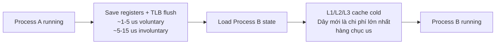

| Loại | Nguyên nhân | Chi phí | AIOps signal |
|---|---|---|---|
| Voluntary | Process tự nhường (chờ I/O, mutex) | 1–5 μs | Cao → I/O wait hoặc lock contention |
| Involuntary | Kernel cưỡng chế (hết time slice) | 5–15 μs | > 10.000/s/core → quá nhiều runnable threads |

> [!TIP]
> **Rule of thumb:** Involuntary context switch > 10.000/s/core là leading indicator cho latency spike, xuất hiện **trước** khi CPU utilization chạm 100%.

### 1.3 CFS Scheduler và container

Linux dùng CFS (Completely Fair Scheduler): mỗi task có `vruntime`, CFS chọn task có vruntime thấp nhất. Trong container, CFS + cgroups CPU quota quyết định bao nhiêu CPU time pod thực sự nhận.

```
cpu.cfs_quota_us / cpu.cfs_period_us = CPU limit
```

Khi pod vượt quota, CFS **throttle** — một nguyên nhân latency spike phổ biến trong Kubernetes mà **không hiện trên CPU utilization metric**. Chi tiết throttling xem [§8](#8-cpu-throttling-latency-an-trong-kubernetes).

### 1.4 Metrics quan trọng cho AIOps

```bash
# CPU time breakdown
mpstat -P ALL 1

# Context switches per process
pidstat -w 1
# cswch/s = voluntary, nvcswch/s = involuntary

# Trong container (cgroups v2)
cat /sys/fs/cgroup/<cgroup>/cpu.stat
# nr_throttled, throttled_usec
```

---

## 2. Memory: RSS, cache, OOM và pressure

### 2.1 Virtual memory và page fault

Mỗi process có address space riêng. Kernel ánh xạ virtual pages → physical frames qua page table:

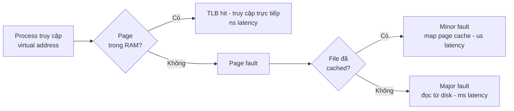

| Loại fault | Chi phí | AIOps implication |
|---|---|---|
| TLB hit | ~ns | Bình thường |
| Minor fault | ~μs | Bình thường khi startup, bất thường khi ổn định |
| Major fault | ~ms | **Disk I/O đang ảnh hưởng memory** — dấu hiệu swap hoặc memory pressure |

### 2.2 RSS, cache và available

| Metric | Ý nghĩa | AIOps cần biết |
|---|---|---|
| **RSS** (Resident Set Size) | Physical memory đang dùng | Tăng liên tục = có thể memory leak |
| **Cache/Buffer** | Kernel dùng RAM thừa để cache disk | Kernel tự giải phóng khi cần — **không phải memory exhaustion** |
| **Available** | Ước lượng memory có thể dùng | Metric đúng để alert, KHÔNG dùng `used` |
| **Swap** | Page bị đẩy ra disk | Bất kỳ swap activity > 0 trong container = đã quá tải |

> [!WARNING]
> **Sai lầm kinh điển:** `memory used = 95%` → alert → scale up. Nhưng `used` bao gồm cache/buffer mà kernel sẽ tự thu hồi. Metric đúng là `available` hoặc `working_set_bytes` trong Kubernetes.

### 2.3 OOM Killer

Khi physical memory và swap cạn, Linux OOM killer chọn process để giết dựa trên `oom_score`:

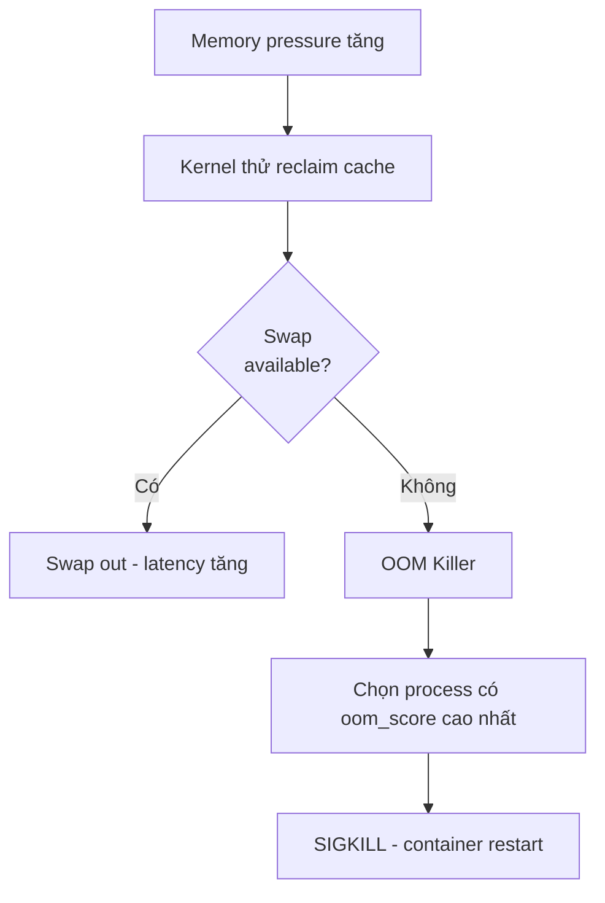

Trong Kubernetes, container vượt memory limit bị OOMKilled (exit code 137). AIOps engine phải phân biệt:
- OOM do memory leak (RSS tăng dần) → cần fix code
- OOM do traffic spike (RSS tăng đột ngột cùng throughput) → cần scale
- OOM do JVM/runtime GC pressure → cần tune heap

### 2.4 Memory pressure trong cgroups v2

```bash
# Pressure Stall Information (PSI)
cat /proc/pressure/memory
# some avg10=0.00 avg60=0.00 avg300=0.00 total=0
# full avg10=0.00 avg60=0.00 avg300=0.00 total=0
```

| PSI metric | Ý nghĩa |
|---|---|
| `some > 0` | Ít nhất một task đang chờ memory |
| `full > 0` | **Mọi** task đang chờ — throughput giảm |

PSI là leading indicator tốt hơn `memory.usage_in_bytes` cho anomaly detection.

---

## 3. Disk I/O: throughput, latency, saturation

### 3.1 I/O stack đơn giản hóa

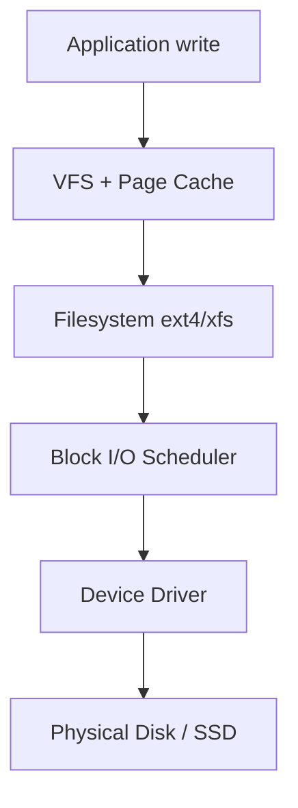

### 3.2 Metrics phân biệt I/O bottleneck

| Metric | Công cụ | AIOps signal |
|---|---|---|
| **IOPS** | `iostat -x 1` | Vượt device limit → queue depth tăng |
| **Throughput** (MB/s) | `iostat` | Vượt bandwidth limit → sequential bottleneck |
| **Await** (ms) | `iostat` | Latency per I/O — **metric quan trọng nhất** |
| **%util** | `iostat` | > 80% → device bão hòa (cho HDD; SSD có thể > 100% parallel) |
| **Queue depth** | `iostat avgqu-sz` | Tăng = I/O requests đang xếp hàng |

> [!IMPORTANT]
> **Cho SSD/NVMe:** `%util = 100%` không có nghĩa device hết khả năng vì SSD xử lý song song. Dùng `await` (latency) và `avgqu-sz` (queue depth) để đánh giá saturation thật.

### 3.3 Disk I/O trong container

Kubernetes resource limits không có disk IOPS limit mặc định. Một pod có thể chiếm toàn bộ disk bandwidth. blkio cgroup giới hạn theo device, nhưng nhiều cluster không bật. AIOps engine phải dùng per-pod I/O metrics từ cAdvisor hoặc eBPF thay vì chỉ node-level `iostat`.

---

## 4. Network: bandwidth, connection state, retransmit

### 4.1 TCP connection states quan trọng

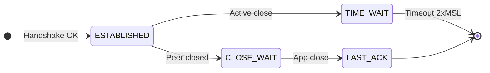

| State | AIOps signal |
|---|---|
| **TIME_WAIT** cao | Nhiều short-lived connections — xem connection pooling |
| **CLOSE_WAIT** tăng | Application không close socket — **memory/fd leak** |
| **SYN_RECV** tăng | SYN flood hoặc backend quá chậm accept |
| **ESTABLISHED** tăng đều | Bình thường nếu cùng throughput; bất thường nếu throughput giảm |

### 4.2 Retransmit — indicator mạnh cho network issue

```bash
# Đếm retransmit
ss -ti | grep -o 'retrans:[0-9/]*'
netstat -s | grep retransmit
```

TCP retransmit rate > 1% thường là:
- Network congestion hoặc packet loss
- Server quá tải không kịp ACK
- MTU mismatch

RCA engine nhìn retransmit rate tăng **trước** latency spike = network evidence mạnh, phản bác giả thuyết application bug.

### 4.3 DNS resolution

DNS failure là root cause thầm lặng: service A gọi B qua DNS, DNS cache hết hạn hoặc DNS server chậm, mọi request timeout nhưng metric chỉ hiện "latency cao" ở service A.

| DNS signal | Cách detect |
|---|---|
| Resolution latency > 100ms | CoreDNS metrics `coredns_dns_request_duration_seconds` |
| NXDOMAIN tăng | CoreDNS `coredns_dns_responses_total{rcode="NXDOMAIN"}` |
| Cache hit ratio giảm | CoreDNS cache metrics |
| `/etc/resolv.conf` ndots:5 | Mỗi lookup thử 5 suffix trước khi FQDN — 5x DNS queries |

> [!TIP]
> Kubernetes mặc định `ndots:5`. Một service gọi `payment.default.svc.cluster.local` sẽ thử suffix trước. Dùng FQDN kết thúc bằng dấu chấm `.` để tránh.

---

## 5. Saturation curves: tại sao 70% và 95% khác nhau theo hàm mũ

### 5.1 Queueing theory tối thiểu

Hệ thống xử lý request giống queue M/M/1. Khi utilization tăng, wait time tăng phi tuyến:

| Utilization | Wait multiplier | Ý nghĩa |
|---:|---:|---|
| 50% | 1x | Bình thường |
| 70% | 2,3x | Bắt đầu nhận thấy |
| 80% | 4x | Alert threshold hợp lý |
| 90% | 9x | Latency tăng rõ rệt |
| 95% | 19x | **Critical** — hệ thống gần sập |
| 99% | 99x | Hệ thống không phản hồi |

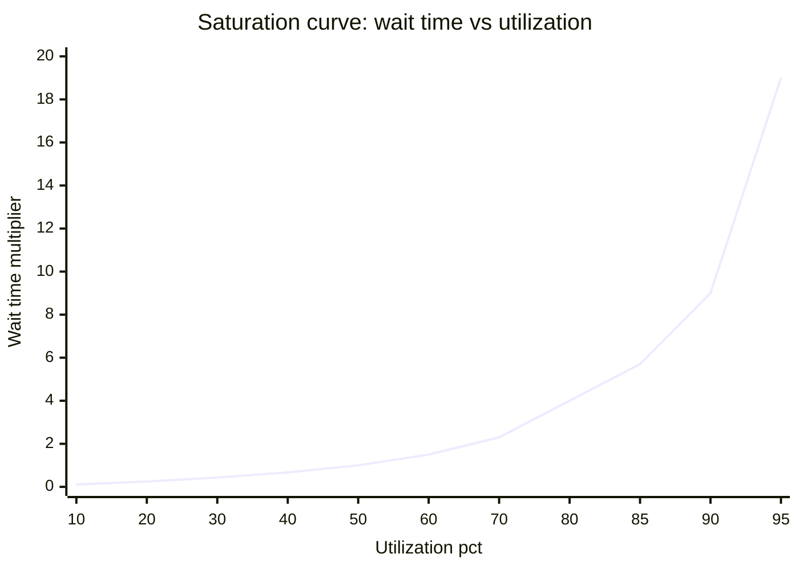

### 5.2 Implication cho AIOps

> [!IMPORTANT]
> **Threshold cố định "CPU > 90%" bỏ lỡ context.** CPU 90% trên 8-core với ít context switch có thể ổn. CPU 90% trên single-thread worker với queue depth 500 đã quá muộn. AIOps engine cần **saturation signal** (queue depth, wait time, throttle count) thay vì chỉ utilization.

Saturation curve giải thích tại sao:
- Scale up lúc 80% hiệu quả hơn lúc 95% (lead time)
- Hai resource cùng 70% nhưng hệ thống vẫn chậm → **cả hai queue chồng nhau** theo tích xác suất
- Traffic spike 20% khi utilization 50% không đáng lo, nhưng cùng spike ở 85% có thể gây sập

---

# SECTION 2 — APPLICATION RUNTIME

> *Resource metrics đúng mà application runtime sai vẫn gây outage. CPU idle, memory thừa, nhưng connection pool cạn thì mọi request timeout. Section này cover các bottleneck ở application layer mà AIOps engine phải hiểu.*

---

## 6. Container và cgroups v2: resource isolation thật sự

### 6.1 Container không phải VM

Container chia sẻ kernel với host. Isolation đến từ:

| Mechanism | Cô lập gì | Giới hạn |
|---|---|---|
| **Namespaces** | PID, network, mount, user | Không cô lập kernel vulnerability |
| **Cgroups v2** | CPU, memory, I/O, PIDs | Giới hạn không phải reservation |
| **Seccomp** | System calls | Filter, không sandbox hoàn toàn |

### 6.2 Cgroups v2 — unified hierarchy

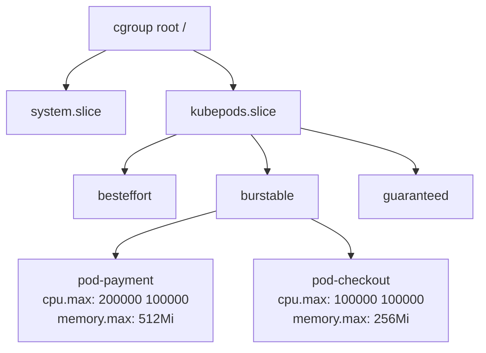

| Cgroup file | Ý nghĩa | AIOps metric |
|---|---|---|
| `cpu.max` | `quota period` — CPU limit | `container_cpu_cfs_throttled_seconds_total` |
| `cpu.stat` | nr_periods, nr_throttled, throttled_usec | Throttle ratio = `nr_throttled/nr_periods` |
| `memory.current` | Current memory usage | `container_memory_working_set_bytes` |
| `memory.max` | Memory limit | OOM khi vượt |
| `memory.pressure` | PSI counters | Leading indicator cho OOM |
| `io.stat` | Per-device I/O counters | Disk bottleneck per pod |

> [!WARNING]
> **`/proc/meminfo` và `/proc/cpuinfo` trong container hiển thị host, không phải container.** Application đọc "32 GB RAM" nhưng thực tế chỉ có 512 Mi → JVM heap quá lớn → OOM. Kubernetes Downward API hoặc cgroup-aware runtime mới đọc đúng.

---

## 7. Kubernetes pod lifecycle và failure modes

### 7.1 Pod states và transitions

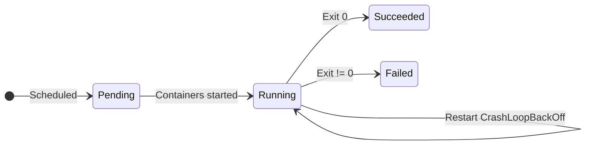

### 7.2 Failure modes AIOps phải phân biệt

| Failure | K8s signal | Ý nghĩa cho RCA |
|---|---|---|
| **CrashLoopBackOff** | Restart count tăng | App crash → check logs cho stack trace |
| **OOMKilled** | Exit code 137, `reason: OOMKilled` | Memory limit quá thấp hoặc leak |
| **ImagePullBackOff** | Event: `Failed to pull image` | Registry issue hoặc credential |
| **Pending (Unschedulable)** | Event: `FailedScheduling` | Cluster hết resource hoặc taint |
| **Evicted** | `reason: Evicted` | Node disk/memory pressure |
| **Readiness probe fail** | `Endpoints` removed | Service đang degrade nhưng pod running |
| **Liveness probe fail** | Container restart | Deadlock hoặc probe quá aggressive |

> [!IMPORTANT]
> **Probe hell:** Liveness probe quá aggressive + app slow startup = restart loop. Mỗi restart tạo thêm tải (image pull, init, cache cold) → **feedback loop**. AIOps engine phải phân biệt "app crash liên tục" với "probe cấu hình sai gây restart liên tục".

### 7.3 Pod disruption và scheduling

| Event | Impact | AIOps signal |
|---|---|---|
| Node drain | Pods bị evict | Surge traffic lên node còn lại |
| Rolling update | Old pod terminated, new pod starting | Momentary capacity giảm |
| Preemption | Lower-priority pod bị kill | Sudden capacity loss |
| HPA scale-up | New pods starting | Capacity tăng nhưng **cold cache** |

---

## 8. CPU throttling: latency ẩn trong Kubernetes

### 8.1 Cơ chế throttling

Kubernetes CPU limit sử dụng CFS bandwidth control:

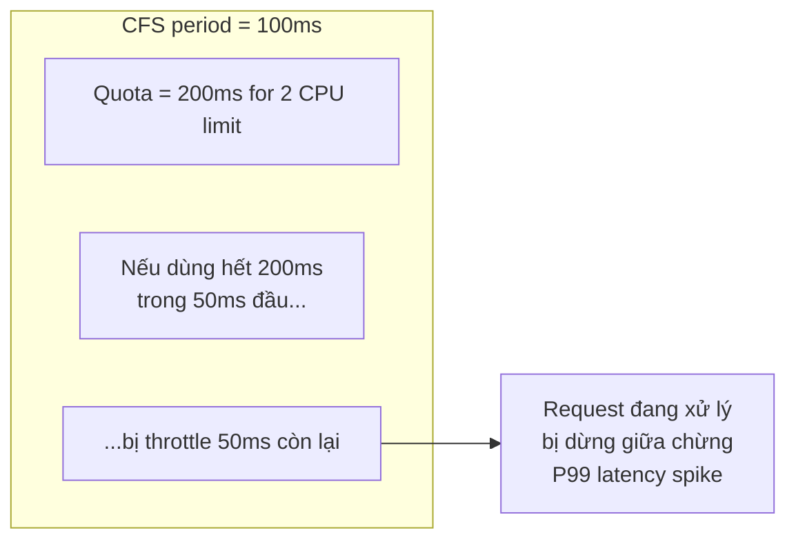

### 8.2 Tại sao CPU utilization thấp mà vẫn throttle

Pod có `cpu.limit = 2` trên node 8 CPU. Burst ngắn dùng 2 CPU trong 50ms → hết quota → throttle 50ms. Average utilization chỉ hiện 50%, nhưng mỗi period có 50ms request bị dừng.

| Metric | Ý nghĩa |
|---|---|
| `container_cpu_cfs_throttled_periods_total / container_cpu_cfs_periods_total` | **Throttle ratio** — > 5% cần review |
| `container_cpu_cfs_throttled_seconds_total` rate | Tổng thời gian bị throttle per second |
| `container_cpu_usage_seconds_total` | Actual CPU consumed — có thể rất thấp so với limit |

> [!WARNING]
> **Anti-pattern phổ biến:** Team thấy "CPU utilization chỉ 25%" nên giảm limit. Thực tế pod đã bị throttle 15% periods. Giảm limit → throttle tăng → P99 latency tăng → on-call page. AIOps engine phải monitor **throttle ratio cùng utilization**, không chỉ utilization.

### 8.3 Burstable vs Guaranteed

| QoS class | Request = Limit? | Throttle behavior |
|---|---|---|
| **Guaranteed** | Có | Predictable, ít bị evict |
| **Burstable** | Request < Limit | Burst OK khi node rảnh, throttle khi busy |
| **BestEffort** | Không set | Dùng gì còn thừa, evict đầu tiên |

---

## 9. Connection pool: cơ chế cạn kiệt và amplification

### 9.1 Tại sao connection pool là bottleneck phổ biến nhất

Connection pool giới hạn concurrent connections tới backend (database, external service). Khi pool cạn:

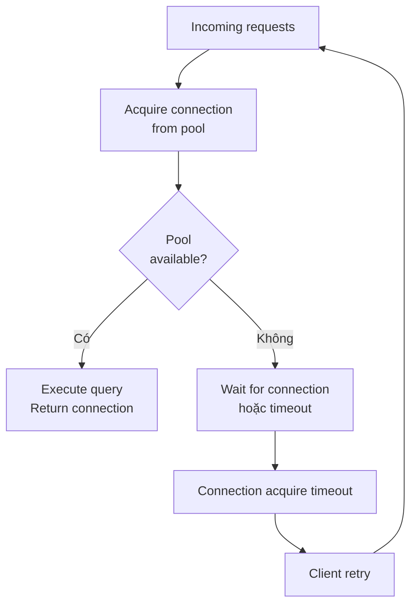

### 9.2 Case study — Payment DB pool exhaustion

Đây là case xuyên suốt handbook:

| Giai đoạn | Pool size | Active | Wait time | Throughput |
|---|---:|---:|---:|---:|
| Bình thường | 50 | 24 | 18 ms | 600 qps |
| Slow query xuất hiện | 50 | 42 | 120 ms | 580 qps |
| Pool near-full | 50 | 49 | 820 ms | 400 qps |
| Pool exhausted | 50 | 50 | timeout | 200 qps |
| Retry amplification | 50 | 50 | timeout | **1.100 qps attempt** nhưng 180 qps success |

> [!IMPORTANT]
> **Observation cho AIOps:** Pool wait time là **leading indicator**, xuất hiện trước error rate. Pool utilization 90% → wait time đã tăng 9x (theo saturation curve §5). Anomaly detector phải watch **pool wait latency** thay vì chỉ error rate.

### 9.3 Connection pool metrics

| Metric | Nguồn | Cách dùng |
|---|---|---|
| `pool_active_connections` | App metric / hikaricp | Current utilization |
| `pool_idle_connections` | App metric | Buffer capacity |
| `pool_pending_requests` | App metric | Queue depth — leading indicator |
| `pool_acquire_duration` | App metric / span | Wait time — saturation signal |
| `pool_timeout_total` | App metric | Error rate từ pool exhaustion |
| `db_connection_count` | PostgreSQL `pg_stat_activity` | Server-side view |

---

## 10. Thread pool và backpressure

### 10.1 Thread pool exhaustion

Tương tự connection pool, thread pool giới hạn concurrent work:

| Worker framework | Default pool size | Exhaustion signal |
|---|---|---|
| Tomcat | 200 threads | `tomcat_threads_busy` = `tomcat_threads_config_max` |
| Netty | 2 x CPU cores | Event loop blocked > 100ms |
| Go runtime | Goroutines unlimited nhưng GOMAXPROCS giới hạn | Goroutine count > 10.000 |
| Node.js | Single event loop | Event loop lag > 100ms |

### 10.2 Backpressure mechanisms

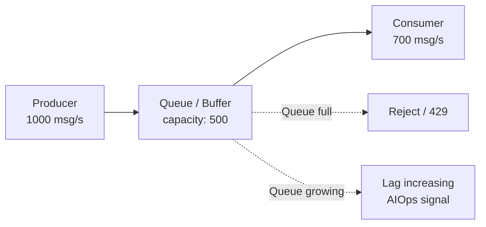

Không có backpressure = unbounded queue = **memory exhaustion rồi OOM**. Có backpressure = 429/rejection = **error tăng nhưng hệ thống sống sót**.

> [!TIP]
> **AIOps engine phải phân biệt:** 429 errors do backpressure hoạt động đúng (protective) vs 500 errors do hệ thống thật sự hỏng (fault). Remediation cho 429 là scale consumer; remediation cho 500 là fix bug. Đổi lẫn sẽ chữa sai bệnh.

---

## 11. Retry, timeout và circuit breaker

### 11.1 Retry amplification — feedback loop nguy hiểm nhất

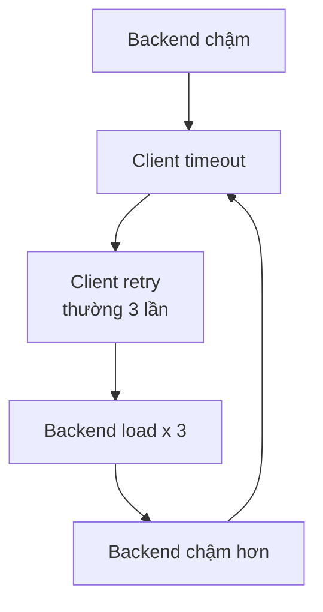

| Retry pattern | Amplification | AIOps implication |
|---|---|---|
| Immediate retry x 3 | 3x load | Nặng nhất, gây sập nhanh |
| Exponential backoff | 1-3x load | Tốt hơn, nhưng vẫn tăng tải |
| Jittered backoff | ~1,5x load | Best practice |
| No retry, fail fast | 1x load | Bảo vệ backend nhưng error tăng |

### 11.2 Timeout hierarchy

Timeout phải giảm dần theo call depth:

```
Gateway: 30s → Checkout: 15s → Payment: 5s → DB: 2s
```

Nếu DB timeout > Payment timeout → Payment timeout trước khi DB trả lời → DB connection bị leak (không ai nhận response).

### 11.3 Circuit breaker states

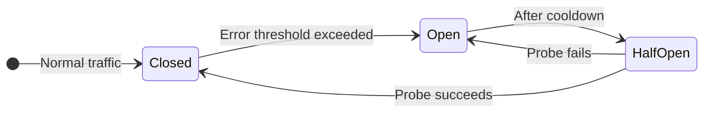

| State | Behavior | AIOps signal |
|---|---|---|
| **Closed** | Traffic bình thường | Healthy |
| **Open** | Reject tất cả → fail fast | Error 100% nhưng **bảo vệ backend** |
| **Half-Open** | Cho ít traffic thử | Recovery probe |

> [!WARNING]
> Circuit breaker làm backend trông **khỏe** (load giảm, CPU giảm) trong khi client vẫn lỗi 100%. AIOps engine nhìn DB metrics tốt lên → kết luận "đã phục hồi" → sai. Phải check **client-side success rate** cùng server-side metrics.

---

# SECTION 3 — FAILURE PATTERNS

> *Hiểu mechanism cụ thể của từng loại failure quyết định RCA có tìm đúng root cause hay chỉ đổ lỗi cho triệu chứng. Section này xây taxonomy mà Ch.09-Ch.11 sử dụng.*

---

## 12. Failure mode taxonomy

### 12.1 Phân loại theo mechanism

| Category | Mechanism | Ví dụ | RCA signal |
|---|---|---|---|
| **Resource exhaustion** | Một resource hết capacity | CPU saturation, memory OOM, disk full, pool exhaustion | Saturation metric → error → timeout chain |
| **Configuration drift** | Config sai hoặc inconsistent | Wrong DB endpoint, feature flag, TLS cert expired | Recent change event + error signature mới |
| **Dependency failure** | External dependency down/slow | Database down, API timeout, DNS failure | Span error propagation, topology downstream |
| **Data corruption** | Data sai gây logic error | Schema mismatch, encoding error, poison message | Error rate tăng nhưng resource metrics bình thường |
| **Capacity mismatch** | Demand vượt provisioned capacity | Flash sale, viral event, batch job conflict | Traffic metric tăng trước error |
| **Clock/time issues** | Time-based logic sai | Certificate expiry, cron collision, timezone bug | Error xuất hiện tại thời điểm specific |
| **Feedback loop** | System tự amplify failure | Retry storm, thundering herd, cache stampede | Load tăng exponential, không theo traffic |

### 12.2 Tại sao taxonomy quan trọng cho AIOps

Cùng triệu chứng "latency tăng" nhưng mechanism khác → remediation khác:

| Mechanism | Remediation đúng | Remediation sai |
|---|---|---|
| Resource exhaustion | Scale up / reduce load | Restart (tạm hết rồi lại đầy) |
| Config drift | Rollback config | Scale up (không giải quyết) |
| Dependency failure | Failover / circuit break | Retry (amplify failure) |
| Feedback loop | Break loop (reduce retry, shed load) | Scale up (thêm tải vào loop) |

RCA engine không chỉ nói "payment-db là root cause" mà phải nói "pool_exhaustion do retry_amplification" — failure mode quyết định action.

---

## 13. Cascading failures và error storms

### 13.1 Cơ chế cascade

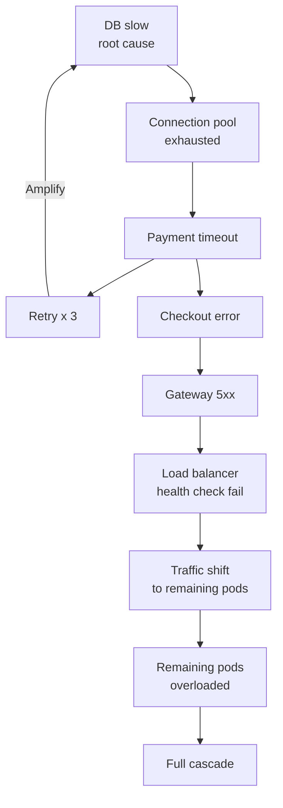

### 13.2 Cascade detection signals

| Signal | Ý nghĩa | AIOps evidence |
|---|---|---|
| Error rate lan theo dependency graph | Cascade đang xảy ra | Topology + temporal order |
| Retry rate tăng trước error rate | Retry amplification | Leading indicator |
| Healthy service downstream bắt đầu lỗi | Propagation, không phải independent fault | Span error propagation |
| Traffic tăng trên remaining instances | Load redistribution | Capacity risk |
| Circuit breaker mở | Protection đang hoạt động | Backend load giảm nhưng client lỗi |

### 13.3 AIOps phải làm gì với cascade

1. **Không đếm alert** — downstream service có nhiều alert nhất không phải root cause
2. **Duyệt ngược** dependency graph — root candidate là node đỏ mà callee khỏe (xem Ch.11 §4)
3. **Tách retry amplification** khỏi primary failure — retry rate là khuếch đại, không phải trigger
4. **Circuit breaker recovery ≠ root fix** — backend metrics tốt lên vì load giảm, không phải vì sửa xong

---

## 14. Feedback loops: retry storm, thundering herd, metastable state

### 14.1 Retry storm

Đã cover ở [§11.1](#111-retry-amplification--feedback-loop-nguy-hiem-nhat). Bổ sung: retry storm có đặc tính **exponential load growth** không tương xứng với traffic growth:

```
Traffic tăng 10% → DB chậm → Retry 3x → Load tăng 30%
→ DB chậm hơn → Timeout → Retry lại → Load tăng 90%
→ DB sập → Toàn bộ timeout → Retry tất cả → Load tăng 300%
```

### 14.2 Thundering herd

Khi nhiều client đồng loạt retry hoặc reconnect sau outage:

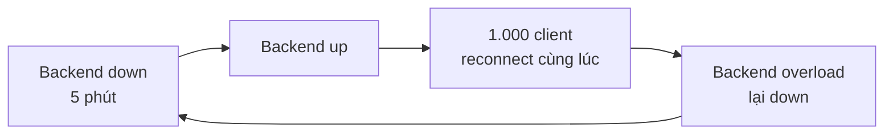

**Giải pháp:** Jittered reconnect, connection draining, progressive admission. AIOps engine nhận diện thundering herd khi load spike xuất hiện **ngay sau recovery** — không phải organic traffic.

### 14.3 Metastable failures

> [!IMPORTANT]
> **Metastable failure** là trạng thái hệ thống hoạt động ở mode degraded ổn định — không crash, không recover, giữ nguyên trạng thái xấu vô hạn cho đến khi có intervention. Ví dụ:
>
> - Queue depth cao → processing chậm → queue tiếp tục cao → trạng thái ổn định ở mức "chậm"
> - GC pressure → throughput giảm → backlog tăng → GC pressure tăng → ổn định ở throughput thấp
> - Retry rate ổn định ở 40% — không tăng, không giảm

Metastable failure nguy hiểm vì anomaly detector có thể **học nó thành baseline mới** nếu persistence window quá ngắn. Ch.09 Anomaly Detection cần freeze baseline khi incident active để tránh baseline poisoning.

### 14.4 Cache stampede

Cache key hết hạn → N requests cùng lúc miss → N requests cùng query backend → backend overload:

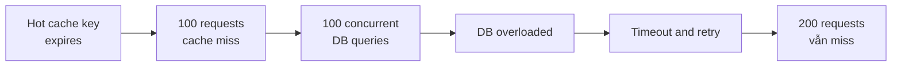

**Giải pháp:** Cache lock (only one request refreshes), stale-while-revalidate, jittered TTL.

---

## 15. Gray failures và partial outages

### 15.1 Gray failure là gì

Gray failure là khi hệ thống **không hoàn toàn down nhưng không hoàn toàn hoạt động**:

| Ví dụ | Tại sao khó detect |
|---|---|
| 1/5 replicas trả lỗi, 4/5 khỏe | Aggregate success rate chỉ giảm 4% |
| Latency P99 spike nhưng P50 bình thường | Threshold trên P50 không bắt được |
| Một region lỗi, hai region khỏe | Global metric trung bình che lỗi |
| Một tenant timeout, 99 tenant khỏe | Per-service metric không phân biệt |
| Network packet loss 2% | Retry che lỗi, throughput giảm nhẹ |

### 15.2 Detection strategy

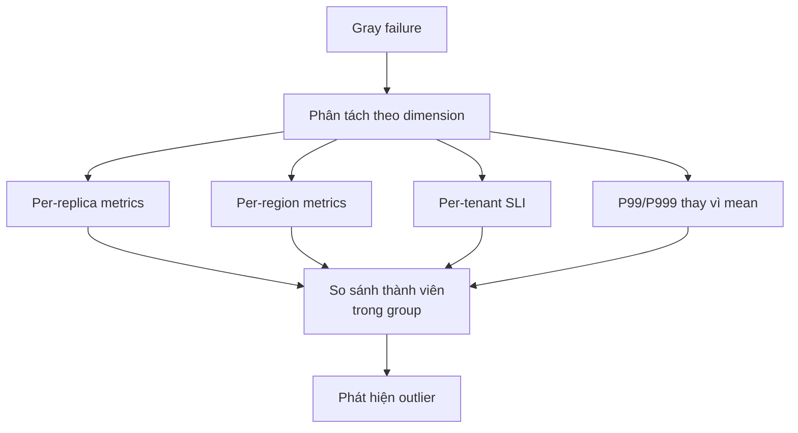

> [!TIP]
> **Rule for AIOps:** Nếu chỉ dùng aggregate metrics, gray failure ẩn. Anomaly detection phải chạy ở granularity đủ nhỏ — per-replica, per-region, per-tenant — rồi mới aggregate. Ch.09 giải thích chi tiết.

---

## 16. Blast radius patterns

### 16.1 Scope phân loại

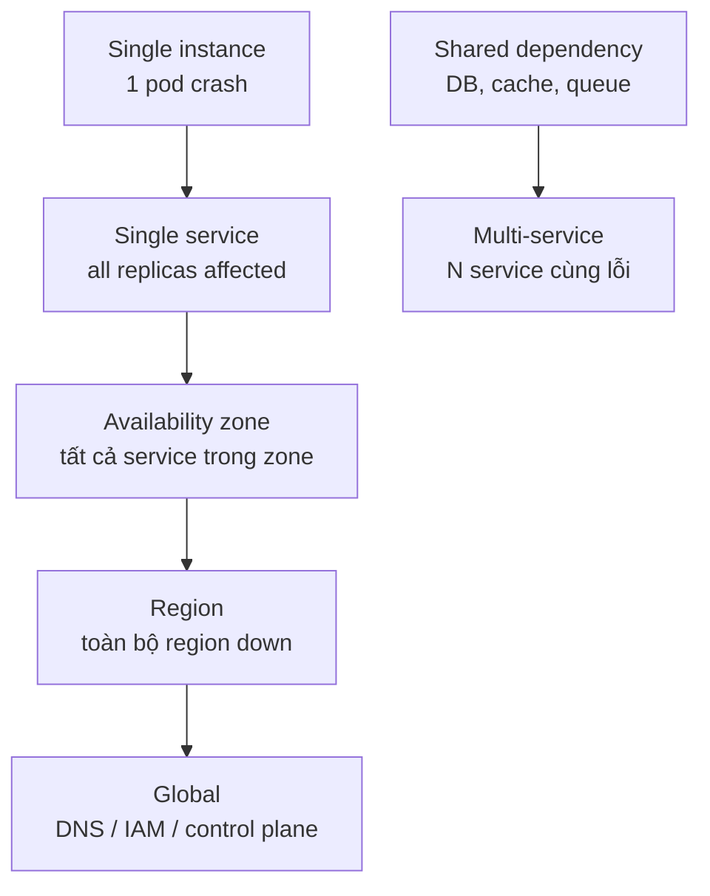

### 16.2 Shared dependency amplification

| Shared resource | Services affected | Blast radius |
|---|---|---|
| PostgreSQL cluster | Payment, Order, Ledger | 3 service critical |
| Redis cache | Auth, Session, Rate limit | All authenticated traffic |
| Kafka cluster | All async processing | Event-driven services |
| DNS | **Tất cả** | **Global** |
| IAM/Auth provider | **Tất cả authenticated** | **Nearly global** |

> [!WARNING]
> **Three replicas sharing DNS, IAM hoặc one message bus vẫn là một failure domain.** AIOps topology phải model shared dependencies, không chỉ direct caller-callee. RCA engine nhìn "3 service cùng đỏ, không có path giữa chúng" → phải check shared infrastructure.

### 16.3 Blast radius cho AIOps

RCA engine cần blast radius để:
1. **Correlation** — 3 service cùng lỗi + cùng dùng shared DB → có thể một incident, không phải ba
2. **RCA ranking** — Shared dependency giải thích nhiều symptom hơn → rank cao hơn
3. **Remediation safety** — Action chạm shared resource có blast radius lớn → cần higher approval tier
4. **Impact estimation** — Customer impact bằng blast radius nhân traffic nhân business criticality

---

# SECTION 4 — TIME, ORDER VÀ CONSISTENCY

> *Temporal reasoning là xương sống của RCA. Nếu clock sai, causal order sai. Nếu event-time bị nhầm với processing-time, "đỏ trước" không đáng tin. Section này xây foundation cho Ch.11 temporal precedence.*

---

## 17. Clock skew và impact lên causal reasoning

### 17.1 Tại sao clock skew nguy hiểm

Service A ghi error lúc `10:00:02` nhưng clock nhanh 40 giây. Service B ghi error lúc `09:59:40` với clock đúng. Sort raw timestamp → B root vì "đỏ trước". Thực tế A lỗi trước.

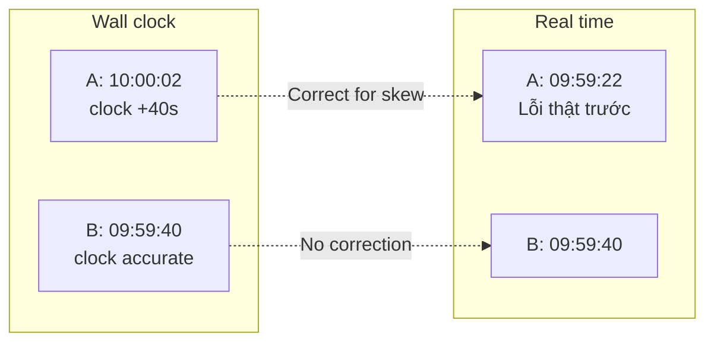

### 17.2 Sources of clock skew

| Source | Magnitude | Mitigation |
|---|---|---|
| NTP sync gap | 10-100 ms | chrony/NTP monitoring |
| VM clock drift | Up to seconds | PTP hoặc frequent NTP |
| Container without NTP | Inherited từ host | Host NTP health |
| Cross-region | Network delay 10-100 ms | Region-aware timestamp |
| Application timestamp | Arbitrary | Dùng trace parent-child thay vì wall clock |

### 17.3 Implication cho AIOps

- **Onset interval thay vì point timestamp:** Service A lỗi trong `[09:59:20, 10:00:00]`, B trong `[09:59:38, 09:59:42]`. Interval chồng nhau → temporal evidence = 0, không thưởng "đỏ trước"
- **Trace parent-child > wall clock:** Trong cùng trace, child span chắc chắn xảy ra sau parent — không phụ thuộc clock
- **Clock skew monitoring:** `node_timex_offset_seconds` trong Prometheus — nếu > 100ms, hạ trust temporal evidence
- **Late event handling:** Evidence đến muộn tạo revision, không tạo incident mới

---

## 18. Event-time, processing-time, ingest-time

### 18.1 Ba khái niệm thời gian

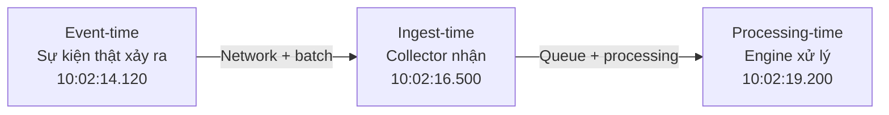

| Loại | Ai ghi | Dùng cho |
|---|---|---|
| **Event-time** | Application/SDK | Causal ordering, onset detection |
| **Ingest-time** | Collector/gateway | Data freshness, lag monitoring |
| **Processing-time** | Engine | SLA xử lý, không dùng cho causality |

### 18.2 Tại sao phải phân biệt

| Sai lầm | Hậu quả |
|---|---|
| Dùng processing-time cho causal order | Event xử lý trước không phải event xảy ra trước |
| Dùng ingest-time cho onset detection | Batch flush tạo "spike giả" |
| Không ghi event-time | Không thể replay deterministic |
| Kafka consumer dùng log append time | Partition rebalance đảo thứ tự |

> [!IMPORTANT]
> **Rule cho AIOps:** Mọi evidence phải mang cả event-time lẫn ingest-time. RCA dùng event-time cho causal reasoning. Data quality dùng `ingest_time - event_time` để detect lag. Ch.06 Data Plane enforce điều này.

---

## 19. Replication lag và split-brain

### 19.1 Replication lag

```mermaid
flowchart LR
    WRITE["Client write\nto primary"] --> PRIMARY["Primary DB"]
    PRIMARY -->|"Replication\nlag = 500ms"| REPLICA1["Replica 1"]
    PRIMARY -->|"Replication\nlag = 2s"| REPLICA2["Replica 2"]
    READ["Client read\nfrom replica"] --> REPLICA1
    READ --> REPLICA2
```

| Lag level | Impact | AIOps signal |
|---|---|---|
| < 100ms | Thường acceptable | Bình thường |
| 100ms - 1s | Read-after-write inconsistency | Business logic có thể lỗi |
| 1s - 10s | **Stale reads gây bug** | Inventory oversell, double booking |
| > 10s | Replica có thể bị disconnect | Health check failure |

### 19.2 Split-brain

Khi network partition chia cluster thành hai partition đều nghĩ mình là primary:

```mermaid
flowchart TB
    subgraph A ["Partition A"]
        PA["Node A\nNghĩ mình là leader"]
    end
    subgraph B ["Partition B"]
        PB["Node B\nNghĩ mình là leader"]
    end
    PA <-->|"Network\npartition"| PB
    CLIENT1["Client group 1"] --> PA
    CLIENT2["Client group 2"] --> PB
```

Split-brain gây **data corruption** — cả hai side write khác nhau, merge sau partition heal rất khó. AIOps signal:
- Leader election metric thay đổi
- Hai nodes cùng claim primary
- Write conflict rate tăng đột ngột
- Fencing token mismatch

> [!WARNING]
> Split-brain là failure mode **không được auto-remediate** vì risk data corruption. RCA engine phải escalate ngay khi detect, không đề xuất restart hay failover.

---

# SECTION 5 — CROSS-LAYER CORRELATION

> *Một triệu chứng ("latency spike") có thể do 5 layer khác nhau. Section này tổng hợp tất cả kiến thức trước đó thành framework mà AIOps engine dùng để phân biệt hypothesis.*

---

## 20. USE, RED và saturation mapping

### 20.1 USE method — cho infrastructure resources

| Dimension | CPU | Memory | Disk | Network |
|---|---|---|---|---|
| **Utilization** | `us + sy + wa + st` | `used / total` | `%util` | `bandwidth used / capacity` |
| **Saturation** | Run queue, throttle count | Swap activity, PSI | Queue depth, await | Retransmit, drop |
| **Errors** | Machine check | OOM kills, corruption | I/O errors | CRC, carrier errors |

### 20.2 RED method — cho application services

| Dimension | Metric | AIOps meaning |
|---|---|---|
| **Rate** | Requests per second | Demand — tăng bất thường? |
| **Errors** | Error count/ratio | Impact — customer affected? |
| **Duration** | Latency percentiles | Experience — response time acceptable? |

### 20.3 Kết hợp USE + RED

```mermaid
flowchart TB
    RED["RED: Rate/Error/Duration\nCustomer-facing"] --> WHAT["Có vấn đề không?\nCustomer impact?"]
    USE["USE: Util/Saturation/Error\nInfrastructure"] --> WHERE["Vấn đề ở đâu?\nResource nào?"]
    WHAT --> WHY["Tại sao?\nRCA"]
    WHERE --> WHY
```

> [!TIP]
> **Workflow cho on-call:** RED (customer impact?) → USE (resource bottleneck?) → Failure mode (mechanism?). AIOps engine nên follow cùng order: detect impact trước, tìm resource sau, xác định mechanism cuối.

---

## 21. Cùng "latency spike" — 5 root cause ở 5 layer

Triệu chứng: `payment` P99 latency tăng từ 300ms lên 5.000ms.

| Layer | Root cause | Discriminating evidence |
|---|---|---|
| **CPU** | CPU throttling trong container | `throttled_periods` tăng; CPU utilization có thể thấp |
| **Memory** | GC pressure do memory pressure | GC pause duration tăng; RSS near limit |
| **Disk** | Slow query do disk I/O | DB `await` tăng; `iowait` cao trên DB node |
| **Network** | DNS resolution timeout | DNS latency tăng; retransmit trên specific path |
| **Application** | Connection pool exhaustion | Pool wait time tăng; DB query time bình thường |

### Key insight cho AIOps

Mỗi hypothesis cần **evidence ủng hộ** và **evidence phản bác**:

| Hypothesis | Ủng hộ nếu | Phản bác nếu |
|---|---|---|
| CPU throttle | Throttle rate > 5%, latency correlate | Throttle = 0, CPU idle cao |
| GC pressure | GC pause > 200ms, heap near max | GC pause normal, RSS ổn định |
| Disk I/O | DB await tăng, iowait cao | Disk metrics bình thường |
| DNS | DNS latency > 100ms, NXDOMAIN tăng | DNS metrics bình thường |
| Pool exhaustion | Pool wait > 500ms, pool full | Pool utilization thấp |

Đây chính là multi-signal RCA mà Ch.11 implement. System fundamentals cung cấp **kiến thức phân biệt** giữa các hypothesis.

---

## 22. Evidence pack: mỗi layer cung cấp signal gì cho RCA

| Layer | Signal type | AIOps evidence | Chapter sử dụng |
|---|---|---|---|
| **Compute** | CPU breakdown, throttle, PSI | Resource exhaustion detection | Ch.09 |
| **Memory** | RSS trend, OOM events, GC | Memory pressure vs leak | Ch.09, Ch.11 |
| **Network** | Connection state, retransmit, DNS | Network vs application failure | Ch.11 |
| **Storage** | IOPS, await, queue depth | Disk vs application bottleneck | Ch.11 |
| **Container** | Pod events, restart count, eviction | Scheduling vs application crash | Ch.10 |
| **Application** | Pool metrics, thread metrics, queue depth | Application bottleneck identification | Ch.11, Ch.12 |
| **Dependency** | Span timing, error propagation | Cascade direction | Ch.11 |
| **Change** | Deploy events, config diff, flag toggle | Change correlation | Ch.08, Ch.11 |
| **Time** | Clock skew, event-time gap | Temporal evidence quality | Ch.06, Ch.11 |

---

## 23. Anti-patterns và production review

### 23.1 Anti-patterns

| Anti-pattern | Hậu quả | Sửa |
|---|---|---|
| Alert trên CPU utilization thay vì saturation | False positive ở high-throughput bình thường, miss real saturation | Dùng throttle count, queue depth, PSI |
| Dùng `memory used` thay vì `available` | Alert khi kernel cache data (bình thường) | Dùng `memory.available` hoặc `working_set_bytes` |
| Aggregate metrics hide gray failure | Partial outage invisible | Per-replica, per-region granularity |
| Ignore connection pool metrics | Pool exhaustion = "database lỗi" | Monitor pool wait time, active connections |
| Clock skew unmonitored | Causal order sai | Monitor NTP offset, dùng trace parent-child |
| Retry without backoff/jitter | Amplify failures | Jittered exponential backoff, circuit breaker |
| Scale up for feedback loop | Thêm resource vào vòng xoáy | Break loop first (shed load, reduce retry) |
| Auto-remediate split-brain | Data corruption | Escalate immediately, human decision |

### 23.2 Production review checklist

Trước khi AIOps engine dùng system signals, trả lời:

- [ ] CPU time có được breakdown (user/system/iowait/steal) hay chỉ total?
- [ ] Memory metric dùng `available`/`working_set_bytes` hay `used`?
- [ ] Container có monitor CPU throttle ratio không?
- [ ] Connection pool metrics có expose hay chỉ có DB-side metrics?
- [ ] Retry policy có backoff + jitter hay immediate retry?
- [ ] Circuit breaker có bật ở critical path không?
- [ ] Clock skew có được monitor và dưới 100ms không?
- [ ] Event-time và ingest-time có được ghi tách biệt không?
- [ ] Shared dependencies có được model trong topology không?
- [ ] Saturation metrics (queue depth, wait time) có được thu thập không?
- [ ] Per-replica metrics có available cho gray failure detection không?
- [ ] Blast radius patterns có được document cho critical services không?

---

## Kết luận

System fundamentals không phải kiến thức "nice to have". Nó quyết định AIOps engine:

- **Detect đúng:** Biết iowait khác CPU overload → không false positive scale-out
- **Diagnose đúng:** Biết pool wait trước error → RCA chỉ đúng root cause
- **Act đúng:** Biết retry storm khác traffic spike → break loop thay vì scale
- **Trust đúng:** Biết clock skew → hạ trust temporal evidence thay vì kết luận sai

Chương tiếp theo — [01 — Observability](../01-observability/README.vi.md) — thiết kế evidence pack từ các system signals này để AIOps engine tiêu thụ.

---

## Tài liệu liên quan

- [01 — Observability](../01-observability/README.vi.md)
- [06 — Data Plane](../06-data-plane/README.vi.md)
- [09 — Anomaly Detection](../09-anomaly-detection/README.vi.md)
- [11 — Root Cause Analysis](../11-root-cause-analysis/README.vi.md)

--8<-- "docs/includes/acceptance-footer.vi.md"
