# Chapter S — Kiến trúc Hệ thống Hiện đại cho Kỹ sư AIOps (Phiên bản 2026)

> **AI chỉ xử lý Data — Metrics, Logs, Traces. Nhưng Data đó phản ánh hành vi vật lý của CPU, Memory, Network, Disk, GPU. Nếu kỹ sư AIOps không hiểu BẢN CHẤT VẬT LÝ đằng sau mỗi con số, mọi mô hình Anomaly Detection sẽ thành hộp đen vô dụng, mọi Root Cause Analysis sẽ chỉ ra triệu chứng thay vì nguyên nhân, và mọi Auto-healing sẽ chữa sai bệnh. Chương này xây dựng nền tảng hệ thống cần thiết trước khi đọc bất kỳ chapter nào về intelligence.**

---

## Prerequisites

- Kinh nghiệm cơ bản với Linux và command line
- Hiểu biết sơ lược về container và Kubernetes
- Khuyến nghị: [00 — Introduction to AIOps](../00-introduction.vi.md)

## Related Documents

- [01 — Observability](../01-observability/README.vi.md) — thiết kế evidence pack từ system signals
- [02 — OpenTelemetry](../02-opentelemetry/README.vi.md) — thu thập telemetry từ các lớp hệ thống
- [03 — Prometheus](../03-prometheus/README.vi.md) — lưu trữ và truy vấn system metrics
- [06 — Data Plane](../06-data-plane/README.vi.md) — normalize và enrich telemetry data
- [09 — Anomaly Detection](../09-anomaly-detection/README.vi.md) — phát hiện bất thường trên system signals

## Next Reading

Sau chương này, hãy chuyển sang [01 — Observability](../01-observability/README.vi.md) để hiểu cách thiết kế evidence pack cho các system signals đã học.

---

## Table of Contents

**Section 1: Compute & Runtime Mechanics**

1. [Linux Process Model](#1-linux-process-model)
2. [Memory Management](#2-memory-management)
3. [Linux Control Groups v2](#3-linux-control-groups-v2)
4. [Container Runtime Internals](#4-container-runtime-internals)
5. [Kubernetes Pod Lifecycle Deep Dive](#5-kubernetes-pod-lifecycle-deep-dive)
6. [Resource Requests/Limits & QoS Classes](#6-resource-requestslimits--qos-classes)
7. [CPU Throttling Mechanics](#7-cpu-throttling-mechanics)
8. [OOMKilled & Memory Pressure](#8-oomkilled--memory-pressure)
9. [Node Pressure & Eviction](#9-node-pressure--eviction)
10. [eBPF-based Telemetry](#10-ebpf-based-telemetry)

**Section 2: Networking & Traffic Engineering**

11. [End-to-End Request Lifecycle](#11-end-to-end-request-lifecycle)
12. [TCP/IP Internals for Operations](#12-tcpip-internals-for-operations)
13. [DNS Resolution Mechanics](#13-dns-resolution-mechanics)
14. [Ingress Controllers & Load Balancing](#14-ingress-controllers--load-balancing)
15. [Service Mesh Deep Dive](#15-service-mesh-deep-dive)
16. [API Gateway Patterns](#16-api-gateway-patterns)
17. [Connection Pool Management](#17-connection-pool-management)
18. [Thread Pool Exhaustion & Backpressure](#18-thread-pool-exhaustion--backpressure)
19. [Circuit Breaking & Cascading Prevention](#19-circuit-breaking--cascading-prevention)

**Section 3: Data & Storage Layer**

20. [Caching Architecture](#20-caching-architecture)
21. [Cache Failure Patterns](#21-cache-failure-patterns)
22. [Database Connection Management](#22-database-connection-management)
23. [Query Performance & Lock Contention](#23-query-performance--lock-contention)
24. [Replication Lag & Consistency](#24-replication-lag--consistency)
25. [Storage I/O Fundamentals](#25-storage-io-fundamentals)

**Section 4: Distributed Systems & Failure Patterns**

26. [Distributed Tracing Internals](#26-distributed-tracing-internals)
27. [Cascading Failures & Error Storms](#27-cascading-failures--error-storms)
28. [Gray Failures & Partial Outages](#28-gray-failures--partial-outages)

**Section 5: AI/ML Infrastructure Internals**

29. [GPU Compute & Saturation](#29-gpu-compute--saturation)
30. [LLM Inference Mechanics](#30-llm-inference-mechanics)
31. [Vector Database & Embedding Pipeline](#31-vector-database--embedding-pipeline)

**Section 6: Synthesis — System Thinking for AIOps**

32. [USE & RED Methods](#32-use--red-methods)
33. [Cross-Layer Correlation](#33-cross-layer-correlation)
34. [Anti-Patterns & Chapter Summary](#34-anti-patterns--chapter-summary)

---

# SECTION 1 — COMPUTE & RUNTIME MECHANICS

> *Mọi workload — từ microservice xử lý HTTP request đến LLM inference pipeline — đều chạy trên cùng một nền tảng: Linux kernel quản lý CPU time, memory pages, và I/O. Kỹ sư AIOps phải hiểu cách kernel phân phối tài nguyên, vì đây là lớp cuối cùng quyết định "con số" mà mô hình AI nhìn thấy.*

---

## 1. Linux Process Model

### 1.1 Tại sao kỹ sư AIOps cần hiểu process scheduling?

Khi anomaly detector báo "CPU utilization spike on pod X", câu hỏi đầu tiên phải là: **spike đó là user time, system time, iowait, hay steal?** Mỗi loại chỉ ra một nguyên nhân gốc khác nhau. Không có kiến thức này, RCA engine sẽ gán nhầm nguyên nhân.

### 1.2 Process states và CPU time breakdown

Một process trong Linux tồn tại ở một trong các trạng thái:

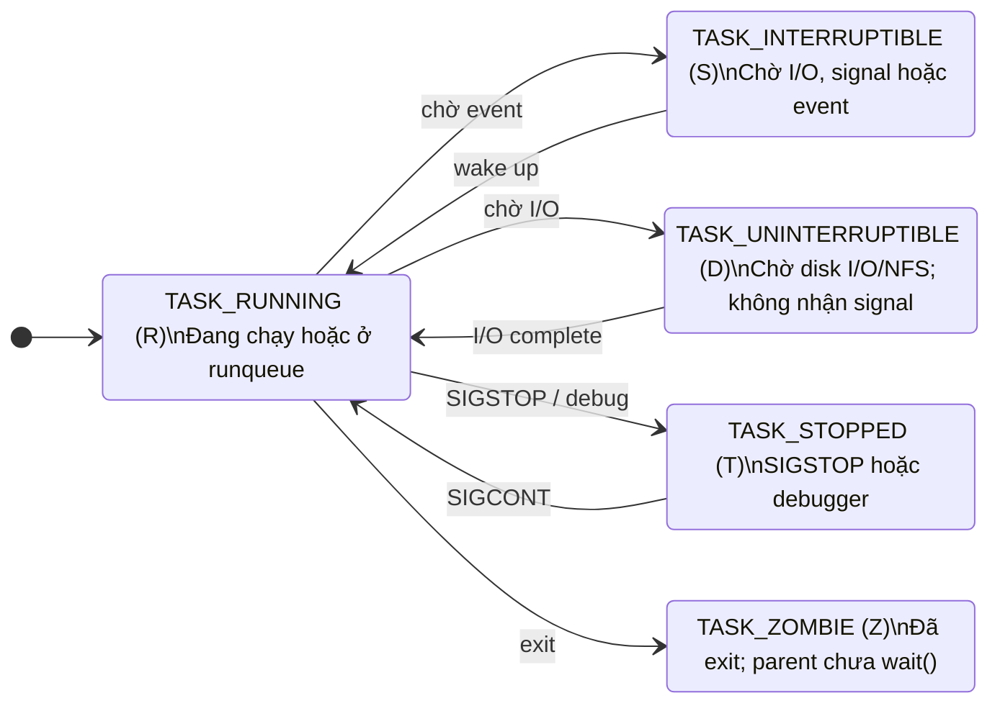

**CPU time phân tách thành:**

| CPU Time Type | Ký hiệu | Ý nghĩa | AIOps signal |
|---|---|---|---|
| **User** | `us` | Thời gian chạy application code | Cao → app busy (bình thường hoặc bug loop) |
| **System** | `sy` | Thời gian trong kernel (syscalls) | Cao → quá nhiều syscalls, context switch, copy |
| **I/O Wait** | `wa` | CPU idle vì chờ disk I/O | Cao → disk bottleneck, NOT CPU bottleneck |
| **Steal** | `st` | CPU bị hypervisor lấy mất (VM/cloud) | Cao → noisy neighbor, overcommit trên host |
| **IRQ/SoftIRQ** | `hi`/`si` | Xử lý hardware/software interrupt | Cao → network packet storm, driver issue |
| **Idle** | `id` | CPU không làm gì | Kết hợp với high latency → thread blocking |
| **Nice** | `ni` | User-space ở priority thấp | Batch jobs, background tasks |

> [!WARNING]
> **Sai lầm kinh điển trong AIOps:** Detector thấy `iowait` cao và kết luận "CPU overloaded" → trigger scale-out. Nhưng `iowait` nghĩa là CPU **đang rảnh** chờ disk. Scale thêm CPU không giúp gì — cần fix disk I/O hoặc caching. Đây là ví dụ điển hình về việc thiếu system knowledge dẫn đến auto-scaling sai.

### 1.3 Context switching

Context switch xảy ra khi kernel chuyển CPU từ process A sang process B. Kernel phải:

1. Lưu toàn bộ register state của A (program counter, stack pointer, general registers)
2. Flush/invalidate TLB entries (Translation Lookaside Buffer)
3. Load register state của B
4. Restore address space mapping của B

**Chi phí thực tế:**
- Voluntary context switch: process tự nhường CPU (chờ I/O, mutex) — ~1–5 μs
- Involuntary context switch: kernel cưỡng chế (hết time slice) — ~5–15 μs
- Chi phí ẩn: cache pollution — sau switch, L1/L2/L3 cache đầy data cũ, phải warm lại — **đây mới là chi phí lớn nhất**, có thể tới hàng chục μs

**Metrics quan trọng:**

```bash
# Đếm context switches trên toàn hệ thống
vmstat 1 | awk '{print $12, $13}'   # cs = context switches

# Đếm per-process
pidstat -w 1
# cswch/s  = voluntary context switches per second
# nvcswch/s = involuntary context switches per second

# Trong container (cgroups v2)
cat /sys/fs/cgroup/<cgroup>/cpu.stat
# nr_throttled, throttled_usec — dấu hiệu bị CFS giới hạn
```

> [!TIP]
> **Rule of thumb cho AIOps:** Involuntary context switch rate > 10.000/s/core thường cho thấy quá nhiều runnable threads so với CPU available. Đây là leading indicator cho latency spike trước khi CPU utilization chạm 100%.

### 1.4 CFS Scheduler — Completely Fair Scheduler

Linux mặc định dùng CFS scheduler. Nguyên lý cốt lõi:

- Mỗi task có **virtual runtime** (`vruntime`) — thời gian CPU mà nó "đã tiêu" (có trọng số theo priority/nice)
- CFS luôn chọn task có `vruntime` thấp nhất để chạy tiếp
- Cây red-black tree sắp xếp tasks theo `vruntime` → O(log n) để chọn next task
- **Time slice** không cố định — phụ thuộc số task runnable và target latency (`sched_latency_ns`, mặc định 6ms cho ≤8 tasks)

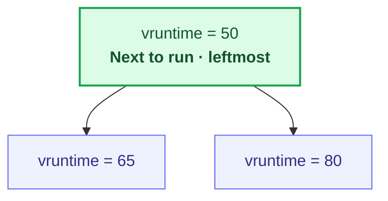

**AIOps implication:** Khi pod chạy trong container, CFS + cgroups CPU quota quyết định bao nhiêu CPU time pod thực sự nhận. `cpu.cfs_quota_us` / `cpu.cfs_period_us` tạo ra hiện tượng **CPU throttling** — một trong những nguyên nhân latency spike phổ biến nhất trong Kubernetes mà không hiện trên CPU utilization metric.

---

## 2. Memory Management

### 2.1 Virtual memory và paging

Mỗi process có address space riêng (virtual memory). Kernel ánh xạ virtual pages → physical frames qua **page table**. Khi process truy cập page chưa có trong RAM:

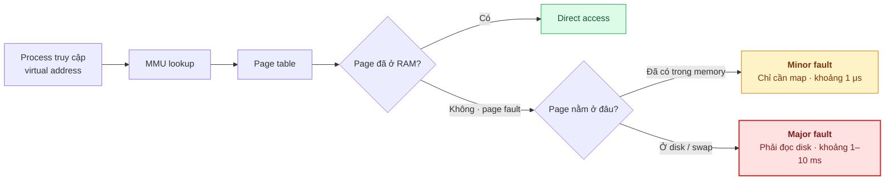

- **Minor page fault:** page có sẵn trong memory (vd: shared library đã loaded) — chỉ cần update page table. Chi phí ~1 μs.
- **Major page fault:** page phải đọc từ disk (swap) — chi phí **1.000x–10.000x** cao hơn. Đây là "death by swap" cho latency-sensitive workloads.

### 2.2 Memory pressure signals

| Signal | Nguồn | Ý nghĩa | Mức nghiêm trọng |
|---|---|---|---|
| `pgfault` (minor) | `/proc/vmstat` | Page table miss, no disk I/O | Bình thường ở mức vừa phải |
| `pgmajfault` (major) | `/proc/vmstat` | Phải đọc từ disk/swap | 🔴 Rất xấu cho latency |
| `pswpin`/`pswpout` | `/proc/vmstat` | Pages swap in/out | 🔴 Swapping đang xảy ra |
| `oom_kill_count` | cgroup stat | Số lần bị OOM kill | 🔴 Memory exhaustion |
| `memory.high events` | cgroup v2 | Vượt soft limit, kernel throttle allocations | 🟡 Cảnh báo sớm |
| `PSI memory` | `/proc/pressure/memory` | Pressure Stall Information | 🟡 Quantified memory contention |

### 2.3 NUMA — Non-Uniform Memory Access

Trên server multi-socket, mỗi CPU socket có "local memory" riêng. Truy cập local memory nhanh (~100ns), truy cập remote memory chậm hơn (~150–300ns):

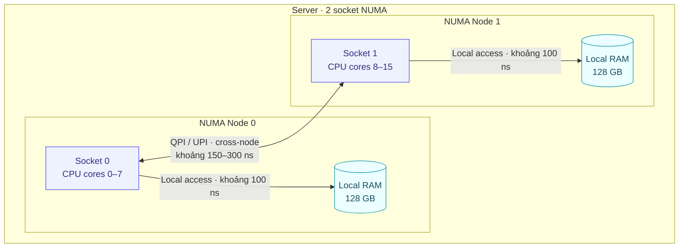

> [!NOTE]
> **AIOps impact:** Khi Kubernetes scheduler đặt pod trên node multi-socket mà không có NUMA-aware topology, container có thể bị phân bổ CPU core ở Socket 0 nhưng memory ở Socket 1. Kết quả: latency tăng 30–50% mà không metric nào giải thích rõ ràng — chỉ thấy "P99 cao bất thường". eBPF probe `numastat` có thể phát hiện `numa_miss` và `numa_foreign` events.

---

## 3. Linux Control Groups v2

### 3.1 Vai trò trong container ecosystem

Cgroups v2 là **cơ chế cốt lõi** mà kernel Linux dùng để giới hạn, theo dõi, và cô lập tài nguyên cho groups of processes. Mọi container (Docker, containerd, CRI-O) đều là processes bị quản lý bởi cgroups.

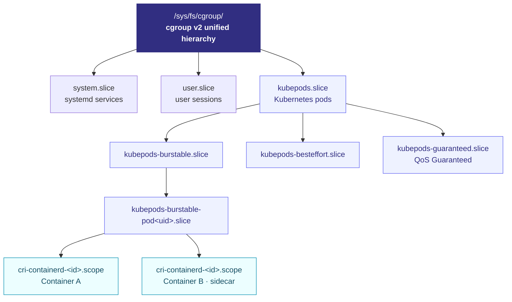

### 3.2 Resource controllers quan trọng

| Controller | File | Chức năng | AIOps metric |
|---|---|---|---|
| **CPU** | `cpu.max` | Bandwidth limit (quota/period) | `nr_throttled`, `throttled_usec` |
| **CPU** | `cpu.weight` | Chia sẻ CPU khi contention | Proportional share |
| **Memory** | `memory.max` | Hard limit → OOM kill khi vượt | `oom_kill` count |
| **Memory** | `memory.high` | Soft limit → throttle allocation | `high` events in `memory.events` |
| **Memory** | `memory.current` | Usage hiện tại | RSS + cache |
| **I/O** | `io.max` | IOPS/BPS limit per device | `io.stat` (rbytes, wbytes, rios, wios) |
| **PID** | `pids.max` | Giới hạn số processes | Fork bomb protection |
| **PSI** | `cpu.pressure`, `memory.pressure`, `io.pressure` | Pressure stall information | `some`, `full` — % thời gian bị stall |

### 3.3 PSI — Pressure Stall Information

PSI là innovation quan trọng trong cgroups v2. Thay vì chỉ biết "CPU utilization 80%", PSI trả lời: **"bao nhiêu phần trăm thời gian có task bị chờ vì thiếu CPU/memory/IO?"**

```
# /sys/fs/cgroup/kubepods.slice/.../cpu.pressure
some avg10=4.52 avg60=2.31 avg300=1.08 total=283947102
full avg10=1.03 avg60=0.55 avg300=0.24 total=89483921
```

- `some`: ít nhất 1 task bị stall (một phần workload bị ảnh hưởng)
- `full`: TẤT CẢ tasks bị stall (toàn bộ workload ngừng tiến)
- `avg10/60/300`: trung bình 10s/60s/300s (%)
- `total`: tổng thời gian stall tính bằng microseconds

> [!TIP]
> **PSI là gold signal cho AIOps.** So với CPU utilization (có thể misleading), PSI `some` > 10% trong 10s window là signal đáng tin cậy hơn cho anomaly detection. Meta (Facebook) sử dụng PSI thay thế load average làm trigger cho autoscaling — chính xác hơn nhiều vì nó đo **impact thực tế** chứ không phải utilization tuyệt đối.

---

## 4. Container Runtime Internals

### 4.1 Container không phải VM

Container là một **nhóm processes** bị cô lập bởi hai cơ chế kernel:

1. **Namespaces** — cô lập visibility: mỗi container thấy PID tree riêng, network stack riêng, filesystem riêng
2. **Cgroups** — cô lập resources: giới hạn CPU, memory, I/O mà nhóm processes có thể dùng

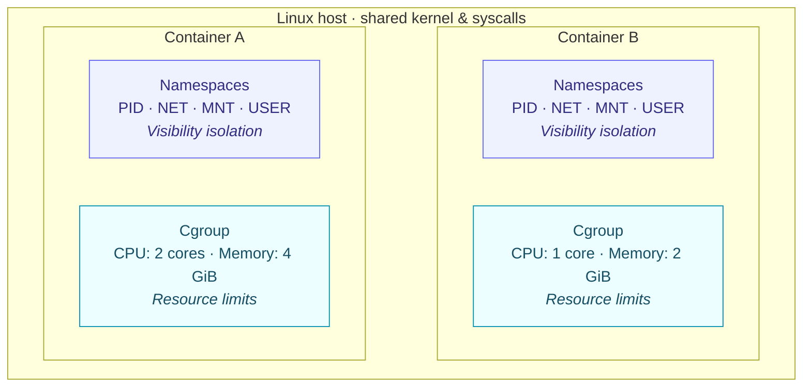

### 4.2 Linux namespaces

| Namespace | Cô lập | AIOps relevance |
|---|---|---|
| **PID** | Process ID tree | Container thấy PID 1, host thấy PID 38291 — cần map khi debug |
| **NET** | Network stack, interfaces, routing | Mỗi pod có IP riêng — metrics phải gắn đúng pod identity |
| **MNT** | Filesystem mount points | Container root filesystem vs host filesystem |
| **UTS** | Hostname | Container hostname ≠ node hostname — cần đúng label |
| **IPC** | Shared memory, semaphores | Hiếm khi quan trọng cho AIOps |
| **USER** | UID/GID mapping | Security context, rootless containers |
| **CGROUP** | Cgroup root view | Container chỉ thấy cgroup subtree của nó |

> [!WARNING]
> **Container observability trap:** Nhiều tool chạy trong container đọc `/proc/meminfo` hay `/proc/cpuinfo` nhưng thấy **thông tin của host**, không phải container. Ví dụ: JVM đọc `/proc/meminfo` thấy host có 128GB RAM → set heap 96GB → vượt container memory limit 4Gi → OOMKilled. Từ Java 10+ và Go 1.19+ đã có cgroup-aware runtime, nhưng legacy apps vẫn gặp lỗi này thường xuyên.

### 4.3 OverlayFS — Container filesystem

Container image sử dụng **layered filesystem** (OverlayFS):

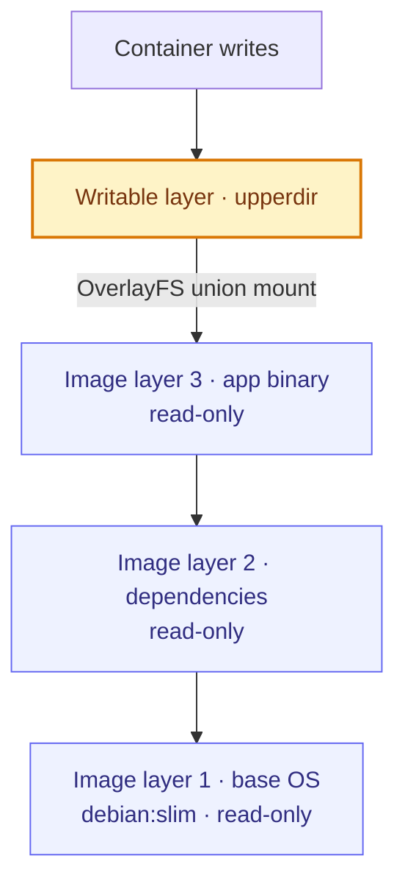

**AIOps impact:** Write-heavy containers tạo large `upperdir` → disk I/O tăng → có thể trigger node eviction (`imagefs.available` pressure). Metric `container_fs_writes_bytes_total` (cAdvisor) và `io.stat` (cgroup) phát hiện vấn đề này.

---

## 5. Kubernetes Pod Lifecycle Deep Dive

### 5.1 Từ `kubectl apply` đến container running

Hiểu lifecycle giúp AIOps engine phân biệt: pod pending vì scheduling hay vì image pull? Crash loop vì app bug hay vì resource limit?

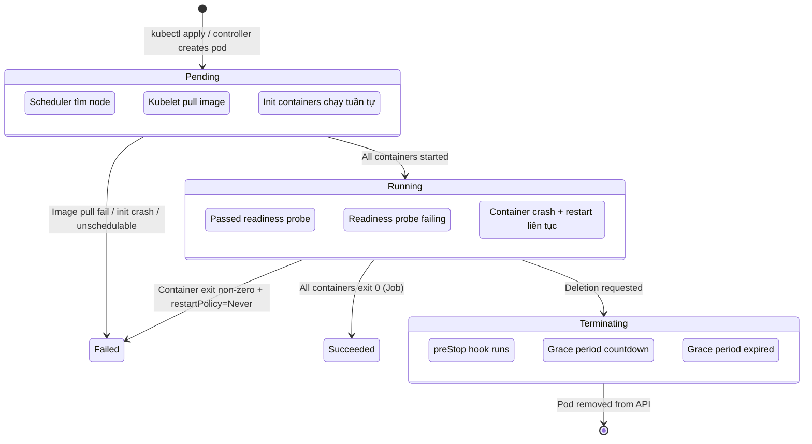

### 5.2 Pod phases và container states

| Pod Phase | Ý nghĩa | Container State | Lý do phổ biến |
|---|---|---|---|
| **Pending** | Pod accepted nhưng chưa chạy | `Waiting` | Scheduling, image pull, init containers |
| **Running** | Ít nhất 1 container running | `Running` | Bình thường |
| **Running** | Container restart liên tục | `Waiting` (CrashLoopBackOff) | App crash, config sai, dependency unavailable |
| **Succeeded** | Tất cả containers exit 0 | `Terminated` (exit 0) | Job hoàn thành |
| **Failed** | Container exit non-zero | `Terminated` (exit ≠ 0) | App error, OOMKilled (exit 137) |
| **Unknown** | Không lấy được status | — | Node unreachable, kubelet down |

### 5.3 Probe types và impact on traffic

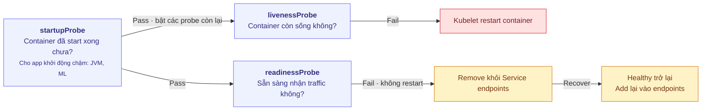

> [!CAUTION]
> **Sai lầm nguy hiểm nhất với probes:** Dùng **liveness probe check dependency** (vd: DB connection). Khi DB down → tất cả pods fail liveness → kubelet restart tất cả → restart storm → pods startup cùng lúc → connection storm → DB càng chết. Đây là cascading failure do misconfigured probes. Liveness phải chỉ check **process health**, không check dependency. Dependency health thuộc về readiness probe.

### 5.4 Graceful shutdown — tại sao 502 xảy ra khi deploy

Khi pod bị xóa (rolling update), timeline xảy ra **song song**:

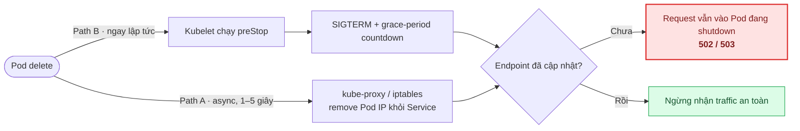

**Fix:** Thêm `preStop` hook với `sleep 5–10s` để chờ endpoint propagation:

```yaml
lifecycle:
  preStop:
    exec:
      command: ["sh", "-c", "sleep 5"]
terminationGracePeriodSeconds: 30
```

**AIOps implication:** Nếu detector thấy spike 502 mỗi lần deploy, đây không phải app bug — đây là endpoint propagation race condition. Correlation với deployment events (Ch. 08 — Topology & Change) sẽ giúp RCA engine loại trừ giả thuyết sai.

---

## 6. Resource Requests/Limits & QoS Classes

### 6.1 Requests vs Limits

| | Requests | Limits |
|---|---|---|
| **Ý nghĩa** | Lượng tài nguyên **bảo đảm** | Lượng tài nguyên **tối đa cho phép** |
| **Scheduler dùng** | ✅ Để quyết định đặt pod ở node nào | ❌ Không ảnh hưởng scheduling |
| **Enforcement** | Kernel cgroups `cpu.weight` | Kernel cgroups `cpu.max` (CPU), `memory.max` (Memory) |
| **Vượt CPU** | Burst lên nếu node rảnh | Bị **throttled** (CFS bandwidth) |
| **Vượt Memory** | — | Bị **OOMKilled** ngay lập tức |

### 6.2 QoS Classes

Kubernetes tự động gán QoS class dựa trên requests/limits config:

| QoS Class | Điều kiện | Eviction priority | Khi nào dùng |
|---|---|---|---|
| **Guaranteed** | requests == limits cho mọi container, mọi resource | Cuối cùng bị evict | Latency-critical services (payment, auth) |
| **Burstable** | Có requests nhưng < limits (hoặc chỉ set 1 resource) | Evict sau BestEffort | Phần lớn workloads |
| **BestEffort** | Không set requests NÀO | **Đầu tiên bị evict** | Batch jobs, dev/test |

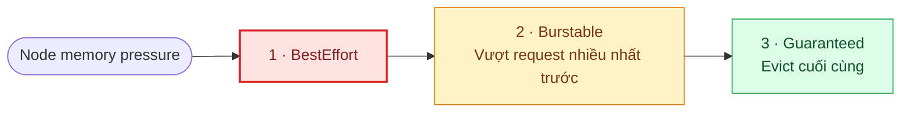

> [!IMPORTANT]
> **Sai lầm phổ biến trong production:** Set `requests` rất thấp (để scheduler dễ đặt) + `limits` rất cao (để app không bị kill). Kết quả: node overcommit → nhiều pods burst cùng lúc → node memory pressure → eviction storm. Đây là nguồn gốc của "random pod kills" mà teams hay đổ lỗi cho Kubernetes.

### 6.3 OOM Score — ai bị kill trước?

Kernel Linux dùng `oom_score_adj` để quyết định process nào bị OOM killer giết khi hết memory:

| QoS Class | `oom_score_adj` | Ý nghĩa |
|---|---|---|
| Guaranteed | `-997` | Gần như không bao giờ bị OOM kill |
| Burstable | `2` → `999` (tỷ lệ request/node) | Trung bình |
| BestEffort | `1000` | Ưu tiên kill đầu tiên |

---

## 7. CPU Throttling Mechanics

### 7.1 CFS Bandwidth Control — nguyên nhân #1 latency ẩn

Khi container có CPU limit, kernel áp dụng **CFS Bandwidth Control**:

```
cpu.max = "200000 100000"
           ↑ quota   ↑ period
           
Nghĩa: trong mỗi 100ms (period), container được dùng tối đa 200ms CPU time.
→ Tương đương 2 CPU cores.

Nếu container dùng hết quota trước khi period kết thúc:
→ Container bị THROTTLED — tất cả threads phải DỪNG cho đến period tiếp theo.
```

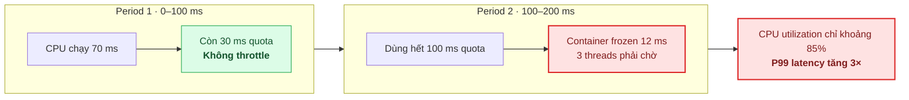

### 7.2 Phát hiện CPU throttling

```bash
# Từ cgroup v2
cat /sys/fs/cgroup/.../cpu.stat
# nr_periods    — tổng số CFS periods
# nr_throttled  — số periods bị throttle
# throttled_usec — tổng thời gian bị throttle (microseconds)

# Tính throttle ratio
throttle_ratio = nr_throttled / nr_periods
# > 5% → đáng lo
# > 20% → nghiêm trọng, latency bị ảnh hưởng rõ
```

**Prometheus metrics (từ cAdvisor):**

```promql
# Throttle ratio per container
rate(container_cpu_cfs_throttled_periods_total[5m])
/
rate(container_cpu_cfs_periods_total[5m])

# Tổng thời gian bị throttle
rate(container_cpu_cfs_throttled_seconds_total[5m])
```

### 7.3 Multi-threaded throttling amplification

Vấn đề đặc biệt nguy hiểm: JVM/Go runtime có nhiều threads (GC, compilation, app threads). Tất cả threads **chia chung** CPU quota của container:

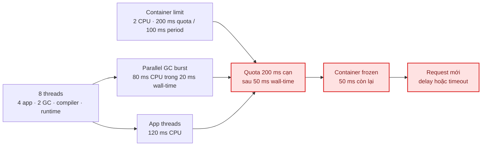

> [!WARNING]
> **Đây là lý do tại sao nhiều teams bỏ CPU limits cho latency-critical services.** Google nội bộ và nhiều công ty (Datadog, Uber) khuyến cáo chỉ set CPU requests (để scheduler biết cần gì) mà KHÔNG set CPU limits (để app burst tự do). Trade-off: mất isolation — một pod có thể "steal" CPU từ pod khác. Cách thay thế: dùng PSI triggers thay vì hard throttling.

---

## 8. OOMKilled & Memory Pressure

### 8.1 Hai loại OOM Kill

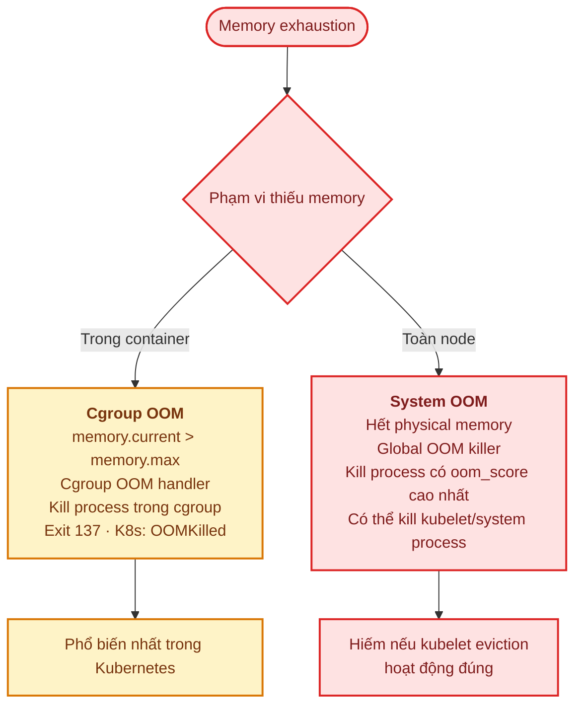

### 8.2 Memory metric anatomy

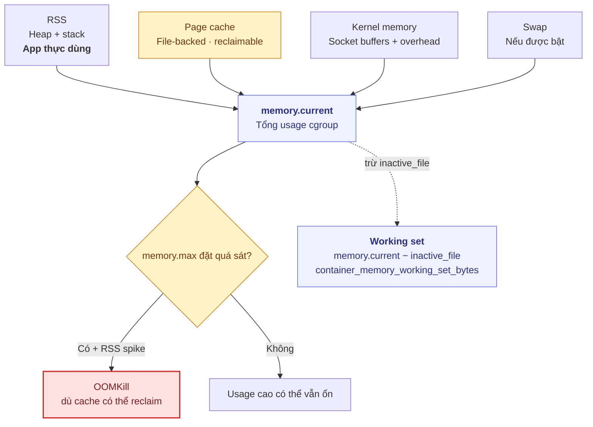

### 8.3 Memory leak detection cho AIOps

Pattern memory leak trong container:

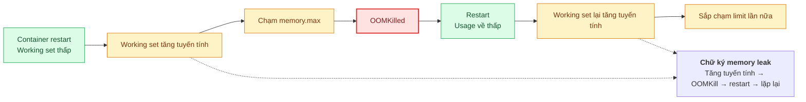

**AIOps detection:**
- **Slope detection:** Tính linear regression trên `container_memory_working_set_bytes` trong 1h/6h/24h window. Slope > 0 liên tục với R² > 0.9 → high probability memory leak
- **Restart correlation:** Container `restartCount` tăng đều + mỗi restart có reason `OOMKilled` → confirm leak
- **Time-to-exhaustion:** (memory.max - current) / slope = thời gian ước tính đến OOMKill tiếp theo → predictive alert

---

## 9. Node Pressure & Eviction

### 9.1 Kubelet eviction signals

Kubelet liên tục monitor node resources. Khi vượt ngưỡng, nó bắt đầu **evict pods** (ưu tiên BestEffort trước):

| Signal | Mô tả | Soft default | Hard default |
|---|---|---|---|
| `memory.available` | RAM khả dụng trên node | `100Mi` | `100Mi` |
| `nodefs.available` | Disk space trên root fs | `10%` | `5%` |
| `nodefs.inodesFree` | Inodes free trên root fs | `5%` | `3%` |
| `imagefs.available` | Disk space trên image fs | `15%` | `10%` |
| `pid.available` | PIDs khả dụng trên node | — | `100` |

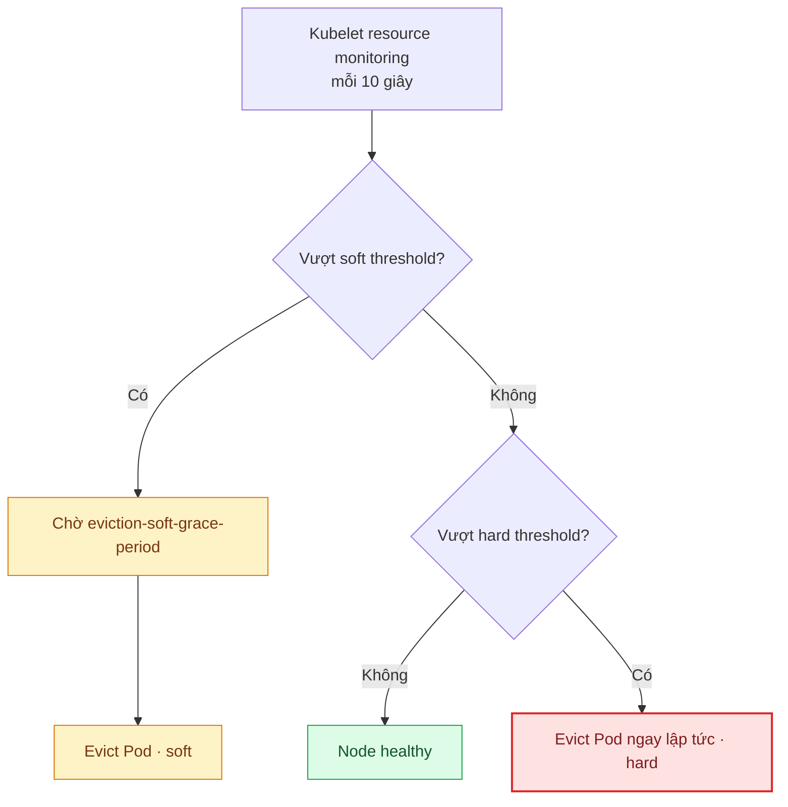

### 9.2 Node conditions

| Condition | Trigger | Ảnh hưởng |
|---|---|---|
| `MemoryPressure` | `memory.available` < threshold | Không schedule BestEffort pods mới |
| `DiskPressure` | `nodefs.available` hoặc `imagefs.available` < threshold | Không schedule pod mới, GC images/containers |
| `PIDPressure` | `pid.available` < threshold | Không schedule pod mới |
| `NetworkUnavailable` | Node network không configured | Scheduling bị block |

> [!TIP]
> **AIOps detection pattern:** Monitor `kube_node_status_condition` metric. Khi node chuyển sang `MemoryPressure=True`, đây là **leading indicator** cho eviction storm. Detector nên correlate với: (1) pods trên node đó có memory usage gần limit không, (2) có deployment/scaling event nào vừa xảy ra, (3) có memory leak pattern ở pod nào trên node.

---

## 10. eBPF-based Telemetry

### 10.1 eBPF — kinh thay đổi cuộc chơi observability

eBPF (extended Berkeley Packet Filter) cho phép chạy **sandboxed programs trong kernel** mà không cần kernel module hay application instrumentation:

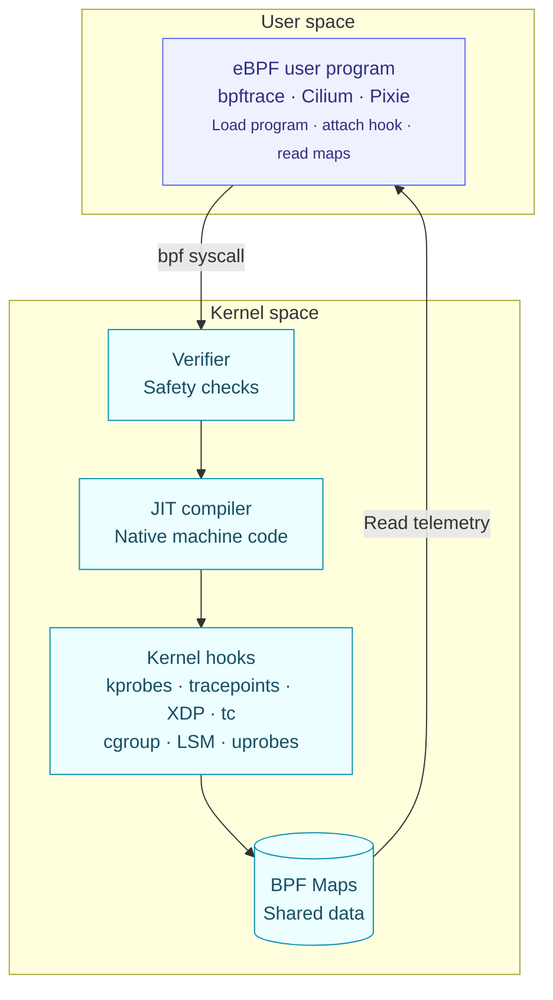

### 10.2 eBPF cho AIOps — use cases cụ thể

| Use Case | eBPF Hook | Dữ liệu thu được | Tool |
|---|---|---|---|
| **Application-transparent tracing** | uprobe trên HTTP libraries | Request latency, status per endpoint — không cần thay đổi code | Pixie, Odigos, Beyla |
| **TCP retransmission tracking** | kprobe `tcp_retransmit_skb` | Retransmit count per connection | BCC `tcpretrans` |
| **DNS latency** | kprobe `udp_sendmsg`/`udp_recvmsg` | DNS query duration, failures | Cilium |
| **File I/O latency** | tracepoint `block:block_rq_issue/complete` | Per-disk I/O latency distribution | BCC `biolatency` |
| **Container network flows** | tc/XDP | L3/L4 flow data per pod | Cilium Hubble |
| **Security: syscall audit** | LSM hooks, seccomp | Suspicious syscall patterns | Falco, Tetragon |
| **OOM event details** | tracepoint `oom:oom_score_adj_update` | Which process, why, memory state | Custom |
| **CPU scheduling delays** | tracepoint `sched:sched_switch` | Run queue latency per process | BCC `runqlat` |

### 10.3 Chi phí và giới hạn

```
eBPF overhead spectrum:

Passive tracing (tracepoints):      ~1-3% CPU overhead
Active probing (kprobes on hot path): ~3-8% CPU overhead  
XDP packet processing:               ~0.1-1% (replaces iptables!)
User-space probes (uprobe):           ~5-15% per probed function

So sánh:
- Sidecar proxy (Envoy): +10-30% latency, +50-200MB memory per pod
- eBPF-based mesh (Cilium): +1-5% latency, shared daemon per node
```

> [!NOTE]
> **Trend 2026:** eBPF đang thay thế sidecar proxy model cho service mesh (Cilium thay Istio sidecar), thay thế iptables cho Kubernetes networking, và cung cấp "zero-instrumentation" observability cho legacy apps. AIOps pipeline cần tích hợp eBPF data source (Hubble flows, Pixie spans, Tetragon security events) song song với OpenTelemetry.

---

# SECTION 2 — NETWORKING & TRAFFIC ENGINEERING

> *Phần lớn incidents trong production là network-related. Latency spike, timeout, connection refused, 503 — tất cả đều liên quan đến cách request di chuyển qua hệ thống. Kỹ sư AIOps phải hiểu từng bước trong request lifecycle để detector không nhầm triệu chứng với nguyên nhân.*

---

## 11. End-to-End Request Lifecycle

### 11.1 Anatomy của một HTTP request trong Kubernetes

Từ browser của user đến application container, request đi qua **ít nhất 6-8 lớp**, mỗi lớp có thể gây latency và failure:

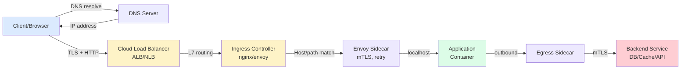

### 11.2 Latency budget breakdown

| Hop | Typical latency | Failure mode | Metric |
|---|---|---|---|
| DNS Resolution | 1–50ms (cached: <1ms) | DNS timeout, NXDOMAIN, stale cache | `dns_lookup_duration_seconds` |
| TLS Handshake | 10–50ms (new), 0ms (resumed) | Certificate expiry, OCSP issue | `tls_handshake_duration_seconds` |
| Cloud LB → Ingress | 1–5ms | Unhealthy target, cross-AZ | ALB `TargetResponseTime` |
| Ingress → Pod | 1–3ms (same-AZ) | Rate limit hit, wrong backend | `nginx_upstream_response_time` |
| Sidecar (Envoy) | 1–3ms | Circuit open, retry exhausted | `envoy_cluster_upstream_rq_time` |
| Application processing | Variable | App bug, slow query, OOM | `http_server_request_duration` |
| Pod → Backend (DB/Cache) | 1–100ms | Connection refused, timeout, slow query | `db_query_duration_seconds` |
| Return path (reverse) | ~Same as forward | — | End-to-end P99 |

> [!TIP]
> **AIOps correlation pattern:** Khi latency spike xảy ra, decompose thành từng hop. Nếu 90% latency nằm ở "Application → DB" hop → root cause ở data layer (slow query, connection pool). Nếu latency tăng đều ở mọi hop → network-level issue (congestion, packet loss). Distributed tracing (Ch. 05) tự động decompose này qua span duration.

---

## 12. TCP/IP Internals for Operations

### 12.1 TCP Handshake và connection states

Mỗi TCP connection đi qua state machine phức tạp. Kỹ sư AIOps cần hiểu vì **connection state accumulation** là nguồn gốc nhiều incidents:

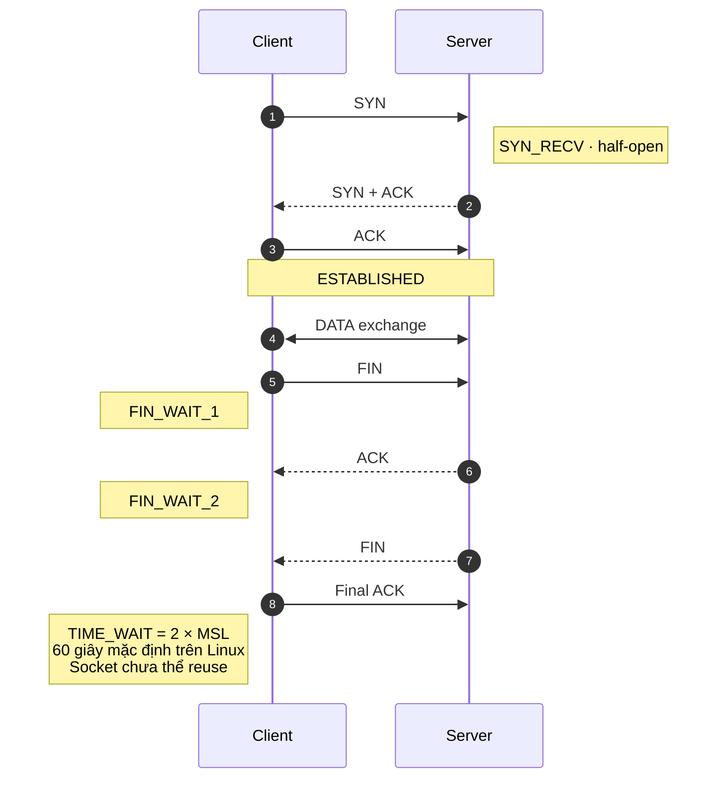

### 12.2 TIME_WAIT — kẻ giết âm thầm

**Vấn đề:** Mỗi connection đóng rồi sẽ ở `TIME_WAIT` 60 giây trên Linux. Trong thời gian đó, tuple (src_ip, src_port, dst_ip, dst_port) không được reuse.

```mermaid
flowchart LR
    rate["10.000 connections đóng / giây"] --> wait["× 60 giây TIME_WAIT"]
    wait --> sockets["600.000 sockets TIME_WAIT"]
    ports["Ephemeral ports<br/>32.768–60.999<br/>chỉ 28.232 ports"] --> exhausted
    sockets --> exhausted["<b>Port exhaustion</b><br/>khi cùng một destination"]
    exhausted --> e1["connect() → EADDRNOTAVAIL"]
    exhausted --> e2["Log: Cannot assign requested address"]
    exhausted --> e3["Destination X fail<br/>destination Y vẫn hoạt động"]

    classDef danger fill:#fee2e2,stroke:#dc2626,color:#7f1d1d,stroke-width:2px
    class exhausted,e1,e2,e3 danger
```

**Metrics cần monitor:**

```bash
# Đếm connections theo state
ss -s
# hoặc chi tiết
ss -tan state time-wait | wc -l

# Prometheus (node_exporter)
node_sockstat_TCP_tw          # Số TIME_WAIT sockets
node_netstat_Tcp_CurrEstab    # Connections đang ESTABLISHED
```

> [!WARNING]
> **AIOps trap:** Detector thấy "connection refused" errors tăng vọt → kết luận "service down". Nhưng nếu chỉ fail khi connect đến **một destination cụ thể** và `TIME_WAIT` count cao → root cause là port exhaustion, không phải service down. Fix: enable `tcp_tw_reuse`, dùng connection pooling, hoặc tăng ephemeral port range.

### 12.3 TCP Retransmissions

Retransmission xảy ra khi TCP segment bị mất (network congestion, packet drop, interface errors):

```mermaid
flowchart LR
    loss(["TCP segment bị mất"]) --> a1["Attempt 1<br/>RTO ≈ 200 ms"]
    a1 --> a2["Attempt 2<br/>RTO ≈ 400 ms"]
    a2 --> a3["Attempt 3<br/>RTO ≈ 800 ms"]
    a3 --> a4["Attempt 4<br/>RTO ≈ 1.600 ms"]
    a4 --> more["Tiếp tục exponential backoff<br/>tcp_retries2 mặc định: 15"]
    more --> timeout["Connection timed out<br/>sau khoảng 13–30 phút"]
    a1 -. "1 retransmit: +200 ms" .-> p99["P99 latency spike"]
    a2 -. "2 retransmits: +600 ms" .-> p99

    classDef warning fill:#fef3c7,stroke:#d97706,color:#78350f
    classDef danger fill:#fee2e2,stroke:#dc2626,color:#7f1d1d,stroke-width:2px
    class a1,a2,a3,a4,more warning
    class timeout,p99 danger
```

**Metrics:**

```bash
# System-wide retransmits
cat /proc/net/snmp | grep Tcp:
# RetransSegs / OutSegs = retransmission rate

# eBPF per-connection (tcpretrans from BCC)
tcpretrans
# Output: timestamp, PID, IP, port, state, retrans count
```

```promql
# Retransmission rate (node_exporter)
rate(node_netstat_Tcp_RetransSegs[5m])
/
rate(node_netstat_Tcp_OutSegs[5m])

# > 0.1% → investigate
# > 1%   → significant packet loss
# > 5%   → critical network issue
```

### 12.4 TCP connection timeouts — các loại timeout

| Timeout | Default | Ý nghĩa | Khi nào gặp |
|---|---|---|---|
| `connect_timeout` | `net.ipv4.tcp_syn_retries` = 6 (~127s) | SYN không được ACK | Destination unreachable, firewall drop |
| `tcp_keepalive_time` | 7200s (2h!) | Thời gian trước keepalive probe | Idle connection bị NAT/firewall đóng |
| `tcp_keepalive_intvl` | 75s | Interval giữa keepalive probes | — |
| `tcp_keepalive_probes` | 9 | Số probe trước khi declare dead | — |
| `tcp_fin_timeout` | 60s | TIME_WAIT duration | Port exhaustion trên high-traffic |
| `net.ipv4.tcp_retries2` | 15 | Retransmit cho established connection | Long timeout trước khi app thấy error |

> [!CAUTION]
> **Timeout mặc định của Linux rất DÀI cho cloud-native workloads.** TCP keepalive 2 giờ nghĩa là nếu pod bị reschedule, backend pod mới đã chạy nhưng client vẫn giữ connection đến IP cũ và không biết nó dead cho đến 2h sau. Cloud load balancers (ALB idle timeout: 60s) và NAT gateways sẽ đóng connection trước keepalive probe. Kết quả: "connection reset by peer" errors sporadically.

---

## 13. DNS Resolution Mechanics

### 13.1 DNS trong Kubernetes

DNS resolution trong Kubernetes cluster đi qua nhiều lớp:

```mermaid
sequenceDiagram
    participant P as Pod
    participant C as CoreDNS · 10.96.0.10
    participant K as Kubernetes API
    Note over P: resolv.conf · ndots:5<br/>3 search domains
    P->>C: FQDN + production.svc.cluster.local
    C-->>P: NXDOMAIN
    P->>C: FQDN + svc.cluster.local
    C-->>P: NXDOMAIN
    P->>C: FQDN + cluster.local
    C-->>P: NXDOMAIN
    P->>C: payment-service.production.svc.cluster.local
    C->>K: kube-dns plugin lookup
    K-->>C: Service ClusterIP
    C-->>P: FOUND · ClusterIP
    Note over P,C: Có thể phát sinh 4 DNS queries không cần thiết trước khi resolve
```

> [!WARNING]
> **`ndots:5` performance trap:** Mỗi external DNS lookup (vd: `api.stripe.com`) sẽ thử **5 search domain variants** trước khi query đúng hostname. Với DNS round-trip ~5ms mỗi query, mỗi external call tốn thêm **25ms chỉ cho DNS**. Fix: thêm trailing dot `api.stripe.com.` hoặc giảm `ndots:2` trong pod spec. Trong high-traffic system, DNS amplification này có thể overload CoreDNS → DNS timeout → cascading failure.

### 13.2 DNS failure modes

| Failure | Biểu hiện | Root cause | AIOps signal |
|---|---|---|---|
| DNS timeout | Latency spike 5s+ (DNS timeout default) | CoreDNS overload, network issue | `coredns_dns_request_duration_seconds` P99 tăng |
| NXDOMAIN | Service not found errors | Typo, service chưa deploy, namespace sai | `coredns_dns_responses_total{rcode="NXDOMAIN"}` |
| Stale cache | Request đến IP cũ | TTL còn hiệu lực nhưng endpoint thay đổi | Connection refused / timeout đến old IP |
| CoreDNS OOM | DNS fail toàn cluster | Quá nhiều DNS queries, memory limit thấp | CoreDNS pod restarts |
| Conntrack full | DNS (UDP) bị drop | Conntrack table full trên node | `conntrack_entries` / `conntrack_max` |

---

## 14. Ingress Controllers & Load Balancing

### 14.1 L4 vs L7 Load Balancing

```mermaid
flowchart LR
    subgraph l4["L4 · Transport Layer"]
        direction TB
        l4p["TCP / UDP"]
        l4r["Forward theo IP:Port<br/>Không đọc nội dung request"]
        l4t["Độ trễ microseconds<br/>TLS passthrough"]
        l4e["AWS NLB<br/>K8s Service LoadBalancer"]
        l4p --> l4r --> l4t --> l4e
    end
    subgraph l7["L7 · Application Layer"]
        direction TB
        l7p["HTTP / HTTPS / gRPC"]
        l7r["Route theo host · path<br/>cookie · header"]
        l7t["TLS termination<br/>Độ trễ milliseconds"]
        l7e["AWS ALB<br/>Ingress: nginx · Envoy · Traefik"]
        l7p --> l7r --> l7t --> l7e
    end
    l4p ~~~ l7p

    classDef transport fill:#ecfeff,stroke:#0891b2,color:#164e63
    classDef application fill:#eef2ff,stroke:#6366f1,color:#312e81
    class l4p,l4r,l4t,l4e transport
    class l7p,l7r,l7t,l7e application
```

### 14.2 Health check gaps — nguồn gốc 502/503

```mermaid
flowchart LR
    client(["Client traffic"]) --> alb["Cloud ALB<br/>30 s × 3 = tối đa 90 s"]
    alb --> ingress["Ingress nginx<br/>5 s × 3 = 15 s"]
    ingress --> endpoint["Service endpoint"]
    endpoint --> pod["Pod readiness<br/>10 s × 3 = 30 s"]
    pod -->|Pod down| removed["Endpoint bị remove"]
    alb -. "ALB chưa hội tụ" .-> stale["Vẫn gửi traffic"]
    stale --> ingress --> error["Forward tới endpoint cũ<br/><b>502 / 503</b>"]

    classDef layer fill:#eef2ff,stroke:#6366f1,color:#312e81
    classDef danger fill:#fee2e2,stroke:#dc2626,color:#7f1d1d,stroke-width:2px
    class alb,ingress,endpoint,pod layer
    class stale,error danger
```

> [!TIP]
> **AIOps correlation:** 502 error spikes sau deployment nên được correlate với (1) endpoint update events (`kube_endpoint_*`), (2) ALB target health transitions, (3) pod lifecycle events. Nếu 502 duration matches health check convergence time → đây là configuration issue, không phải app bug.

---

## 15. Service Mesh Deep Dive

### 15.1 Sidecar Proxy Architecture (Istio/Envoy)

```mermaid
flowchart LR
    inbound(["Inbound traffic"]) --> ipt["iptables redirect"]
    subgraph pod["Kubernetes Pod"]
        direction LR
        envoy["<b>Envoy sidecar</b><br/>Inbound 15001<br/>Outbound 15006"] <-->|localhost| app["Application container<br/>Port 8080<br/><small>Không biết service mesh</small>"]
    end
    ipt --> envoy
    envoy --> outbound(["Upstream service"])
    envoy -. cung cấp .-> capabilities["mTLS · L7 load balancing · retries<br/>circuit breaking · timeout · rate limit<br/>metrics · traces · access logs"]

    classDef proxy fill:#eef2ff,stroke:#6366f1,color:#312e81,stroke-width:2px
    classDef app fill:#ecfeff,stroke:#0891b2,color:#164e63
    class envoy proxy
    class app app
```

### 15.2 Retry budget — phòng ngừa retry storm

```mermaid
flowchart LR
    users["1.000 concurrent requests"] --> a["Service A<br/>retry tối đa 3×"]
    a -->|3×| b["Service B<br/>retry tối đa 3×"]
    b -->|3×| c["Service C · DOWN"]
    c --> amplification["1 request → 3 × 3 = 9 attempts<br/>1.000 requests → 9.000 attempts"]
    amplification --> cascade["C không thể recover<br/>B overload<br/>Cascading failure"]
    budget["<b>Retry budget 20%</b><br/>1.000 baseline + 200 retries<br/>tối đa 1.200 requests"] --> recovery["Downstream có cơ hội recover"]

    classDef danger fill:#fee2e2,stroke:#dc2626,color:#7f1d1d,stroke-width:2px
    classDef safe fill:#dcfce7,stroke:#16a34a,color:#14532d
    class c,amplification,cascade danger
    class budget,recovery safe
```

### 15.3 Envoy circuit breaking

```yaml
# Istio DestinationRule circuit breaker config
apiVersion: networking.istio.io/v1
kind: DestinationRule
metadata:
  name: payment-service
spec:
  host: payment-service.production.svc.cluster.local
  trafficPolicy:
    connectionPool:
      tcp:
        maxConnections: 100           # Max TCP connections to upstream
      http:
        h2UpgradePolicy: DEFAULT
        maxRequestsPerConnection: 100 # Rotate connections
        http1MaxPendingRequests: 50   # Max queued requests
        http2MaxRequests: 1000        # Max active requests (HTTP/2)
    outlierDetection:
      consecutive5xxErrors: 5         # 5 consecutive 5xx → eject
      interval: 10s                   # Evaluation interval
      baseEjectionTime: 30s           # Min ejection time
      maxEjectionPercent: 50          # Max 50% endpoints ejected
```

**Metrics Envoy cung cấp cho AIOps:**

| Metric | Ý nghĩa | AIOps use |
|---|---|---|
| `envoy_cluster_upstream_rq_total` | Total requests per cluster | Baseline traffic |
| `envoy_cluster_upstream_rq_xx` | Requests by response code (2xx,4xx,5xx) | Error rate |
| `envoy_cluster_upstream_rq_time` | Request duration histogram | Latency anomaly |
| `envoy_cluster_upstream_rq_pending_overflow` | Requests rejected (queue full) | Overload signal |
| `envoy_cluster_upstream_rq_retry` | Retry count | Retry amplification |
| `envoy_cluster_circuit_breakers_default_cx_open` | Circuit breaker open? | Upstream failure |
| `envoy_cluster_outlier_detection_ejections_active` | Endpoints ejected | Partial failure |
| `envoy_cluster_upstream_cx_connect_timeout` | Connection timeout count | Network issue |

---

## 16. API Gateway Patterns

### 16.1 API Gateway vs Ingress Controller vs Service Mesh

| Capability | Ingress Controller | Service Mesh | API Gateway |
|---|---|---|---|
| **L7 routing** | Host/path based | Full L7 | Full L7 + API versioning |
| **Auth** | Basic/TLS | mTLS (identity) | OAuth, JWT, API key |
| **Rate limiting** | Basic | Per-service | Per-API, per-consumer, quotas |
| **Request transform** | Limited | No | Full (header, body, protocol) |
| **API lifecycle** | No | No | Versioning, deprecation, docs |
| **Typical tool** | nginx, Traefik | Istio, Linkerd | Kong, APISIX, AWS API GW |
| **Position** | Edge of cluster | Between services | Edge, often before Ingress |

### 16.2 Rate limiting — leaky bucket vs token bucket

```mermaid
flowchart LR
    subgraph token["Token Bucket · cho phép burst"]
        direction TB
        refill["Refill 10 token / giây"] --> bucket[("Bucket<br/>Capacity 100 token")]
        req1(["Request"]) --> has{"Còn token?"}
        bucket --> has
        has -->|Có| allow["Allow<br/>Trừ 1 token"]
        has -->|Không| reject1["Reject · HTTP 429"]
    end
    subgraph leaky["Leaky Bucket · làm mượt traffic"]
        direction TB
        req2(["Request"]) --> full{"Queue đầy?"}
        full -->|Không| queue[("Queue<br/>Capacity 100")]
        full -->|Có| reject2["Reject"]
        queue --> drain["Drain cố định<br/>10 request / giây"]
    end
    allow ~~~ drain

    classDef ok fill:#dcfce7,stroke:#16a34a,color:#14532d
    classDef danger fill:#fee2e2,stroke:#dc2626,color:#7f1d1d
    class allow,drain ok
    class reject1,reject2 danger
```

> [!NOTE]
> **AIOps impact:** Rate limiting metrics (`rate_limit_remaining`, `429 response count`) là **leading indicator** cho capacity issues. Nếu detector thấy 429 tăng nhưng backend resource còn dư → rate limit config quá chặt. Nếu 429 tăng cùng với backend latency → legitimate overload, rate limit đang bảo vệ system.

---

## 17. Connection Pool Management

### 17.1 Tại sao cần connection pool?

Mỗi TCP connection mới tốn: DNS lookup + TCP handshake (1 RTT) + TLS handshake (1–2 RTT) = **50–200ms**. Connection pool giữ connections sẵn, reuse cho multiple requests:

```mermaid
flowchart LR
    subgraph noPool["Không có pool · mỗi request tạo connection"]
        direction TB
        n1["Request 1<br/>DNS + TCP + TLS + Query + Close<br/><b>180 ms</b>"]
        n2["Request 2<br/>DNS + TCP + TLS + Query + Close<br/><b>180 ms</b>"]
        n3["Request 3<br/>DNS + TCP + TLS + Query + Close<br/><b>180 ms</b>"]
    end
    subgraph pooled["Connection pool · reuse"]
        direction TB
        p1["Request 1 · establish<br/>DNS + TCP + TLS + Query<br/><b>180 ms</b>"]
        p2["Request 2 · reuse<br/>Query · <b>20 ms</b>"]
        p3["Request 3 · reuse<br/>Query · <b>20 ms</b>"]
        p1 --> p2 --> p3
    end
    n1 ~~~ p1

    classDef slow fill:#fee2e2,stroke:#dc2626,color:#7f1d1d
    classDef fast fill:#dcfce7,stroke:#16a34a,color:#14532d
    class n1,n2,n3 slow
    class p2,p3 fast
```

### 17.2 Pool failure modes

| Failure Mode | Biểu hiện | Nguyên nhân gốc | AIOps metric |
|---|---|---|---|
| **Pool exhaustion** | Requests queue → timeout | Quá nhiều concurrent requests, connection leak | `pool_active` / `pool_max` > 95% |
| **Connection leak** | Pool dần hết dù traffic bình thường | Code không return connection (missing `close()`) | `pool_active` tăng monotonic |
| **Stale connection** | Random "connection reset" errors | Server đóng idle connection, client chưa biết | `pool_stale_removed` count |
| **Pool sizing wrong** | High wait time HOẶC too many idle connections | Config không match traffic pattern | `pool_wait_duration_seconds` |
| **Connection storm** | App start → open max_pool_size connections cùng lúc | Cold start, scale-out event | `pool_new_connections_total` spike |

### 17.3 Connection pool sizing

```
Optimal pool size per instance:
  pool_size = (target_throughput × avg_query_time) / num_instances + headroom

Ví dụ:
  Target: 1000 queries/sec
  Avg query time: 10ms = 0.01s
  Instances: 5 pods
  
  pool_size = (1000 × 0.01) / 5 + 5 = 2 + 5 = 7 connections per pod

Nhưng:
  - P99 query time = 100ms → burst cần: (1000 × 0.1) / 5 = 20
  - Nên set: min=7, max=25, idle_timeout=300s
```

> [!IMPORTANT]
> **Database-side limit:** PostgreSQL max_connections default = 100. Nếu 20 pods × 25 max_pool = 500 connections → **vượt DB limit!** PgBouncer (connection multiplexer) cần đặt trước DB. AIOps cần monitor cả 2 phía: app pool metrics VÀ DB connection count (`pg_stat_activity` count).

---

## 18. Thread Pool Exhaustion & Backpressure

### 18.1 Sync vs Async threading models

```mermaid
flowchart LR
    subgraph sync["Synchronous · thread per request"]
        direction TB
        queue1["Request queue<br/>req 201 … req 500"] --> pool["Thread pool · 200 threads"]
        pool --> blocked["Tất cả threads chờ<br/>DB / API downstream"]
        blocked --> reject["Queue đầy · HTTP 503<br/>CPU vẫn chỉ khoảng 10%"]
    end
    subgraph async["Asynchronous · event loop"]
        direction TB
        queue2["N requests"] --> loop["1 hoặc vài event-loop threads"]
        loop --> asyncCall["Start DB / API call<br/>non-blocking · trả future"]
        asyncCall --> ready["Result ready"]
        ready --> callbackNode["Callback → response"]
        callbackNode --> loop
    end
    blocked ~~~ asyncCall

    classDef danger fill:#fee2e2,stroke:#dc2626,color:#7f1d1d,stroke-width:2px
    classDef asyncNode fill:#dcfce7,stroke:#16a34a,color:#14532d
    class blocked,reject danger
    class loop,asyncCall,ready,callbackNode asyncNode
```

### 18.2 Backpressure mechanisms

```mermaid
flowchart LR
    subgraph without["Không có backpressure"]
        direction LR
        c1["Client<br/>10K req/s"] --> s1["Server<br/>Capacity 5K req/s"]
        s1 --> overload["Overload → crash"]
        overload --> retry["Client retry<br/>20K req/s"]
        retry --> cascade["Cascading failure"]
    end
    subgraph with["Có backpressure"]
        direction LR
        c2["Client<br/>10K req/s"] --> s2["Server<br/>Capacity 5K req/s"]
        s2 --> accepted["5K xử lý thành công"]
        s2 --> shed["5K excess<br/>503 + Retry-After"]
        shed --> backoff["Client exponential backoff"]
        backoff --> recovery["Gradual recovery"]
    end
    overload ~~~ accepted

    classDef danger fill:#fee2e2,stroke:#dc2626,color:#7f1d1d,stroke-width:2px
    classDef safe fill:#dcfce7,stroke:#16a34a,color:#14532d
    class overload,retry,cascade danger
    class accepted,shed,backoff,recovery safe
```

---

## 19. Circuit Breaking & Cascading Prevention

### 19.1 Circuit Breaker pattern

```mermaid
stateDiagram-v2
    direction LR
    [*] --> Closed
    state "CLOSED\nRequests đi qua bình thường" as Closed
    state "OPEN\nFail-fast; không tải downstream" as Open
    state "HALF-OPEN\nCho phép một test request" as HalfOpen

    Closed --> Open: failure_count > threshold
    Open --> HalfOpen: timeout hết hạn
    HalfOpen --> Closed: test thành công
    HalfOpen --> Open: test thất bại
```

**AIOps metrics cho circuit breaker:**

```promql
# Circuit breaker state (Envoy)
envoy_cluster_circuit_breakers_default_cx_open          # 0 = closed, 1 = open
envoy_cluster_circuit_breakers_high_cx_open

# Outlier detection (endpoint ejections)
envoy_cluster_outlier_detection_ejections_active        # Endpoints ejected
envoy_cluster_outlier_detection_ejections_total          # Cumulative ejections

# Application-level (Resilience4j, Hystrix)
resilience4j_circuitbreaker_state                       # 0=closed, 1=open, 2=half_open
resilience4j_circuitbreaker_failure_rate                 # Current failure rate (%)
```

> [!TIP]
> **AIOps tương quan:** Circuit breaker OPEN là evidence mạnh cho RCA. Khi CB open trên service A → service B, có nghĩa A đã phát hiện B unhealthy. Kết hợp với (1) B's error rate, (2) B's latency, (3) deployment events trên B → RCA engine có chain of evidence rõ ràng.

---

# SECTION 3 — DATA & STORAGE LAYER

> *Database và cache là trung tâm của mọi ứng dụng. Slow query gây latency spike, connection starvation gây timeout cascade, cache failure gây thundering herd. Hiểu bản chất vật lý của storage layer là chìa khóa để AIOps không nhầm triệu chứng (high latency) với nguyên nhân (lock contention).*

---

## 20. Caching Architecture

### 20.1 Cache access patterns

```mermaid
flowchart TB
    subgraph aside["Read-Aside · phổ biến nhất"]
        direction LR
        aClient(["Client"]) --> aCache[("Cache")]
        aCache -->|HIT| aReturn["Return data"]
        aCache -->|MISS| aDb[("Database")]
        aDb --> aStore["Store vào cache"] --> aReturn
    end
    subgraph through["Write-Through · consistent, write chậm hơn"]
        direction LR
        tClient(["Client"]) -->|Write| tCache[("Cache")]
        tCache -->|Sync write| tDb[("Database")]
        tDb --> tReturn["Return"]
    end
    subgraph behind["Write-Behind · nhanh, có rủi ro mất data"]
        direction LR
        bClient(["Client"]) -->|Write| bCache[("Cache")]
        bCache --> bReturn["Return ngay"]
        bCache -. Async / batch .-> bDb[("Database")]
    end
    subgraph readThrough["Read-Through · cache là abstraction layer"]
        direction LR
        rClient(["Client"]) --> rCache[("Cache")]
        rCache -->|HIT| rReturn["Return"]
        rCache -->|MISS · tự query| rDb[("Database")]
        rDb --> rCache
    end
```

### 20.2 Cache hit ratio — north star metric

```
Hit Ratio = cache_hits / (cache_hits + cache_misses) × 100%

Benchmark:
  > 95% → Excellent (standard for hot-path caching)
  90-95% → Good (acceptable for most workloads)  
  80-90% → Needs investigation (cold start? wrong TTL?)
  < 80% → Cache không hiệu quả (sai strategy hoặc key space quá lớn)
```

**Impact trên backend:**

```
1000 requests/sec, 95% hit ratio:
  → 50 requests/sec đến DB
  
1000 requests/sec, 80% hit ratio:
  → 200 requests/sec đến DB (4x more load!)

Nếu hit ratio drop từ 95% → 80%:
  DB load tăng 4x → có thể trigger slow queries → cascading
```

### 20.3 Redis/Memcached internals cho AIOps

| Aspect | Redis | Memcached |
|---|---|---|
| **Threading** | Single-threaded event loop (main) + I/O threads (6.0+) | Multi-threaded |
| **Data structures** | String, Hash, List, Set, Sorted Set, Stream | Key-Value only |
| **Persistence** | RDB snapshots + AOF (append-only file) | None (pure cache) |
| **Memory mgmt** | jemalloc, `maxmemory` + eviction policy | Slab allocator |
| **Replication** | Async primary-replica | None native |
| **Cluster** | Redis Cluster (hash slots) | Client-side consistent hashing |

**Redis metrics cần monitor:**

| Metric | Ý nghĩa | Ngưỡng cảnh báo |
|---|---|---|
| `used_memory` / `maxmemory` | Memory utilization | > 90% → eviction sẽ xảy ra |
| `evicted_keys` | Keys bị xóa do memory full | > 0 liên tục → cần tăng memory hoặc giảm TTL |
| `keyspace_hits` / `keyspace_misses` | Hit ratio | < 90% → investigate |
| `connected_clients` | Số connections | > 80% `maxclients` → connection exhaustion risk |
| `blocked_clients` | Clients chờ blocking command | > 0 → BLPOP/BRPOP blocking |
| `instantaneous_ops_per_sec` | Throughput | Baseline cho anomaly detection |
| `latency_percentiles_usec` | Command latency distribution | P99 > 1ms → investigate |
| `rdb_last_bgsave_status` | Backup health | `err` → data loss risk |
| `master_link_status` | Replication health (replica) | `down` → replication broken |
| `repl_backlog_active` | Replication buffer | — |

---

## 21. Cache Failure Patterns

### 21.1 Cache Avalanche (tuyết lở cache)

```mermaid
flowchart LR
    set["T = 0<br/>Set 100.000 keys<br/>cùng TTL = 3.600 s"] --> expire["T = 3.600<br/>100.000 keys expire cùng lúc"]
    expire --> miss["100.000 cache MISS đồng thời"]
    miss --> db["Database overload"]
    db --> timeout["Timeout → cascading failure"]

    jitter["Jittered TTL<br/>Phân tán thời điểm expire"] --> prevent["Giảm avalanche"]
    warm["Pre-warming<br/>Refresh trước khi expire"] --> prevent
    cb["DB circuit breaker<br/>Giới hạn concurrent queries"] --> prevent

    classDef danger fill:#fee2e2,stroke:#dc2626,color:#7f1d1d,stroke-width:2px
    classDef safe fill:#dcfce7,stroke:#16a34a,color:#14532d
    class expire,miss,db,timeout danger
    class jitter,warm,cb,prevent safe
```

### 21.2 Cache Stampede (Thundering Herd on Cache)

```mermaid
flowchart LR
    expire["Một hot key expire"] --> miss["100 concurrent cache MISS"]
    miss --> t1["Thread 1 → DB query 500 ms"]
    miss --> t2["Thread 2 → duplicate query"]
    miss --> tn["Thread 3…100 → duplicate query"]
    t1 --> load["100 query giống hệt nhau<br/>Thundering herd"]
    t2 --> load
    tn --> load

    per["Probabilistic early expiration"] --> safe["Chỉ một refresh"]
    mutex["Mutex / single-flight"] --> safe
    stale["Stale-while-revalidate"] --> safe

    classDef danger fill:#fee2e2,stroke:#dc2626,color:#7f1d1d,stroke-width:2px
    classDef safe fill:#dcfce7,stroke:#16a34a,color:#14532d
    class miss,t1,t2,tn,load danger
    class per,mutex,stale,safe safe
```

### 21.3 Cache Penetration

```mermaid
flowchart LR
    request["Attacker / bug<br/>GET user_id không tồn tại"] --> cache[("Cache")]
    cache -->|MISS| db[("Database")]
    db -->|Empty result không được cache| repeat["Request kế tiếp lại MISS<br/>Mọi request bypass cache"]
    repeat --> cache

    validate["Validate ID tại API Gateway"] --> blocked["Reject sớm"]
    bloom["Bloom filter · O(1)"] -->|Definitely absent| blocked
    null["Cache NULL<br/>TTL ngắn 60 s"] --> cached["Không query DB lặp lại"]

    classDef danger fill:#fee2e2,stroke:#dc2626,color:#7f1d1d
    classDef safe fill:#dcfce7,stroke:#16a34a,color:#14532d
    class repeat danger
    class validate,bloom,null,blocked,cached safe
```

> [!WARNING]
> **AIOps detection:** Cache penetration thường bị nhầm với "cache performance degradation". Signal phân biệt: hit ratio giảm NHƯNG `cache_get` latency rất thấp (vì chỉ lookup miss, không slow). Nếu DB query count tăng mạnh với pattern "cùng query, cùng empty result" → cache penetration, thường do malicious traffic hoặc application bug tạo invalid keys.

---

## 22. Database Connection Management

### 22.1 Connection lifecycle

```mermaid
flowchart TB
    start(["App start"]) --> init["Tạo connection pool<br/>min_idle connections"]
    init --> request["Request đến<br/>Borrow connection"]
    request --> available{"Có connection rảnh?"}
    available -->|Có| query["Execute query"]
    query --> release["Return connection về pool"]
    release --> request
    available -->|Không| max{"Pool đã chạm max?"}
    max -->|Chưa| create["Tạo connection mới"] --> query
    max -->|Rồi| wait["Wait → timeout hoặc reject"]

    classDef ok fill:#dcfce7,stroke:#16a34a,color:#14532d
    classDef danger fill:#fee2e2,stroke:#dc2626,color:#7f1d1d
    class query,release ok
    class wait danger
```

### 22.2 Connection starvation patterns

```mermaid
flowchart TB
    pool[("Connection pool<br/>max = 20")]
    pool --> slow["Slow query 5 s<br/>Connection bận lâu hơn 500×"]
    slow --> qps["Throughput tối đa 4 query/s"] --> timeout1["Queue → timeout → 503"]
    pool --> leak["Connection leak<br/>Không close() khi exception"]
    leak --> decline["Available giảm dần"] --> timeout2["Pool exhausted<br/>Mọi request timeout"]
    scale["Scale 5 → 20 pods<br/>100 → 400 connections"] --> dbmax["DB max_connections = 200"]
    dbmax --> refused["Connection refused"] --> loop["Health-check fail<br/>scale-down / scale-up loop"]

    classDef danger fill:#fee2e2,stroke:#dc2626,color:#7f1d1d,stroke-width:2px
    class timeout1,timeout2,refused,loop danger
```

**Metrics:**

```promql
# HikariCP (Java) pool metrics
hikaricp_connections_active           # Currently borrowed
hikaricp_connections_idle             # Available in pool
hikaricp_connections_pending          # Threads waiting for connection
hikaricp_connections_timeout_total    # Connection acquisition timeouts
hikaricp_connections_creation_seconds # Time to create new connection

# Alert rule:
hikaricp_connections_pending > 0 for 1m  → Pool contention
hikaricp_connections_timeout_total > 0   → Connection starvation
```

---

## 23. Query Performance & Lock Contention

### 23.1 Slow query anatomy

```mermaid
flowchart LR
    sql["SQL text"] --> parser["Parser"] --> optimizer["Optimizer"]
    optimizer --> plan["Execution plan"] --> storage["Storage engine"] --> result["Result"]
    optimizer --> index{"Access path?"}
    optimizer --> join{"Join strategy?"}
    optimizer --> sort{"Sort strategy?"}
    index -->|Sai / thiếu index| full["Full table scan · O(n)<br/>1M × 1 KB ≈ 1 GB · vài giây"]
    index -->|B-tree index| indexed["Index scan · O(log n)<br/>khoảng 20 disk reads · milliseconds"]
    join --> joins["Nested loop / hash join"]
    sort --> sorts["In-memory / disk sort"]

    classDef danger fill:#fee2e2,stroke:#dc2626,color:#7f1d1d,stroke-width:2px
    classDef ok fill:#dcfce7,stroke:#16a34a,color:#14532d
    class full danger
    class indexed ok
```

### 23.2 Lock contention

```mermaid
sequenceDiagram
    participant A as Transaction A
    participant DB as Database lock manager
    participant B as Transaction B
    A->>DB: BEGIN · UPDATE accounts id=1
    DB-->>A: Lock account row 1
    B->>DB: BEGIN · UPDATE orders id=99
    DB-->>B: Lock order row 99
    A->>DB: UPDATE orders id=99
    DB--xA: BLOCKED · B giữ lock
    B->>DB: UPDATE accounts id=1
    DB--xB: BLOCKED · A giữ lock
    Note over A,B: DEADLOCK cycle
    DB-->>B: Kill một transaction
    B->>DB: Retry với lock order nhất quán
```

**Metrics cho query performance:**

| Metric | Source | AIOps signal |
|---|---|---|
| `pg_stat_statements.mean_time` | PostgreSQL | Slow query detection |
| `pg_stat_activity.wait_event_type` | PostgreSQL | Lock waits visible |
| `pg_locks.granted=false` count | PostgreSQL | Lock contention |
| `pg_stat_user_tables.seq_scan` | PostgreSQL | Missing indexes (full table scans) |
| `Innodb_row_lock_waits` | MySQL | Row lock contention |
| `Slow_queries` count | MySQL | Query > `long_query_time` |
| `deadlocks` counter | Both | Deadlock frequency |

---

## 24. Replication Lag & Consistency

### 24.1 Async replication lag

```mermaid
sequenceDiagram
    participant C as Client
    participant P as Primary DB
    participant R as Replica DB
    C->>P: UPDATE user SET name = B
    P-->>C: Commit · T = 100 ms
    C->>R: Read ngay sau write
    R-->>C: Giá trị CŨ
    Note over C,R: Read-after-write inconsistency
    P-->>R: WAL / Binlog · async ship + apply
    Note right of R: Applied · T = 350 ms<br/>Replication lag = 250 ms
    C->>R: Read lại
    R-->>C: Giá trị MỚI
```

### 24.2 Replication lag impact trên AIOps

```mermaid
flowchart LR
    order["User đặt order"] --> primary["Primary<br/>order_status = created"]
    primary -. "Replication lag 500 ms" .-> replica[("Replica")]
    payment["Payment service"] -->|Read ngay| replica
    replica -->|Chưa apply| missing["Order not found"]
    missing --> alert["Error spike alert"]
    missing -->|Retry sau 1 giây| success["Order found · success"]
    root["<b>Root cause</b><br/>Replication lag<br/>không phải app bug"] -.-> missing

    classDef danger fill:#fee2e2,stroke:#dc2626,color:#7f1d1d
    classDef ok fill:#dcfce7,stroke:#16a34a,color:#14532d
    class missing,alert danger
    class success ok
```

Ngưỡng vận hành: `< 100 ms` thường chấp nhận được; `100 ms–1 s` cần thận trọng với read-after-write; `> 1 s` cần điều tra ngay; `> 10 s` là mức critical. Theo dõi `pg_stat_replication.replay_lag` (PostgreSQL) hoặc `Seconds_Behind_Master` (MySQL).

---

## 25. Storage I/O Fundamentals

### 25.1 Ba chiều của storage performance

```mermaid
flowchart TB
    perf(["Storage performance"])
    perf --> iops["<b>IOPS</b><br/>Operations / giây<br/>Random read · KV lookup<br/>Index · metadata"]
    perf --> throughput["<b>Throughput</b><br/>MB / giây<br/>Sequential I/O · backup<br/>Log shipping · analytics scan"]
    perf --> latency["<b>Latency</b><br/>Thời gian / operation<br/>Commit · cache miss<br/>User-facing query"]
    iops --> relation["Latency ≈ f(IOPS, queue depth, device capability)"]
    throughput --> relation
    latency --> relation

    classDef dimension fill:#eef2ff,stroke:#6366f1,color:#312e81
    class iops,throughput,latency dimension
```

### 25.2 AWS EBS storage tiers

| Volume Type | IOPS baseline | Max IOPS | Throughput | Latency | Use case |
|---|---|---|---|---|---|
| gp3 | 3000 | 16,000 | 125–1000 MB/s | ~1ms | General purpose, databases |
| io2 Block Express | Provisioned | 256,000 | 4,000 MB/s | sub-ms | Critical databases, SAP |
| st1 | N/A | 500 IOPS | 500 MB/s | ~5ms | Sequential read/write (logs) |
| sc1 | N/A | 250 IOPS | 250 MB/s | ~10ms | Cold storage, infrequent access |

### 25.3 I/O Saturation detection

```mermaid
flowchart LR
    low["0–80% utilization<br/>Vùng gần tuyến tính"] --> threshold{"Vượt khoảng 80%?"}
    threshold -->|Không| stable["Queue depth ổn định<br/>Latency kiểm soát được"]
    threshold -->|Có| queue["Queue depth tăng nhanh"]
    queue --> latency["I/O latency bùng nổ"]
    latency --> app["Application latency tăng phi tuyến<br/><b>Hockey-stick effect</b>"]
    example["Capacity 3.000 IOPS<br/>Demand 2.500 IOPS = 83%"] --> threshold

    classDef ok fill:#dcfce7,stroke:#16a34a,color:#14532d
    classDef warning fill:#fef3c7,stroke:#d97706,color:#78350f
    classDef danger fill:#fee2e2,stroke:#dc2626,color:#7f1d1d,stroke-width:2px
    class stable ok
    class threshold,queue warning
    class latency,app danger
```

**Metrics:**

```bash
# Linux I/O stats
iostat -x 1
# %util     — device utilization (>80% → saturation territory)
# await     — average I/O wait time (ms)
# r_await   — read wait time
# w_await   — write wait time
# aqu-sz    — average queue depth (>4 → queuing)
# rareq-sz  — average read request size (KB)

# Prometheus (node_exporter)
rate(node_disk_io_time_seconds_total[5m])              # Device utilization
rate(node_disk_read_time_seconds_total[5m])
  / rate(node_disk_reads_completed_total[5m])           # Avg read latency
```

> [!IMPORTANT]
> **EBS burst credit trap:** gp3 volumes cung cấp 3000 IOPS baseline. Nhưng gp2 (legacy) dùng burst credit model: baseline = volume_size_GB × 3, burst tới 3000. Một volume 100GB gp2 có baseline 300 IOPS, burst 3000. Khi hết burst credits → IOPS drop từ 3000 → 300 (10x giảm) → latency tăng 10x → DB meltdown. AIOps phải monitor `BurstBalance` metric trên EBS gp2.

---

# SECTION 4 — DISTRIBUTED SYSTEMS & FAILURE PATTERNS

> *Hệ thống phân tán fail theo những cách mà hệ thống đơn lẻ không có: partial failures, inconsistent views, cascading collapses. Đây là lý do AIOps quan trọng — con người không thể theo dõi đồng thời hàng trăm services. Nhưng AI phải hiểu mechanics của distributed failure để phân biệt nguyên nhân gốc từ hiệu ứng lan truyền.*

---

## 26. Distributed Tracing Internals

### 26.1 Context Propagation — cơ chế nối trace

```mermaid
flowchart LR
    a["<b>Frontend</b><br/>GET /checkout<br/>Trace abc-123 · Span 001<br/>Parent: none"]
    b["<b>Order Service</b><br/>CreateOrder<br/>Trace abc-123 · Span 002<br/>Parent: span-001"]
    c["<b>Payment Service</b><br/>ProcessPayment<br/>Trace abc-123 · Span 003<br/>Parent: span-002"]
    d[("<b>Database</b><br/>INSERT payment<br/>Trace abc-123 · Span 004<br/>Parent: span-003")]
    a -->|W3C traceparent header| b
    b -->|gRPC metadata| c
    c -->|Context propagation| d

    trace["TraceID abc-123<br/>được giữ xuyên suốt"] -.-> a
    trace -.-> b
    trace -.-> c
    trace -.-> d

    classDef span fill:#eef2ff,stroke:#6366f1,color:#312e81
    class a,b,c,d span
```

### 26.2 Span relationships và Critical Path Analysis

```mermaid
flowchart LR
    a["Service A<br/>GET /checkout · 450 ms"]
    b["Service B<br/>CreateOrder · 200 ms"]
    insert["DB INSERT<br/>15 ms"]
    kafka["Kafka publish<br/>5 ms"]
    c["Service C<br/>ProcessPayment · 380 ms"]
    fraud["FraudCheck<br/>50 ms"]
    charge["ChargeCard<br/>300 ms"]
    stripe["Stripe API<br/>280 ms"]
    update["DB UPDATE<br/>20 ms"]
    a --> b
    b --> insert
    b --> kafka
    a ==> c
    c --> fraud
    c ==> charge ==> stripe
    c --> update

    critical["<b>Critical path: 380 / 450 ms</b><br/>A → C → ChargeCard → Stripe"] -.-> stripe
    classDef criticalPath fill:#fee2e2,stroke:#dc2626,color:#7f1d1d,stroke-width:2px
    class a,c,charge,stripe,critical criticalPath
```

> [!TIP]
> **AIOps application:** Critical path analysis tự động xác định **bottleneck span** trong trace. Nếu anomaly detector flag "latency spike on Service A", RCA engine nên decompose trace → tìm critical path → xác định span nào tăng latency → đó là root cause candidate, không phải Service A. Đây là lý do distributed tracing thiết yếu cho RCA chính xác.

### 26.3 Trace sampling challenges

```mermaid
flowchart LR
    trace(["Trace bắt đầu"]) --> choice{"Sampling ở đâu?"}
    choice -->|Entry point| head["<b>Head-based</b><br/>Đơn giản · consistent<br/>Sample bình thường 1%"]
    head --> miss["Có thể miss rare errors<br/>Thiếu evidence cho RCA"]
    choice -->|Sau khi trace hoàn tất| tail["<b>Tail-based</b><br/>Buffer toàn bộ spans<br/>Tốn memory / collector capacity"]
    tail --> rules{"error=true<br/>latency &gt; P99<br/>status ≥ 500?"}
    rules -->|Có| keepAll["Keep 100%"]
    rules -->|Không| keepSample["Keep khoảng 1%"]
    keepAll --> evidence["Luôn có failure trace cho RCA"]

    classDef danger fill:#fee2e2,stroke:#dc2626,color:#7f1d1d
    classDef ok fill:#dcfce7,stroke:#16a34a,color:#14532d
    class miss danger
    class keepAll,evidence ok
```

---

## 27. Cascading Failures & Error Storms

### 27.1 Cascading failure mechanics

```mermaid
flowchart TB
    db["1 · DB chậm<br/>Disk I/O saturation"] --> cpool["2 · Query Service C chậm<br/>Connection pool đầy"]
    cpool --> cslow["3 · C trả lời B chậm"]
    cslow --> bpool["4 · Thread pool B exhausted"]
    bpool --> retry["5 · A timeout → retry<br/>Load bị khuếch đại"]
    retry --> bcrash["6 · B overload → crash / restart"]
    bcrash --> reroute["7 · A dồn traffic vào B còn lại"]
    reroute --> outage["8 · Các B còn lại crash<br/>Full outage"]
    outage --> impact["9 · Service A fail<br/>User impact"]

    classDef origin fill:#fef3c7,stroke:#d97706,color:#78350f,stroke-width:2px
    classDef danger fill:#fee2e2,stroke:#dc2626,color:#7f1d1d
    class db origin
    class retry,bcrash,reroute,outage,impact danger
```

### 27.2 Retry Storm

```mermaid
flowchart LR
    base["Baseline<br/>100 req/s"] --> r1["30% lỗi<br/>+30 retry = 130"]
    r1 --> r2["40% lỗi<br/>+52 retry = 182"]
    r2 --> r3["50% lỗi<br/>+91 retry = 273"]
    r3 --> r4["70% lỗi<br/>+191 retry = 464"]
    r4 --> failure["Downstream overwhelmed<br/>100% failure"]

    budget["Retry budget ≤ 20%"] --> mitigation["Chặn runaway amplification"]
    backoff["Exponential backoff + jitter"] --> mitigation
    breaker["Circuit breaker"] --> mitigation
    deadline["Deadline propagation"] --> mitigation

    classDef danger fill:#fee2e2,stroke:#dc2626,color:#7f1d1d,stroke-width:2px
    classDef safe fill:#dcfce7,stroke:#16a34a,color:#14532d
    class r2,r3,r4,failure danger
    class budget,backoff,breaker,deadline,mitigation safe
```

### 27.3 Thundering Herd

```mermaid
flowchart LR
    restart["Cache restart<br/>Mất toàn bộ data"] --> miss["10.000 concurrent cache MISS"]
    miss --> db["DB: 500 → 10.000 query/s"]
    db --> timeout["Slow query → timeout"]
    timeout --> retry["Retry → 20.000 requests"]
    retry --> crash["Database crash"]

    rolling["Staggered restart"] --> protection["Phòng ngừa thundering herd"]
    warm["Cache warming"] --> protection
    single["Single-flight<br/>10.000 request → 1 query"] --> protection
    limit["Rate limit miss path"] --> protection
    breaker["DB circuit breaker"] --> protection

    classDef danger fill:#fee2e2,stroke:#dc2626,color:#7f1d1d,stroke-width:2px
    classDef safe fill:#dcfce7,stroke:#16a34a,color:#14532d
    class miss,db,timeout,retry,crash danger
    class rolling,warm,single,limit,breaker,protection safe
```

> [!WARNING]
> **AIOps detection insight:** Thundering herd tạo ra pattern đặc biệt: cache hit ratio drop đột ngột **100% → ~0%** cùng lúc với DB query rate spike **10x–100x**. Detector cần correlate cache restart event + hit ratio + DB load. Nếu chỉ thấy DB overload mà không biết cache restart → sẽ kết luận sai là "DB performance degradation" và scale DB (không giúp).

---

## 28. Gray Failures & Partial Outages

### 28.1 Gray failure — loại lỗi khó detect nhất

```mermaid
flowchart LR
    subgraph black["Black failure · dễ phát hiện"]
        direction LR
        down["Service down hoàn toàn"] --> refused["Connection refused"]
        refused --> health["Health check fail"] --> reroute["LB remove + reroute"]
    end
    subgraph gray["Gray failure · khó phát hiện"]
        direction LR
        degraded["Service vẫn up<br/>5% timeout · sai data 200<br/>P99 tăng 10× · P50 bình thường<br/>chỉ một region / tenant"]
        degraded --> pass["Health check vẫn pass"]
        pass --> routed["LB tiếp tục route"]
        routed --> silent["Overall metric bình thường<br/>Subset users chịu ảnh hưởng"]
    end
    health ~~~ pass

    classDef clear fill:#fef3c7,stroke:#d97706,color:#78350f
    classDef hidden fill:#fee2e2,stroke:#dc2626,color:#7f1d1d,stroke-width:2px
    class down,refused,health clear
    class degraded,pass,routed,silent hidden
```

### 28.2 Differential observability cho gray failures

| Technique | Phát hiện | Ví dụ |
|---|---|---|
| **Multi-dimensional breakdown** | Error rate per region, per endpoint, per tenant | APAC 5% error, US 0.1% |
| **Latency distribution comparison** | So sánh histogram, không chỉ average | P99 tăng 5x dù P50 bình thường |
| **Canary comparison** | So sánh canary vs baseline populations | Canary 3% error, baseline 0.1% |
| **Peer comparison** | So sánh instance A vs instance B cùng service | Pod-3 latency 2x others |
| **Trace-level anomaly** | Individual trace duration vs historical | 1 in 20 traces 10x slower |
| **Business metric correlation** | Revenue, conversion, signup rate | Conversion drop 8%, no infra alert |

> [!NOTE]
> **Gray failures là lý do AIOps quan trọng hơn simple monitoring.** Threshold-based alerts miss gray failures vì overall metrics ở "normal" range. AIOps cần: (1) multi-dimensional anomaly detection, (2) automatic breakdown by dimensions, (3) peer comparison, (4) business metric correlation. Đây là unique value proposition của AI trong operations.

---

# SECTION 5 — AI/ML INFRASTRUCTURE INTERNALS (2026 EDITION)

> *Với sự bùng nổ của LLM, RAG pipelines, và AI agents trong production, AIOps engineer cần hiểu GPU compute pipeline, inference bottlenecks, và vector database mechanics. Đây là lớp hệ thống mới mà traditional monitoring chưa cover đầy đủ.*

---

## 29. GPU Compute & Saturation

### 29.1 GPU architecture cho operations engineers

```mermaid
flowchart TB
    host["Host CPU / RAM"] -->|PCIe Gen5 · 128 GB/s| gpu
    subgraph gpu["NVIDIA GPU · A100 / H100 / H200"]
        direction TB
        subgraph sm["Streaming Multiprocessors · H100: 108 SM"]
            cores["CUDA / Tensor cores<br/>khoảng 128 cores mỗi SM"]
            cache["Shared memory + L1<br/>228 KB mỗi SM"]
            cores <--> cache
        end
        hbm[("HBM3 VRAM<br/>H100: 80 GB · 3,35 TB/s<br/>H200: 141 GB · 4,8 TB/s")]
        link["NVLink / NVSwitch<br/>GPU ↔ GPU · 900 GB/s"]
        sm <--> hbm
        sm <--> link
    end
    link -->|Nhanh hơn PCIe| peer["Peer GPU"]

    classDef compute fill:#eef2ff,stroke:#6366f1,color:#312e81
    classDef memory fill:#ecfeff,stroke:#0891b2,color:#164e63
    class cores,cache compute
    class hbm,link memory
```

### 29.2 GPU utilization — không giống CPU utilization

```mermaid
flowchart LR
    util["nvidia-smi GPU-Util = 100%"] --> meaning["Chỉ có nghĩa:<br/>ít nhất 1 kernel đang chạy"]
    meaning --> trap["Có thể chỉ 1 SM bận<br/>107 SM còn lại idle"]
    trap --> better["Cần đọc thêm metrics"]
    better --> occupancy["SM occupancy<br/>Active warps / maximum"]
    better --> bandwidth["Memory bandwidth<br/>Actual / peak"]
    better --> tensor["Tensor Core utilization"]
    bandwidth --> llm["LLM inference thường memory-bound<br/>Compute thấp nhưng throughput đã max"]

    classDef danger fill:#fee2e2,stroke:#dc2626,color:#7f1d1d
    classDef metric fill:#dcfce7,stroke:#16a34a,color:#14532d
    class trap danger
    class occupancy,bandwidth,tensor metric
```

### 29.3 GPU monitoring metrics cho AIOps

| Metric | Source | Ý nghĩa | Alert threshold |
|---|---|---|---|
| `gpu_utilization` | DCGM/nvidia-smi | SM activity % | < 30% (underutilized) hoặc sustained 100% |
| `gpu_memory_used` | DCGM | VRAM usage | > 90% → OOM risk |
| `gpu_memory_total` | DCGM | Total VRAM | Sizing reference |
| `tensor_active` | DCGM | Tensor core utilization | Low → not using GPU efficiently |
| `gpu_temperature` | DCGM | °C | > 83°C → thermal throttling |
| `gpu_power_usage` | DCGM | Watts | Near TDP → max performance |
| `pcie_tx/rx_bytes` | DCGM | Host↔GPU data transfer | Bottleneck detection |
| `nvlink_tx/rx_bytes` | DCGM | GPU↔GPU data transfer | Multi-GPU communication |
| `gpu_clock_sm` | DCGM | Current SM clock speed | Throttled → lower than max |
| `ecc_errors` | DCGM | Memory errors | Any uncorrectable → hardware issue |

### 29.4 Multi-GPU scheduling trong Kubernetes

```mermaid
flowchart TB
    gpu(["Một GPU vật lý"]) --> exclusive["<b>Exclusive</b><br/>1 GPU / Pod<br/>Isolation tốt · có thể lãng phí"]
    gpu --> mig["<b>MIG</b><br/>Tối đa 7 instances<br/>Hard isolation · không resize runtime"]
    gpu --> mps["<b>MPS</b><br/>Nhiều process dùng chung<br/>Linh hoạt · failure có thể lan"]
    gpu --> slicing["<b>Time-slicing</b><br/>Context switch khoảng 1 ms<br/>Không memory isolation · OOM risk"]
    mig --> attribution["Metrics theo đúng partition / process"]
    mps --> attribution
    slicing --> attribution
    attribution --> aiops["DCGM per-instance monitoring<br/>Baseline phải hiểu sharing mode"]

    classDef safe fill:#dcfce7,stroke:#16a34a,color:#14532d
    classDef warn fill:#fef3c7,stroke:#d97706,color:#78350f
    class exclusive,mig safe
    class mps,slicing warn
```

---

## 30. LLM Inference Mechanics

### 30.1 Inference pipeline

```mermaid
flowchart LR
    prompt["Prompt tokens"] --> prefill["<b>1 · PREFILL</b><br/>Xử lý mọi token song song<br/>Tạo KV cache<br/>Compute-bound · GPU cao<br/>Metric: TTFT"]
    prefill --> first["First token<br/>TTFT ≈ 100 ms"]
    first --> decode["<b>2 · DECODE</b><br/>Sinh từng token tuần tự<br/>Đọc KV cache<br/>Memory-bandwidth-bound<br/>Metrics: TPOT · TPS"]
    decode --> output["200 output tokens<br/>TPOT ≈ 20 ms/token"]
    output --> total["Total latency<br/>TTFT + tokens × TPOT<br/>100 ms + 200 × 20 ms = 4,1 s"]

    classDef compute fill:#eef2ff,stroke:#6366f1,color:#312e81
    classDef memory fill:#ecfeff,stroke:#0891b2,color:#164e63
    class prefill,first compute
    class decode,output memory
```

### 30.2 KV Cache — memory killer

```mermaid
flowchart LR
    formula["KV cache = 2 × layers × hidden dim<br/>× context length × precision bytes"]
    formula --> request["Llama 3.1 70B · FP16<br/>80 × 8.192 × 4.096<br/><b>10,7 GB / request</b>"]
    request --> concurrent["32 concurrent requests<br/><b>342 GB KV cache</b>"]
    weights["Model weights<br/>140 GB"] --> total["Tổng VRAM ≈ 482 GB<br/>Cần nhiều GPU"]
    concurrent --> total
    dynamic["KV cache động<br/>Tăng theo context · riêng mỗi request"] --> paged["PagedAttention · vLLM<br/>Allocate theo page<br/>Giảm fragmentation · share prefix"]
    paged --> gain["Throughput cao hơn 2–4×"]

    classDef danger fill:#fee2e2,stroke:#dc2626,color:#7f1d1d,stroke-width:2px
    classDef safe fill:#dcfce7,stroke:#16a34a,color:#14532d
    class total danger
    class paged,gain safe
```

### 30.3 LLM inference metrics cho AIOps

| Metric | Ý nghĩa | AIOps application |
|---|---|---|
| **TTFT** (Time To First Token) | Prefill latency | User perceived responsiveness |
| **TPOT** (Time Per Output Token) | Decode speed | Streaming smoothness |
| **TPS** (Tokens Per Second) | Throughput | Capacity planning |
| **Request throughput** | Requests completed/sec | Baseline for anomaly detection |
| **Queue depth** | Waiting requests | Leading indicator for TTFT spike |
| **KV Cache utilization** | VRAM used for KV cache | > 90% → request rejection, latency spike |
| **Batch size** | Requests processed together | Impact on TPOT (continuous batching) |
| **Prompt/completion token count** | Token statistics | Cost prediction, capacity planning |
| **Time to queue** | Wait time before processing | Overload signal |
| **Token budget remaining** | Remaining tokens in context | Truncation risk |

### 30.4 Inference optimization — Continuous batching

```mermaid
flowchart LR
    subgraph static["Static batching"]
        direction TB
        sb["req1: 10 · req2: 100 · req3: 50 tokens"] --> wait["Cả batch chờ req2<br/>Padding waste · GPU cycles lãng phí"]
    end
    subgraph continuous["Continuous batching · vLLM / TRT-LLM"]
        direction TB
        i1["Iteration 1<br/>req1 · req2 · req3"] -->|req1 xong; thêm req4| i2["Iteration 2<br/>req2 · req3 · req4"]
        i2 -->|req3 xong; thêm request mới| i3["Iteration 3<br/>req2 · req4 · req5"]
        i3 --> gain["Không padding waste<br/>Throughput 2–4× · TTFT thấp hơn"]
    end
    wait ~~~ gain

    classDef danger fill:#fee2e2,stroke:#dc2626,color:#7f1d1d
    classDef safe fill:#dcfce7,stroke:#16a34a,color:#14532d
    class wait danger
    class i1,i2,i3,gain safe
```

> [!IMPORTANT]
> **AIOps detection cho LLM services:** Khi TTFT spike, phân biệt: (1) Queue depth tăng → capacity issue, cần scale, (2) KV cache utilization > 95% → memory pressure, cần evict cached contexts, (3) Prompt length tăng → long-context requests crowding out short ones, cần priority queuing, (4) GPU temperature → thermal throttling, cần cooling. Mỗi root cause có mitigation khác nhau — detector phải classify.

---

## 31. Vector Database & Embedding Pipeline

### 31.1 Vector search internals

```mermaid
flowchart LR
    subgraph indexing["Indexing · offline"]
        direction LR
        docs["Documents"] --> embed1["Embedding model"]
        embed1 --> vectors["Vectors<br/>768–3.072 dimensions"]
        vectors --> index[("Vector index<br/>HNSW · IVF · Flat")]
    end
    subgraph querying["Querying · online"]
        direction LR
        query["User query"] --> embed2["Embedding model"]
        embed2 --> qvector["Query vector"]
        qvector --> knn["K-NN search"]
        knn --> topk["Top-K documents + scores"]
        topk --> llm["LLM context"] --> answer["Generated answer"]
    end
    index --> knn

    classDef offline fill:#eef2ff,stroke:#6366f1,color:#312e81
    classDef online fill:#dcfce7,stroke:#16a34a,color:#14532d
    class docs,embed1,vectors,index offline
    class query,embed2,qvector,knn,topk,llm,answer online
```

### 31.2 Index types và trade-offs

| Index | Search time | Memory | Build time | Recall | When to use |
|---|---|---|---|---|---|
| **Flat (brute-force)** | O(N×D) | O(N×D) | O(N) | 100% | N < 10K, accuracy critical |
| **IVF** (Inverted File) | O(√N × D) | O(N×D) | O(N log N) | 95-99% | N < 10M, balanced |
| **HNSW** (Hierarchical NSW) | O(log N × D) | O(N×D × 1.5) | O(N log N) | 98-99.5% | N < 100M, low latency |
| **PQ** (Product Quantization) | O(N × D/M) | O(N × M) | O(N) | 85-95% | N > 100M, memory constrained |
| **IVF-PQ** | O(√N × D/M) | O(N × M) | O(N log N) | 90-97% | N > 100M, balanced |

### 31.3 Vector search metrics cho AIOps

| Metric | Ý nghĩa | Ngưỡng |
|---|---|---|
| `search_latency_p99` | Query latency distribution | > 50ms cho real-time apps |
| `recall_at_k` | % relevant results in top-K | < 95% → index config issue |
| `index_size_bytes` | Memory consumption | Near node memory limit |
| `queries_per_second` | Throughput | Baseline for capacity |
| `embedding_latency` | Time to generate embedding | > 20ms → embedding model bottleneck |
| `index_build_duration` | Time to rebuild index | Impacts freshness |
| `segment_count` | Index segments | High → fragmentation → slow search |

### 31.4 RAG pipeline bottlenecks

```mermaid
flowchart LR
    query["User query"] --> embedding["Embedding<br/>5–20 ms<br/><small>GPU contention · batching</small>"]
    embedding --> search["Vector search<br/>10–50 ms<br/><small>Cold segments · dimensions</small>"]
    search --> rerank["Reranking<br/>50–200 ms<br/><small>Cross-encoder · O(N)</small>"]
    rerank --> llm["LLM inference<br/>100 ms–5 s<br/><small>Context size · prefill · TTFT</small>"]
    llm --> total["End-to-end<br/>5 + 30 + 100 + 2.000<br/><b>≈ 2.135 ms</b>"]

    classDef stage fill:#eef2ff,stroke:#6366f1,color:#312e81
    classDef dominant fill:#fef3c7,stroke:#d97706,color:#78350f,stroke-width:2px
    class embedding,search,rerank stage
    class llm,total dominant
```

> [!TIP]
> **AIOps cho RAG pipelines:** Monitor từng stage latency riêng biệt (sử dụng distributed tracing spans). Khi end-to-end latency spike, decompose: nếu embedding latency tăng → GPU contention. Nếu vector search tăng → index update đang chạy hoặc cache eviction. Nếu LLM tăng → context quá dài hoặc batch size quá cao. Đây là critical path analysis (Section 26) áp dụng cho AI pipeline.

---

# SECTION 6 — SYNTHESIS: SYSTEM THINKING FOR AIOPS

> *Từng section trên dạy mechanics của từng layer. Section này tổng hợp: cách sử dụng kiến thức hệ thống để xây dựng AIOps pipeline thông minh, chính xác, và tránh false positives.*

---

## 32. USE & RED Methods

### 32.1 USE Method — cho infrastructure resources

**Utilization, Saturation, Errors** — áp dụng cho mỗi hardware/software resource:

| Resource | Utilization | Saturation | Errors |
|---|---|---|---|
| **CPU** | `cpu_usage_percent` | Run queue length, PSI `cpu some` | `machine_check_exception` |
| **Memory** | `memory_used / total` | Swap activity, PSI `memory some`, OOM events | `ecc_errors`, `oom_kill_count` |
| **Disk** | `%util` (iostat) | I/O queue depth (`aqu-sz`), PSI `io` | `disk_errors`, SMART warnings |
| **Network** | `interface_bytes / bandwidth` | `TCP_retransmits`, socket buffer overflows | `rx_errors`, `tx_dropped` |
| **GPU** | `gpu_utilization` | Queue depth, memory_bandwidth_util | `ecc_errors`, thermal events |
| **Connection Pool** | `active / max` | Wait queue length, wait duration | Timeout count, connection errors |
| **Thread Pool** | `active / max` | Queue depth, queue wait time | Rejected tasks |
| **File Descriptors** | `fd_used / fd_max` | — | `EMFILE` / `ENFILE` errors |

### 32.2 RED Method — cho services

**Rate, Errors, Duration** — áp dụng cho mỗi service endpoint:

| Dimension | Metric | AIOps use |
|---|---|---|
| **Rate** | `http_requests_total` (rate) | Baseline traffic, detect sudden changes |
| **Errors** | `http_requests_total{status=~"5.."}` / total | Error rate anomaly detection |
| **Duration** | `http_request_duration_seconds` (histogram) | Latency anomaly, SLO compliance |

### 32.3 Combined approach

```mermaid
flowchart LR
    alert(["Incident alert"]) --> red["<b>1 · RED</b><br/>Rate · Errors · Duration<br/><i>Service gặp vấn đề gì?</i>"]
    red --> tracing["<b>2 · Tracing</b><br/>Critical path analysis<br/><i>Request chậm ở đâu?</i>"]
    tracing --> use["<b>3 · USE</b><br/>Utilization · Saturation · Errors<br/><i>Resource nào bottleneck?</i>"]
    use --> change["<b>4 · Change correlation</b><br/>Deploy · config · traffic shift<br/><i>Xác nhận hoặc loại trừ</i>"]
    change --> root["Root cause<br/>có evidence"]

    classDef method fill:#eef2ff,stroke:#6366f1,color:#312e81
    classDef outcome fill:#dcfce7,stroke:#16a34a,color:#14532d,stroke-width:2px
    class red,tracing,use,change method
    class root outcome
```

---

## 33. Cross-Layer Correlation

### 33.1 Mental model: tầng nào gây vấn đề?

```mermaid
flowchart TB
    alert(["HIGH LATENCY ALERT"])
    alert --> cpuHigh["CPU cao"]
    alert --> cpuLow["CPU thấp · latency cao"]
    alert --> memory["Memory pressure"]
    alert --> network["Network signals"]
    alert --> storage["Storage signals"]

    cpuHigh --> user["user% cao → hot loop · regex · serialization"]
    cpuHigh --> system["system% cao → syscall / context switch"]
    cpuHigh --> iowait["iowait% cao → disk bottleneck, không phải CPU"]
    cpuHigh --> steal["steal% cao → noisy neighbor"]

    cpuLow --> threads["Thread pool exhausted → blocked downstream"]
    cpuLow --> conns["Connection pool exhausted → chờ DB/cache"]
    cpuLow --> locks["Lock contention → mutex / row lock"]
    cpuLow --> dns["DNS chậm → timeout external call"]
    cpuLow --> gc["GC pause → stop-the-world"]

    memory --> oom["OOMKilled → container limit thấp"]
    memory --> faults["Major page faults cao → swapping"]
    memory --> leak["Working set tăng đều → memory leak"]
    memory --> cache["Memory cao · RSS thấp → page cache"]

    network --> retransmit["TCP retransmits &gt; 1% → packet loss"]
    network --> timewait["TIME_WAIT cao → port exhaustion"]
    network --> refused["Connection refused → target down/overload"]
    network --> nxdomain["DNS NXDOMAIN → service discovery sai"]

    storage --> iops["IOPS gần limit → scale / cache"]
    storage --> queue["I/O queue depth &gt; 4 → disk saturated"]
    storage --> burst["EBS burst cạn → IOPS cliff"]
    storage --> lag["Replication lag → read inconsistency"]

    classDef category fill:#eef2ff,stroke:#6366f1,color:#312e81,stroke-width:2px
    classDef warning fill:#fef3c7,stroke:#d97706,color:#78350f
    class cpuHigh,cpuLow,memory,network,storage category
    class iowait,oom,faults,leak,retransmit,timewait,refused,nxdomain,iops,queue,burst,lag warning
```

### 33.2 Temporal correlation — sequence matters

```mermaid
flowchart LR
    t5["<b>T−5 min · ROOT CAUSE</b><br/>Slow query xuất hiện<br/>Query plan đổi sau table growth"]
    t3["T−3 min<br/>Connection hold<br/>10 → 500 ms"]
    t2["T−2 min · LEADING SIGNAL<br/>Pool utilization<br/>30% → 80%"]
    t1["T−1 min<br/>Pool wait<br/>0 → 200 ms"]
    t0["T = 0<br/>Pool exhausted 100%<br/>Request timeout"]
    tp1["T+1 min<br/>HTTP 503 spike"]
    tp2["T+2 min<br/>LB health fail → 502"]
    tp3["<b>T+3 min · ALERT</b><br/>High error rate"]
    tp4["T+4 min<br/>Autoscaler thêm Pod<br/>DB càng overload"]
    t5 --> t3 --> t2 --> t1 --> t0 --> tp1 --> tp2 --> tp3 --> tp4

    evidence["Cause → alert: 8 phút<br/>AIOps nên detect từ T−5 hoặc T−2"] -.-> t5
    evidence -.-> t2

    classDef cause fill:#fef3c7,stroke:#d97706,color:#78350f,stroke-width:2px
    classDef danger fill:#fee2e2,stroke:#dc2626,color:#7f1d1d,stroke-width:2px
    classDef signal fill:#dcfce7,stroke:#16a34a,color:#14532d
    class t5 cause
    class t0,tp1,tp2,tp3,tp4 danger
    class t2,evidence signal
```

---

## 34. Anti-Patterns & Chapter Summary

### 34.1 Top 10 AIOps anti-patterns từ góc nhìn system

| # | Anti-pattern | System knowledge thiếu | Hậu quả |
|---|---|---|---|
| 1 | Alert trên CPU% > 80% mà không phân biệt us/sy/wa/st | CPU time breakdown | Alert noise, sai root cause |
| 2 | Detect "memory leak" từ `memory.current` thay vì working set | Page cache vs RSS | False positive memory alerts |
| 3 | Auto-scale trên CPU% khi thực tế thread pool exhausted | Thread blocking vs CPU busy | Scale không giúp, tốn tiền |
| 4 | Bỏ qua CPU throttling vì utilization < limit | CFS bandwidth control | Miss latency root cause |
| 5 | Retry không có budget/backoff | Retry amplification | Tự gây cascading failure |
| 6 | Liveness probe check dependency | Probe semantics | Mass restart storm |
| 7 | Set low requests, high limits | QoS classes, overcommit | Random evictions |
| 8 | Ignore replication lag khi debug data inconsistency | Async replication | Blame wrong service |
| 9 | Kết luận "network down" từ timeout | TIME_WAIT, DNS, connection pool | Sai root cause |
| 10 | Monitor GPU utilization % mà không monitor memory bandwidth | GPU memory-bound workloads | Miss LLM inference bottleneck |

### 34.2 Building system intuition — checklist cho AIOps engineers

Trước khi build hoặc tune bất kỳ AIOps model nào, hãy trả lời:

- [ ] Metric này đo CÁI GÌ ở tầng vật lý? (CPU user time ≠ CPU total ≠ CPU throttled)
- [ ] Metric này có thể MISLEADING khi nào? (CPU utilization che giấu throttling)
- [ ] Khi metric này abnormal, nguyên nhân gốc có thể ở TẦNG NÀO? (latency high → CPU? Network? Disk? Lock?)
- [ ] Metric này là NGUYÊN NHÂN hay TRIỆU CHỨNG? (high error rate là triệu chứng, connection pool exhausted là nguyên nhân)
- [ ] Có feedback loop nào khuếch đại vấn đề? (retry storm, eviction → reschedule → more eviction)
- [ ] System behavior có thay đổi theo SCALE không? (100 pods OK, 200 pods → DB connection limit exceeded)

### 34.3 Quick reference — system metrics by layer

| Layer | Golden metrics | Tool | eBPF alternative |
|---|---|---|---|
| **CPU** | Utilization (by type), throttle ratio, PSI | cAdvisor, node_exporter | `runqlat`, `cpudist` |
| **Memory** | Working set, OOM events, major faults, PSI | cAdvisor, node_exporter | `memleak`, `oomsnoop` |
| **Disk** | IOPS, throughput, latency, queue depth | node_exporter, iostat | `biolatency`, `biotop` |
| **Network** | Retransmits, connections by state, DNS latency | node_exporter, CoreDNS | `tcpretrans`, `tcpconnect` |
| **Container** | CPU throttle, memory working set, restarts | cAdvisor, kube-state-metrics | — |
| **Kubernetes** | Pod phase, node conditions, endpoint readiness | kube-state-metrics | — |
| **Connection pool** | Active/idle/wait, timeout count | App metrics (HikariCP, etc.) | — |
| **Cache** | Hit ratio, evictions, latency, memory used | Redis INFO, Memcached stats | — |
| **Database** | Active connections, slow queries, locks, replication lag | pg_stat, performance_schema | — |
| **GPU** | SM utilization, memory used, temperature, ECC | DCGM exporter | — |
| **LLM Inference** | TTFT, TPOT, queue depth, KV cache usage | vLLM/TRT-LLM metrics | — |
| **Vector DB** | Search latency, recall, index size | Milvus/Weaviate metrics | — |

---

## Production Review

### Checklist cho chapter này

- [ ] Hiểu 7 loại CPU time và ý nghĩa mỗi loại cho AIOps detection
- [ ] Phân biệt minor vs major page fault và impact lên latency
- [ ] Giải thích CFS CPU throttling và tại sao nó ẩn trên CPU utilization
- [ ] Trả lời: tại sao pod bị OOMKilled dù memory metric < limit?
- [ ] Mô tả 5 bước trong cascading failure chain
- [ ] Giải thích retry storm mechanics và cách phòng ngừa
- [ ] Phân biệt cache avalanche, stampede, và penetration
- [ ] Giải thích KV cache trong LLM và tại sao nó là memory bottleneck
- [ ] Áp dụng USE + RED + Tracing khi debug incident
- [ ] Nhận diện ít nhất 5 anti-patterns trong AIOps system monitoring

---

*Chương tiếp theo: [01 — Observability](../01-observability/README.vi.md) — thiết kế evidence pack từ system signals đã học trong chương này.*
